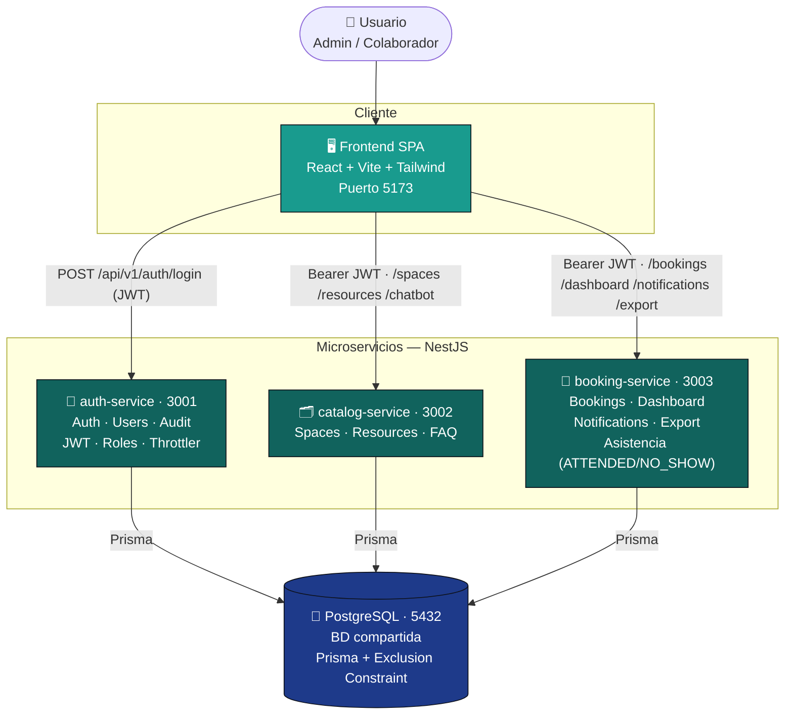
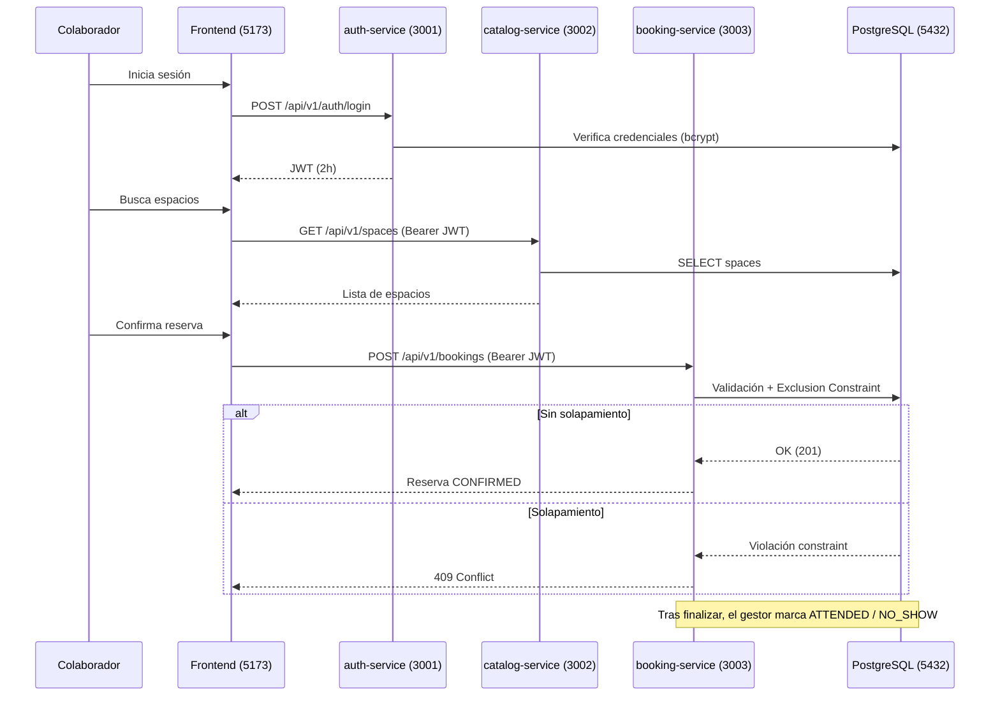

# Arquitectura — OfficeSpace

Sistema de **microservicios con base de datos PostgreSQL compartida**. Cada servicio es un proceso NestJS independiente, con su propio puerto, Dockerfile y Swagger, y valida el mismo `JWT_SECRET`.

---

## Diagrama Mermaid (pegar en GitHub)



### Flujo de una reserva (secuencia)



---

## Diagrama ASCII (documentación textual)

```
                                   ┌──────────────────────────────┐
                                   │            USUARIO            │
                                   │     Admin / Colaborador       │
                                   └───────────────┬──────────────┘
                                                   │ HTTPS
                                                   ▼
                          ┌──────────────────────────────────────────┐
                          │   FRONTEND  (React + Vite + Tailwind)      │
                          │                Puerto 5173                 │
                          └───────┬───────────────┬───────────────┬────┘
              Bearer JWT          │               │               │
        ┌─────────────────────────┘               │               └─────────────────────────┐
        ▼                                          ▼                                          ▼
┌────────────────────┐              ┌────────────────────────┐              ┌────────────────────────────┐
│   auth-service      │              │   catalog-service       │              │     booking-service         │
│      :3001          │              │       :3002             │              │        :3003                │
│  /api/v1/auth       │              │  /api/v1/spaces         │              │  /api/v1/bookings           │
│  /api/v1/users      │              │  /api/v1/resources      │              │  /api/v1/dashboard          │
│  /api/v1/audit      │              │  /api/v1/chatbot        │              │  /api/v1/notifications      │
│  JWT · Roles        │              │  Borrado lógico · FAQ   │              │  /api/v1/export             │
│  Throttler          │              │                         │              │  Asistencia ATTENDED/NO_SHOW│
│  /api-docs          │              │  /api-docs              │              │  /api-docs                  │
└─────────┬──────────┘              └───────────┬─────────────┘              └──────────────┬──────────────┘
          │ Prisma                              │ Prisma                                    │ Prisma
          └─────────────────────────────────────┼───────────────────────────────────────────┘
                                                 ▼
                          ┌──────────────────────────────────────────┐
                          │   PostgreSQL 15  (Base de Datos compartida) │
                          │                Puerto 5432                  │
                          │  Tablas: roles, users, spaces, resources,   │
                          │  space_resources, bookings, audit_logs,     │
                          │  notifications, chatbot_faq                 │
                          │  Reglas: EXCLUDE no_overlapping_bookings,   │
                          │  CHECKs, índices, triggers audit inmutable  │
                          └──────────────────────────────────────────┘

Comunicación:
  Frontend  --HTTP/JSON + Bearer JWT-->  auth | catalog | booking
  Cada microservicio  --Prisma-->  PostgreSQL (misma BD)
  JWT_SECRET compartido: cada servicio valida el token localmente (sin llamadas internas)
```

---

## Modelo de datos (entidades principales)

```
roles ──1:N── users ──1:N── bookings ──N:1── spaces ──N:M── resources
                  │                                  (space_resources)
                  ├─1:N── audit_logs
                  └─1:N── notifications
chatbot_faq (independiente)
```

- **Borrado lógico** en users, spaces, resources (campo `status`).
- **Exclusion Constraint** `no_overlapping_bookings` (`WHERE status='CONFIRMED'`) → anti‑solapamiento a nivel de datos.
- **Auditoría inmutable**: triggers que impiden `UPDATE`/`DELETE` en `audit_logs`.
- Estados de reserva: `CONFIRMED`, `ATTENDED`, `NO_SHOW`, `CANCELLED`, `FINISHED` (derivado), `PENDING_APPROVAL` (reservado).
