# NeoWallet Frontend - Diagramas de Arquitectura

## 📐 Arquitectura General del Sistema

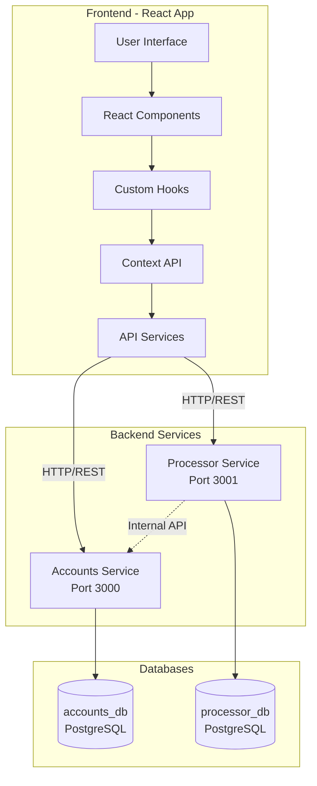

## 🔄 Flujo de Datos - Transferencia P2P

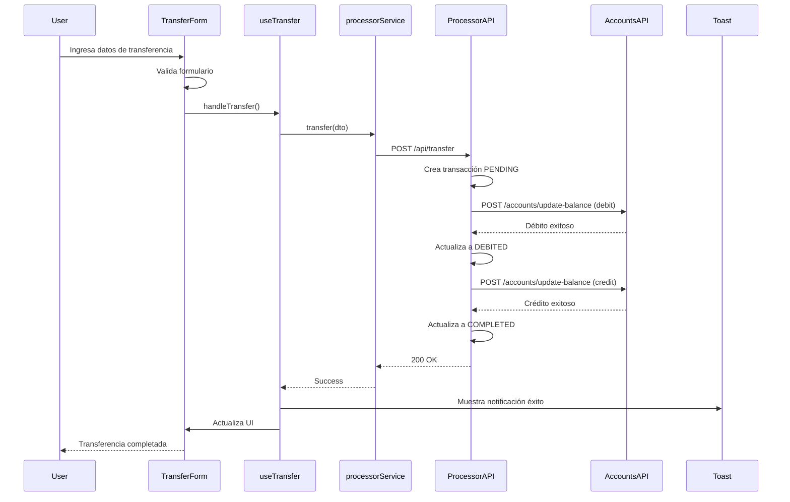

## 🎨 Arquitectura de Componentes

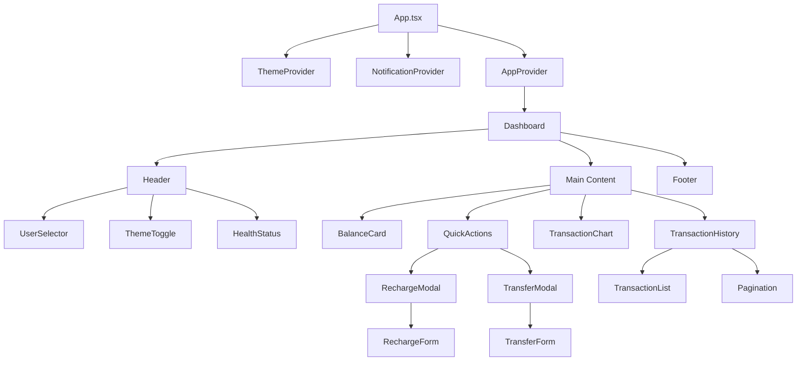

## 🔌 Estructura de Servicios API

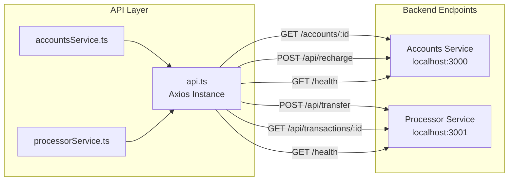

## 🎭 Flujo de Estado - Context API

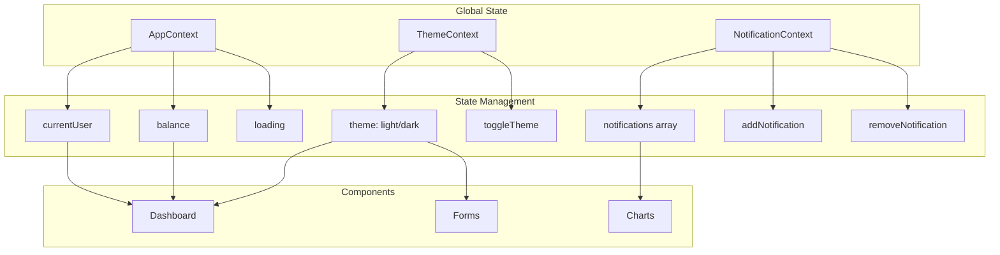

## 📱 Responsive Design Breakpoints

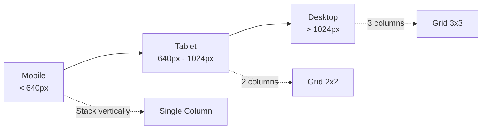

## 🔄 Ciclo de Vida de una Transacción

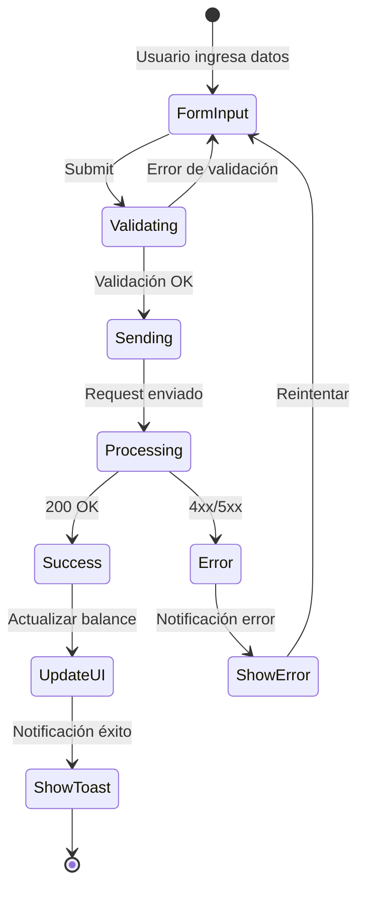

## 🎨 Sistema de Temas

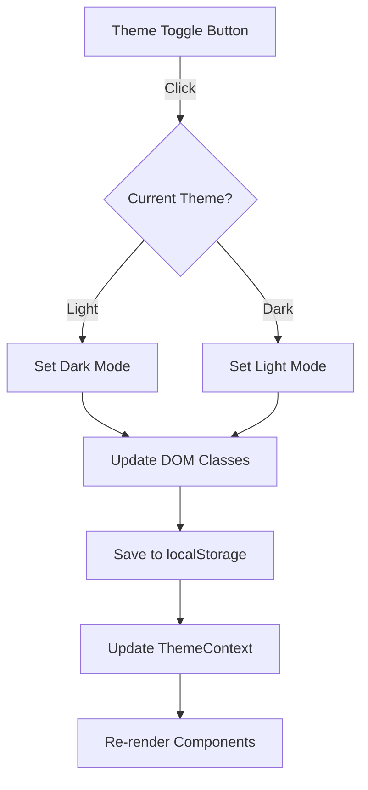

## 🔔 Sistema de Notificaciones

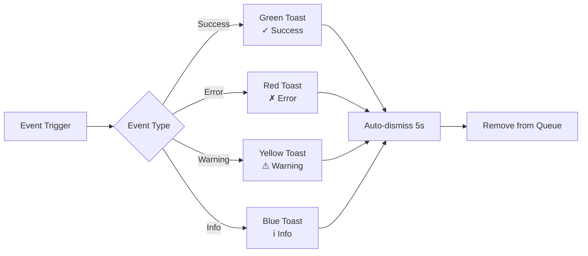

## 🐳 Arquitectura Docker

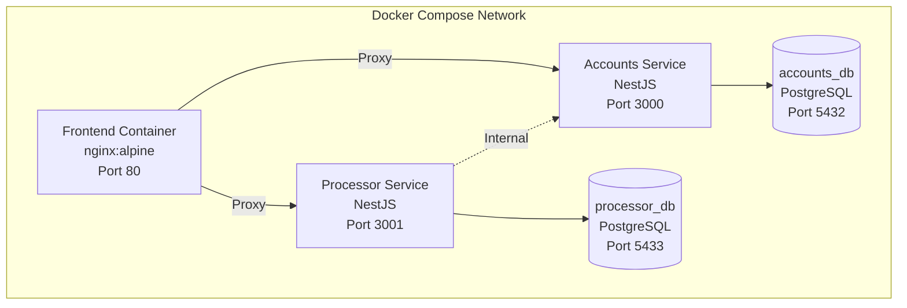

## 📊 Flujo de Datos - Dashboard

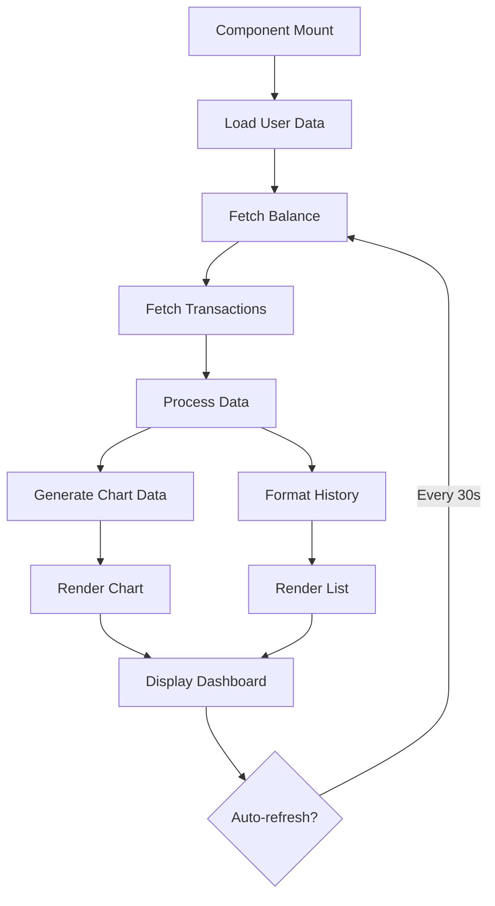

## 🔐 Manejo de Errores

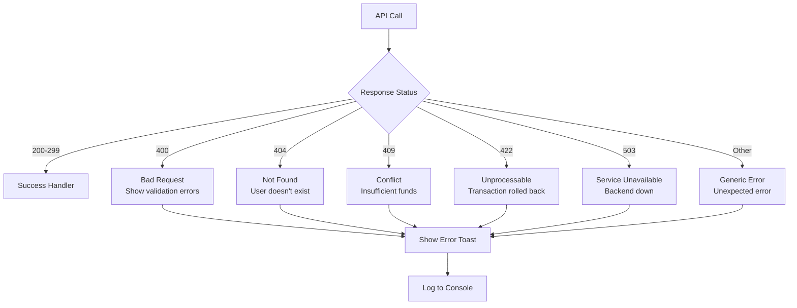

## 🎯 Performance Optimization

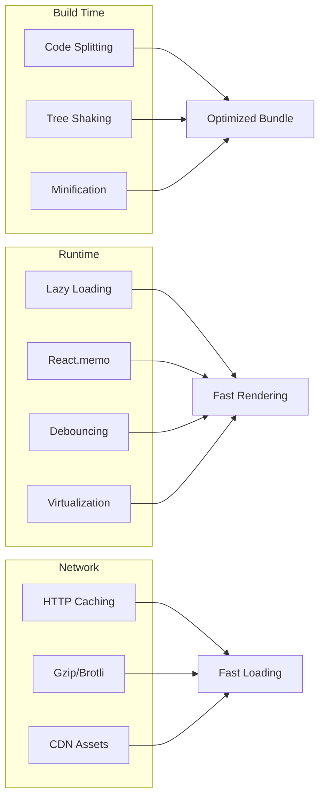

---

**Diagramas de Arquitectura v1.0**  
**Fecha:** Junio 2026  
**Herramienta:** Mermaid.js