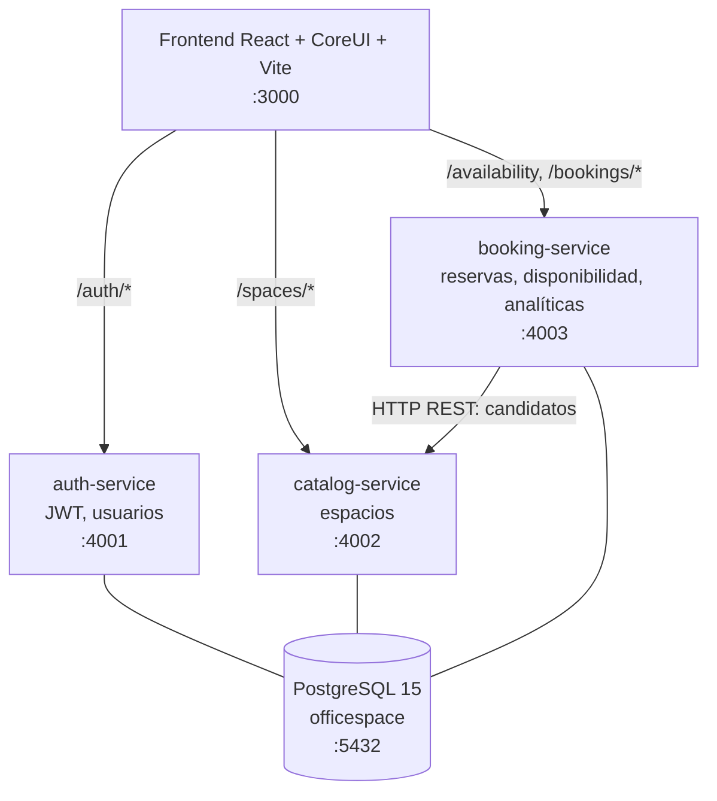

# IBM OfficeSpace · Gestión Híbrida Inteligente

IBM OfficeSpace es una plataforma web para administrar reservas de **salas de juntas**
y **escritorios hot desk** en un modelo de trabajo híbrido. Reemplaza el uso de hojas
de cálculo compartidas por un sistema con autenticación, roles, disponibilidad en
tiempo real, validación anti-solapamiento, dashboard operativo, analíticas y asistente
local por texto/voz.

El proyecto está construido como un MVP de microservicios con estética IBM Carbon:
interfaz sobria, controles compactos, color primario `#0f62fe`, tipografía IBM Plex y
flujos orientados a operación diaria.

---

## Características

- Autenticación JWT con roles `ADMINISTRADOR` y `COLABORADOR`.
- Login con formulario manual de correo y contraseña.
- CRUD de espacios para administradores.
- Catálogo de salas/escritorios con capacidad, piso, ubicación y recursos.
- Buscador de disponibilidad por fecha, hora, tipo y capacidad.
- Motor de reservas con validación de fecha, horario, capacidad y no-solapamiento.
- Restricción anti-solapamiento también en PostgreSQL con `EXCLUDE USING gist`.
- Mis Reservas con historial, estado y cancelación de reservas futuras.
- Dashboard de ocupación diaria para administradores.
- Calendario de Google embebido y auto-sincronizado: cada reserva (de admin y de colaboradores) se publica como evento, con color por rol. Ver [`GOOGLE_CALENDAR_SETUP.md`](GOOGLE_CALENDAR_SETUP.md).
- Analíticas con totales, cancelaciones, espacios top, horas pico y reservas por tipo.
- Asistente local con texto, micrófono y síntesis de voz mediante Web Speech API.
- Respuestas del asistente basadas en datos reales del backend.
- Interfaz multi-idioma: Español, English, Português, Français y Deutsch.
- Swagger/OpenAPI en cada microservicio.
- Docker Compose para levantar base de datos, servicios y frontend.

---

## Arquitectura

El sistema usa **microservicios con base de datos compartida**. Cada servicio tiene su
propio `Dockerfile`, proceso, puerto y documentación OpenAPI. Los servicios comparten
PostgreSQL para simplificar la consistencia transaccional del motor de reservas.



| Componente | Responsabilidad |
|---|---|
| `frontend` | React 19, CoreUI, rutas protegidas, i18n, asistente y llamadas REST |
| `auth-service` | Login, JWT, perfil, listado de usuarios para admin |
| `catalog-service` | Lectura y CRUD administrativo de espacios |
| `booking-service` | Disponibilidad, reservas, cancelaciones, ocupación, analíticas y sugerencias |
| `shared-infra` | Esquema PostgreSQL, restricciones, índices y datos semilla |

Más detalle: [`docs/ARCHITECTURE.md`](docs/ARCHITECTURE.md).

---

## Stack

| Capa | Tecnología |
|---|---|
| Frontend | React 19, Vite 8, CoreUI 5, CoreUI Icons, Framer Motion, Chart.js |
| Estado/UI | Context API para auth, Redux mínimo de plantilla, i18n propio |
| Backend | Node.js 20, Express 4, JWT, bcryptjs, express-validator |
| Base de datos | PostgreSQL 15, `btree_gist`, restricciones e índices |
| API docs | swagger-jsdoc + swagger-ui-express |
| Producción local | Docker Compose, nginx para servir el frontend |

---

## Puesta En Marcha

### Opción A: Docker Compose

Requisitos: Docker y Docker Compose.

```bash
cd officespace-ibm
docker compose up --build
```

| Servicio | URL |
|---|---|
| Aplicación web | http://localhost:3000 |
| Auth Swagger | http://localhost:4001/api-docs |
| Catalog Swagger | http://localhost:4002/api-docs |
| Booking Swagger | http://localhost:4003/api-docs |
| PostgreSQL | `localhost:5432` (`officespace` / `officespace` / `officespace`) |

Nota: si ya existe una base inicializada y quieres sincronizar las cuentas de prueba
documentadas, ejecuta `shared-infra/upsert-requested-users.sql`.

Ejemplo con Docker:

```bash
docker exec -i officespace-db psql -U officespace -d officespace < shared-infra/upsert-requested-users.sql
```

### Descargar La Rama Del Hackathon

Esta es la forma recomendada para que otra persona descargue y vea el proyecto desde
GitHub:

```bash
git clone -b joseph-hackathon https://github.com/eigarciaortega/IBMHackathon2026.git
cd IBMHackathon2026
docker compose -f docker-compose.yml -f docker-compose.local.yml up --build -d
```

Después abre:

```text
http://localhost:3000
```

El archivo `docker-compose.local.yml` publica el frontend en `3000` y PostgreSQL en
`55432`. Los microservicios quedan en `4001`, `4002` y `4003`.

Para detener todo:

```bash
docker compose -f docker-compose.yml -f docker-compose.local.yml down
```

### Subir A La Rama `joseph-hackathon`

Ejecuta estos comandos desde la carpeta del proyecto. Esto crea una raíz Git limpia
solo para `officespace-ibm`, sin subir carpetas ajenas de `C:\VSC`.

```bash
cd "C:\VSC\IBM\Escenario 1\officespace-ibm"
git init
git checkout -b joseph-hackathon
git remote add origin https://github.com/eigarciaortega/IBMHackathon2026.git
git add .
git status
git commit -m "Agregar IBM OfficeSpace para hackathon"
git push -u origin joseph-hackathon
```

Antes de hacer commit, revisa que no haya secretos:

```bash
git status --short
git diff --cached -- .env .env.example booking-service/.env.example
```

No se deben subir archivos `.env`, logs, `node_modules`, `build` ni credenciales
reales de Twilio/SMTP. Los archivos `.env.example` solo contienen valores de ejemplo
o placeholders para documentar la configuración.

### Opción B: desarrollo local

Requisitos: Node.js 20+ y PostgreSQL.

```bash
# Crear base y cargar esquema/datos
psql -U postgres -c "CREATE DATABASE officespace;"
psql -U postgres -d officespace -f shared-infra/init-db.sql

# Terminal 1
cd auth-service
npm install
npm start

# Terminal 2
cd catalog-service
npm install
npm start

# Terminal 3
cd booking-service
npm install
npm start

# Terminal 4
cd frontend
npm install
npm start
```

---

## Variables De Entorno

Los servicios tienen valores por defecto para desarrollo, pero estas variables son las
relevantes:

| Variable | Servicio | Default |
|---|---|---|
| `PORT` | backend | `4001`, `4002`, `4003` según servicio |
| `PGHOST` | backend | `localhost` o `postgres` en Compose |
| `PGPORT` | backend | `5432` |
| `PGUSER` | backend | `officespace` |
| `PGPASSWORD` | backend | `officespace` |
| `PGDATABASE` | backend | `officespace` |
| `JWT_SECRET` | backend | `ibm-officespace-shared-secret-change-me` |
| `JWT_EXPIRES_IN` | auth-service | `8h` |
| `CATALOG_SERVICE_URL` | booking-service | `http://localhost:4002` |
| `CATALOG_TIMEOUT_MS` | booking-service | `1500` |
| `VITE_AUTH_URL` | frontend | `http://localhost:4001` |
| `VITE_CATALOG_URL` | frontend | `http://localhost:4002` |
| `VITE_BOOKING_URL` | frontend | `http://localhost:4003` |
| `VITE_REQUEST_TIMEOUT_MS` | frontend | `8000` |

---

## Credenciales De Prueba

Todas las contraseñas de colaboradores son `User123`. Los administradores usan `Admin123`.
Por seguridad, la pantalla de login no muestra ni autocompleta cuentas; ingresa el
correo y la contraseña manualmente.

Los usuarios con rol **Administrador** entran al dashboard y pueden gestionar espacios,
analíticas y funciones administrativas. Los usuarios con rol **Colaborador** entran al
flujo de búsqueda/reserva y solo gestionan sus propias reservas.

| Rol | Nombre | Usuario | Contraseña |
|---|---|---|---|
| Administrador | Administrador IBM | `admin@corporativoalpha.com` | `Admin123` |
| Administrador | Joseph Trejo H. | `jtrejoh2300@alumno.ipn.mx` | `Admin123` |
| Colaborador | Carlos Méndez | `carlos.mendez@corporativoalpha.com` | `User123` |
| Colaborador | Ana Torres | `ana.torres@corporativoalpha.com` | `User123` |
| Colaborador | Joseph Trejo Hernandez | `josephtrejohernandez@gmail.com` | `User123` |

### 50 usuarios ficticios extra con boleta

| # | Rol | Nombre | Usuario | Contraseña |
|---|---|---|---|---|
| 1 | Colaborador | Alex Rivera - Boleta 20260001 | `boleta20260001@corporativoalpha.com` | `User123` |
| 2 | Colaborador | Brenda Soto - Boleta 20260002 | `boleta20260002@corporativoalpha.com` | `User123` |
| 3 | Colaborador | Cesar Luna - Boleta 20260003 | `boleta20260003@corporativoalpha.com` | `User123` |
| 4 | Colaborador | Diana Vega - Boleta 20260004 | `boleta20260004@corporativoalpha.com` | `User123` |
| 5 | Colaborador | Eduardo Mora - Boleta 20260005 | `boleta20260005@corporativoalpha.com` | `User123` |
| 6 | Colaborador | Fernanda Rios - Boleta 20260006 | `boleta20260006@corporativoalpha.com` | `User123` |
| 7 | Colaborador | Gabriel Diaz - Boleta 20260007 | `boleta20260007@corporativoalpha.com` | `User123` |
| 8 | Colaborador | Helena Cruz - Boleta 20260008 | `boleta20260008@corporativoalpha.com` | `User123` |
| 9 | Colaborador | Ivan Ortega - Boleta 20260009 | `boleta20260009@corporativoalpha.com` | `User123` |
| 10 | Colaborador | Julia Navarro - Boleta 20260010 | `boleta20260010@corporativoalpha.com` | `User123` |
| 11 | Colaborador | Kevin Flores - Boleta 20260011 | `boleta20260011@corporativoalpha.com` | `User123` |
| 12 | Colaborador | Laura Campos - Boleta 20260012 | `boleta20260012@corporativoalpha.com` | `User123` |
| 13 | Colaborador | Mateo Salas - Boleta 20260013 | `boleta20260013@corporativoalpha.com` | `User123` |
| 14 | Colaborador | Natalia Ponce - Boleta 20260014 | `boleta20260014@corporativoalpha.com` | `User123` |
| 15 | Colaborador | Oscar Reyes - Boleta 20260015 | `boleta20260015@corporativoalpha.com` | `User123` |
| 16 | Colaborador | Paula Marin - Boleta 20260016 | `boleta20260016@corporativoalpha.com` | `User123` |
| 17 | Colaborador | Ricardo Leon - Boleta 20260017 | `boleta20260017@corporativoalpha.com` | `User123` |
| 18 | Colaborador | Sofia Bravo - Boleta 20260018 | `boleta20260018@corporativoalpha.com` | `User123` |
| 19 | Colaborador | Tomas Aguilar - Boleta 20260019 | `boleta20260019@corporativoalpha.com` | `User123` |
| 20 | Colaborador | Valeria Silva - Boleta 20260020 | `boleta20260020@corporativoalpha.com` | `User123` |
| 21 | Colaborador | Andres Molina - Boleta 20260021 | `boleta20260021@corporativoalpha.com` | `User123` |
| 22 | Colaborador | Camila Fuentes - Boleta 20260022 | `boleta20260022@corporativoalpha.com` | `User123` |
| 23 | Colaborador | Diego Ibarra - Boleta 20260023 | `boleta20260023@corporativoalpha.com` | `User123` |
| 24 | Colaborador | Elena Vargas - Boleta 20260024 | `boleta20260024@corporativoalpha.com` | `User123` |
| 25 | Colaborador | Felipe Robles - Boleta 20260025 | `boleta20260025@corporativoalpha.com` | `User123` |
| 26 | Colaborador | Giselle Santos - Boleta 20260026 | `boleta20260026@corporativoalpha.com` | `User123` |
| 27 | Colaborador | Hector Mejia - Boleta 20260027 | `boleta20260027@corporativoalpha.com` | `User123` |
| 28 | Colaborador | Isabel Franco - Boleta 20260028 | `boleta20260028@corporativoalpha.com` | `User123` |
| 29 | Colaborador | Javier Nunez - Boleta 20260029 | `boleta20260029@corporativoalpha.com` | `User123` |
| 30 | Colaborador | Karla Cardenas - Boleta 20260030 | `boleta20260030@corporativoalpha.com` | `User123` |
| 31 | Colaborador | Leonardo Paredes - Boleta 20260031 | `boleta20260031@corporativoalpha.com` | `User123` |
| 32 | Colaborador | Mariana Lozano - Boleta 20260032 | `boleta20260032@corporativoalpha.com` | `User123` |
| 33 | Colaborador | Nicolas Vidal - Boleta 20260033 | `boleta20260033@corporativoalpha.com` | `User123` |
| 34 | Colaborador | Olivia Herrera - Boleta 20260034 | `boleta20260034@corporativoalpha.com` | `User123` |
| 35 | Colaborador | Pablo Trevino - Boleta 20260035 | `boleta20260035@corporativoalpha.com` | `User123` |
| 36 | Colaborador | Regina Solis - Boleta 20260036 | `boleta20260036@corporativoalpha.com` | `User123` |
| 37 | Colaborador | Samuel Escobar - Boleta 20260037 | `boleta20260037@corporativoalpha.com` | `User123` |
| 38 | Colaborador | Teresa Galvan - Boleta 20260038 | `boleta20260038@corporativoalpha.com` | `User123` |
| 39 | Colaborador | Uriel Bautista - Boleta 20260039 | `boleta20260039@corporativoalpha.com` | `User123` |
| 40 | Colaborador | Victoria Roman - Boleta 20260040 | `boleta20260040@corporativoalpha.com` | `User123` |
| 41 | Colaborador | Walter Medina - Boleta 20260041 | `boleta20260041@corporativoalpha.com` | `User123` |
| 42 | Colaborador | Ximena Carrillo - Boleta 20260042 | `boleta20260042@corporativoalpha.com` | `User123` |
| 43 | Colaborador | Yahir Padilla - Boleta 20260043 | `boleta20260043@corporativoalpha.com` | `User123` |
| 44 | Colaborador | Zaira Beltran - Boleta 20260044 | `boleta20260044@corporativoalpha.com` | `User123` |
| 45 | Colaborador | Adrian Montoya - Boleta 20260045 | `boleta20260045@corporativoalpha.com` | `User123` |
| 46 | Colaborador | Bianca Orozco - Boleta 20260046 | `boleta20260046@corporativoalpha.com` | `User123` |
| 47 | Colaborador | Cristian Valdez - Boleta 20260047 | `boleta20260047@corporativoalpha.com` | `User123` |
| 48 | Colaborador | Daniela Pineda - Boleta 20260048 | `boleta20260048@corporativoalpha.com` | `User123` |
| 49 | Colaborador | Emilio Salazar - Boleta 20260049 | `boleta20260049@corporativoalpha.com` | `User123` |
| 50 | Colaborador | Fabiola Quintana - Boleta 20260050 | `boleta20260050@corporativoalpha.com` | `User123` |

---

## Pantallas

| Ruta | Acceso | Descripción |
|---|---|---|
| `/login` | Público | Login animado IBM, selector de idioma y formulario manual |
| `/dashboard` | Admin | KPIs de ocupación y reservas confirmadas del día |
| `/calendario` | Autenticado | Google Calendar embebido con todas las reservas (admin y colaboradores) |
| `/buscar` | Autenticado | Búsqueda de disponibilidad por fecha, hora, tipo y capacidad |
| `/reservar` | Autenticado | Confirmación de reserva con asistentes, motivo y validaciones |
| `/mis-reservas` | Autenticado | Próximas, pasadas y canceladas; permite cancelar futuras |
| `/admin/espacios` | Admin | CRUD de espacios, recursos y estado activo/inactivo |
| `/analiticas` | Admin | Gráficas de uso, reservas por tipo, horas pico y cancelaciones |
| `/asistente` | Autenticado | Chat con intención local, voz y respuestas con datos reales |

---

## API

Todos los endpoints excepto `POST /auth/login` requieren:

```http
Authorization: Bearer <token>
```

### auth-service `:4001`

| Método | Ruta | Acceso | Uso |
|---|---|---|---|
| `POST` | `/auth/login` | Público | Login con email/password, devuelve JWT |
| `GET` | `/auth/me` | Autenticado | Perfil del usuario actual |
| `GET` | `/auth/users` | Admin | Lista de usuarios |

### catalog-service `:4002`

| Método | Ruta | Acceso | Uso |
|---|---|---|---|
| `GET` | `/spaces` | Autenticado | Lista espacios; filtros `type`, `minCapacity`, `projector`, `ac`, `videoconference`, `all` |
| `GET` | `/spaces/:id` | Autenticado | Obtiene un espacio |
| `POST` | `/spaces` | Admin | Crea espacio |
| `PUT` | `/spaces/:id` | Admin | Actualiza espacio |
| `DELETE` | `/spaces/:id` | Admin | Elimina espacio y reservas asociadas por cascada |

### booking-service `:4003`

| Método | Ruta | Acceso | Uso |
|---|---|---|---|
| `GET` | `/availability` | Autenticado | Espacios libres en rango `date`, `start`, `end` |
| `POST` | `/bookings` | Autenticado | Crea reserva validando reglas críticas |
| `GET` | `/bookings/me` | Autenticado | Reservas del usuario |
| `DELETE` | `/bookings/:id` | Dueño/Admin | Cancela reserva futura |
| `GET` | `/bookings/occupancy` | Autenticado | Ocupación del día |
| `GET` | `/bookings/calendar/embed` | Autenticado | Config del Google Calendar embebido (URL para iframe) |
| `GET` | `/bookings/analytics` | Autenticado | Métricas agregadas |
| `GET` | `/bookings/suggestions` | Autenticado | Sugerencias de franjas libres |

Contrato completo: [`docs/API_CONTRACT.md`](docs/API_CONTRACT.md).

---

## Reglas Críticas De Reserva

El motor valida:

- Fecha en formato `YYYY-MM-DD`.
- Horas en formato `HH:MM` o `HH:MM:SS`.
- `end_time` mayor que `start_time`.
- Fecha/hora de inicio no pasada.
- `attendees` al menos 1.
- Asistentes no mayores que la capacidad del espacio.
- Espacio activo.
- No-solapamiento de reservas confirmadas en el mismo espacio.

La semántica de intervalos es `[inicio, fin)`: una reserva `10:00-11:00` y otra
`11:00-12:00` son válidas porque no se enciman.

En PostgreSQL la garantía final es:

```sql
EXCLUDE USING gist (
  space_id WITH =,
  tsrange((booking_date + start_time), (booking_date + end_time)) WITH &&
) WHERE (status = 'CONFIRMADA')
```

---

## Asistente Local

El asistente vive como página completa y como widget flotante. No usa servicios externos
de IA: interpreta intención con palabras clave multi-idioma y consulta el backend real.

Puede responder sobre:

- Ocupación actual.
- Disponibilidad próxima.
- Mis reservas y próxima reserva.
- Sugerencias de salas/escritorios.
- Catálogo de espacios.
- Analíticas.
- Endpoints/API disponibles.

La voz usa `SpeechRecognition`/`webkitSpeechRecognition` y `speechSynthesis`. En
navegadores sin Web Speech API, el chat de texto sigue funcionando.

---

## Base De Datos

Tablas principales:

| Tabla | Campos clave |
|---|---|
| `users` | `full_name`, `email`, `password_hash`, `role`, `created_at` |
| `spaces` | `name`, `type`, `capacity`, `floor`, `location`, recursos, `active` |
| `bookings` | `space_id`, `user_id`, `booking_date`, `start_time`, `end_time`, `attendees`, `status` |

Datos de referencia de la base:

- 2 administradores.
- 3 colaboradores principales.
- 50 colaboradores ficticios con boleta para pruebas.
- 10 espacios iniciales.
- Reservas de ejemplo para `CURRENT_DATE`.

---

## Scripts

| Carpeta | Comando | Uso |
|---|---|---|
| `auth-service` | `npm start` | Inicia auth-service |
| `auth-service` | `npm run dev` | Inicia auth-service con watch |
| `catalog-service` | `npm start` | Inicia catalog-service |
| `catalog-service` | `npm run dev` | Inicia catalog-service con watch |
| `booking-service` | `npm start` | Inicia booking-service |
| `booking-service` | `npm run dev` | Inicia booking-service con watch |
| `booking-service` | `npm test` | Ejecuta tests puros del motor de reservas y de Google Calendar |
| `booking-service` | `npm run backfill:google` | Sincroniza reservas existentes con Google Calendar |
| `frontend` | `npm start` | Inicia Vite en `:3000` |
| `frontend` | `npm run build` | Compila frontend en `frontend/build` |
| `frontend` | `npm run lint` | Ejecuta ESLint |
| `frontend` | `npm run serve` | Sirve build con Vite preview |

---

## Pruebas

Pruebas automatizadas del motor de reservas:

```bash
cd booking-service
npm test
```

Cubre solapamiento, reservas consecutivas, capacidad, horario, fecha pasada y formatos
inválidos.

Casos manuales y BDD: [`docs/CASOS_DE_PRUEBA.md`](docs/CASOS_DE_PRUEBA.md).

---

## Estructura

```text
officespace-ibm/
├── auth-service/
│   ├── src/config/
│   ├── src/controllers/
│   ├── src/middleware/
│   ├── src/routes/
│   ├── Dockerfile
│   └── package.json
├── booking-service/
│   ├── src/config/
│   ├── src/controllers/
│   ├── src/middleware/
│   ├── src/routes/
│   ├── src/services/
│   ├── src/validators/
│   ├── Dockerfile
│   └── package.json
├── catalog-service/
│   ├── src/config/
│   ├── src/controllers/
│   ├── src/middleware/
│   ├── src/routes/
│   ├── Dockerfile
│   └── package.json
├── frontend/
│   ├── public/
│   ├── src/api/
│   ├── src/components/
│   ├── src/context/
│   ├── src/i18n/
│   ├── src/layout/
│   ├── src/scss/
│   ├── src/views/
│   ├── Dockerfile
│   ├── nginx.conf
│   └── package.json
├── shared-infra/
│   ├── init-db.sql
│   └── upsert-requested-users.sql
├── docs/
│   ├── API_CONTRACT.md
│   ├── ARCHITECTURE.md
│   └── CASOS_DE_PRUEBA.md
├── docker-compose.yml
├── PRODUCT.md
└── README.md
```

---

## Documentación Relacionada

- [`PRODUCT.md`](PRODUCT.md): visión de producto, usuarios, principios y accesibilidad.
- [`GOOGLE_CALENDAR_SETUP.md`](GOOGLE_CALENDAR_SETUP.md): guía para conectar el Google Calendar embebido y la auto-sincronización.
- [`docs/ARCHITECTURE.md`](docs/ARCHITECTURE.md): decisión arquitectónica, ERD y regla crítica.
- [`docs/API_CONTRACT.md`](docs/API_CONTRACT.md): endpoints, ejemplos y códigos de respuesta.
- [`docs/CASOS_DE_PRUEBA.md`](docs/CASOS_DE_PRUEBA.md): casos manuales, BDD y pruebas unitarias.
- [`frontend/ARCHITECTURE.md`](frontend/ARCHITECTURE.md): arquitectura interna del frontend.
- [`frontend/DEVELOPMENT.md`](frontend/DEVELOPMENT.md): notas de desarrollo frontend.

---

© IBM Corporation — IBM OfficeSpace. Proyecto educativo, Escenario 1.
