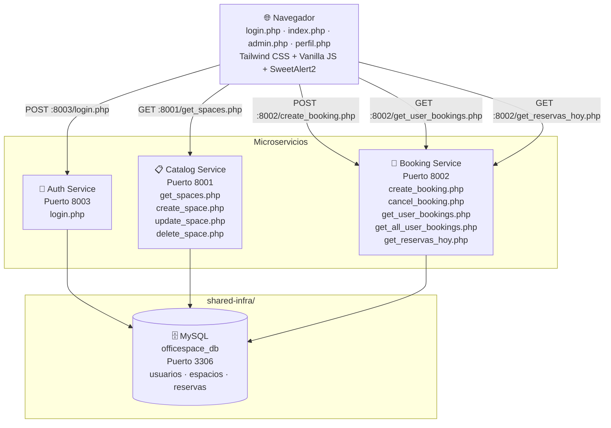

# OfficeSpace — Gestión Híbrida Inteligente

Sistema de reserva de espacios de trabajo desarrollado para el Hackathon IBM 2026.
Permite a colaboradores buscar y reservar salas de juntas y escritorios, con un panel de administración completo para gestión de espacios.

---

## Tabla de Contenidos

- [Requisitos Previos](#requisitos-previos)
- [Instalación y Arranque](#instalación-y-arranque)
- [Credenciales de Prueba](#credenciales-de-prueba)
- [Arquitectura del Sistema](#arquitectura-del-sistema)
- [Decisiones Técnicas](#decisiones-técnicas)
- [Documentación de API](#documentación-de-api)
- [Guía de Usuario](#guía-de-usuario)

---

## ⚙️ Requisitos Previos

| Herramienta | Versión | Notas |
|---|---|---|
| PHP | 8.3.x | Incluido en MAMP |
| MySQL | 8.x | Incluido en MAMP |
| MAMP | 6.x+ | Para macOS/Windows |
| Navegador | Cualquier moderno | Chrome recomendado |

> **Nota:** El proyecto utiliza servidores PHP integrados (`php -S`) en lugar de Docker para maximizar la velocidad de desarrollo durante el hackathon. Cada microservicio corre en su propio proceso y puerto independiente.

---

## Instalación y Arranque

### 1. Clonar el repositorio

```bash
git clone https://github.com/tu-usuario/officespace-ibm.git
cd officespace-ibm
```

### 2. Iniciar MAMP

- Abre MAMP y arranca los servicios de Apache y MySQL
- Verifica que MySQL esté corriendo en el puerto **3306**

### 3. Inicializar la base de datos

Abre MySQL Workbench (o phpMyAdmin en `http://localhost:8888/phpMyAdmin`) y ejecuta el script de inicialización:

```sql
-- Ejecutar el archivo completo:
source shared-infra/init-db.sql
```

O copia y pega el contenido de `shared-infra/init-db.sql` directamente en el editor SQL.

### 4. Configurar la conexión a BD

Verifica que `shared-infra/db.php` tenga estos valores:

```php
$host = '127.0.0.1';
$port = 3306;
$user = 'root';
$pass = 'root';   // Cambia si tu MAMP tiene contraseña distinta
$db   = 'officespace_db';
```

### 5. Levantar los microservicios

Abre **3 terminales** y ejecuta un comando en cada una:

```bash
# Terminal 1 — Auth Service (puerto 8003)
cd auth-service
/Applications/MAMP/bin/php/php8.3.30/bin/php -S localhost:8003

# Terminal 2 — Catalog Service (puerto 8001)
cd catalog-service
/Applications/MAMP/bin/php/php8.3.30/bin/php -S localhost:8001

# Terminal 3 — Booking Service (puerto 8002)
cd booking-service
/Applications/MAMP/bin/php/php8.3.30/bin/php -S localhost:8002
```

### 6. Acceder al sistema

Abre el navegador y ve a:

```
http://localhost:8888/officespace-ibm/frontend/login.php
```

> ✅ **Verificación rápida:** Abre `http://localhost:8001/get_spaces.php` — debe devolver un JSON con los espacios registrados.

---

## 🔐 Credenciales de Prueba

| Rol | Email | Contraseña |
|---|---|---|
| **Administrador** | admin@corporativoalpha.com | Admin123 |
| **Colaborador** | carlos.mendez@corporativoalpha.com | User123 |
| **Colaborador** | ana.torres@corporativoalpha.com | User123 |

---

## 🏗️ Arquitectura del Sistema



### Puertos del sistema

| Servicio | Puerto | Descripción |
|---|---|---|
| Frontend (Apache MAMP) | 8888 | Sirve los archivos PHP del frontend |
| Auth Service | 8003 | Autenticación y emisión de JWT |
| Catalog Service | 8001 | Gestión del catálogo de espacios |
| Booking Service | 8002 | Motor de reservas y validaciones |
| MySQL | 3306 | Base de datos compartida |

### Esquema de Base de Datos

```
usuarios
├── id_usuario (PK, AUTO_INCREMENT)
├── email (UNIQUE)
├── password
├── rol (ENUM: ADMINISTRADOR, COLABORADOR)
└── activo (TINYINT)

espacios
├── id_espacio (PK, AUTO_INCREMENT)
├── nombre
├── tipo (ENUM: SALA, DESK)
├── capacidad
├── recursos
├── piso
└── activo (TINYINT)

reservas
├── id_reserva (PK, AUTO_INCREMENT)
├── id_espacio (FK → espacios)
├── id_usuario (FK → usuarios)
├── fecha (DATE)
├── hora_inicio (TIME)
├── hora_fin (TIME)
├── asistentes
├── notas (TEXT, nullable)
├── estatus (ENUM: Activa, Cancelada)
└── fecha_creacion (TIMESTAMP)
```

---

## 🧠 Decisiones Técnicas

### ¿Por qué microservicios con base de datos compartida?

Se adoptó una **arquitectura híbrida de microservicios con BD compartida** por las siguientes razones:

1. **Separación de responsabilidades clara:** Cada servicio tiene un dominio bien definido — autenticación, catálogo y reservas — y se comunica con los otros únicamente a través de HTTP, nunca mediante llamadas directas a funciones.

2. **Velocidad de desarrollo en hackathon:** Una BD compartida elimina la complejidad de la sincronización entre bases de datos distribuidas (event sourcing, sagas), permitiendo enfocarse en la lógica de negocio.

3. **Despliegue independiente:** Cada servicio tiene su propio proceso y puerto, lo que permite reiniciarlo, escalarlo o modificarlo sin afectar a los demás.

4. **Transacciones simples:** Al compartir la BD, validaciones críticas como el algoritmo de no-solapamiento de horarios pueden hacerse con una sola consulta SQL atómica, sin coordinación distribuida.

### ¿Por qué PHP en lugar de Node.js?

- **Stack dominado por el equipo:** PHP 8.3 con sus mejoras de rendimiento y tipado es el lenguaje con el que el equipo tiene mayor experiencia práctica.
- **MAMP como entorno integrado:** Elimina la configuración de entorno y permite arrancar inmediatamente.
- **Sin dependencias de npm:** Cero tiempo perdido en instalación de paquetes o problemas de versiones.

### Algoritmo de no-solapamiento

La validación de conflictos de horario usa la regla matemática de intersección de intervalos:

```
Nueva reserva choca si:
  hora_inicio_nueva < hora_fin_existente
  AND
  hora_fin_nueva > hora_inicio_existente
```

Esta condición detecta todos los casos posibles: solapamiento parcial izquierdo, parcial derecho, contenido y envolvente.

### JWT artesanal (sin librerías)

Por requisito explícito del hackathon, el JWT se implementa manualmente con HMAC-SHA256:

```
token = base64url(header) + "." + base64url(payload) + "." + base64url(firma)
firma = HMAC-SHA256(header + "." + payload, secret)
```

El payload incluye: `id_usuario`, `email`, `rol` y `exp` (expiración a 24 horas).

---

## 📡 Documentación de API

La documentación interactiva está disponible en: `http://localhost:8888/officespace-ibm/api-docs.php`

### Auth Service — Puerto 8003

#### POST /login.php
Autenticar usuario y obtener token JWT.

```bash
curl -X POST http://localhost:8003/login.php \
  -H "Content-Type: application/json" \
  -d '{
    "email": "carlos.mendez@corporativoalpha.com",
    "password": "User123"
  }'
```

**Respuesta exitosa (200):**
```json
{
  "status": "success",
  "token": "eyJ0eXAiOiJKV1QiLCJhbGciOiJIUzI1NiJ9...",
  "user": {
    "id": 2,
    "email": "carlos.mendez@corporativoalpha.com",
    "rol": "COLABORADOR"
  }
}
```

**Respuesta fallida (401):**
```json
{ "status": "error", "message": "Credenciales incorrectas" }
```

---

### Catalog Service — Puerto 8001

#### GET /get_spaces.php
Obtener espacios disponibles con filtros opcionales.

```bash
# Todos los espacios
curl http://localhost:8001/get_spaces.php

# Filtrado por fecha, horario y tipo
curl "http://localhost:8001/get_spaces.php?fecha=2026-06-25&hora_inicio=09:00&hora_fin=11:00&tipo=SALA&capacidad=4"

# Admin: ver todos incluyendo inactivos
curl "http://localhost:8001/get_spaces.php?mostrar_inactivos=1" \
  -H "Authorization: Bearer <TOKEN>"
```

| Parámetro | Tipo | Descripción |
|---|---|---|
| fecha | string (Y-m-d) | Fecha de la reserva |
| hora_inicio | string (H:i) | Hora de inicio |
| hora_fin | string (H:i) | Hora de fin |
| tipo | SALA \| DESK | Tipo de espacio |
| capacidad | integer | Capacidad mínima requerida |
| mostrar_inactivos | 0 \| 1 | Solo admin |

**Respuesta (200):**
```json
{
  "status": "success",
  "data": [
    {
      "id_espacio": 1,
      "nombre": "Sala Creativa",
      "tipo": "SALA",
      "capacidad": 8,
      "recursos": "Proyector, Pantalla 65, AC",
      "piso": "Piso 2",
      "activo": 1
    }
  ]
}
```

#### POST /create_space.php 🔒 Admin
```bash
curl -X POST http://localhost:8001/create_space.php \
  -H "Content-Type: application/json" \
  -H "Authorization: Bearer <TOKEN_ADMIN>" \
  -d '{
    "nombre": "Sala Nueva",
    "tipo": "SALA",
    "capacidad": 10,
    "piso": "Piso 3",
    "recursos": "Proyector, AC"
  }'
```

#### POST /update_space.php 🔒 Admin
```bash
curl -X POST http://localhost:8001/update_space.php \
  -H "Content-Type: application/json" \
  -H "Authorization: Bearer <TOKEN_ADMIN>" \
  -d '{
    "id_espacio": 1,
    "nombre": "Sala Creativa Plus",
    "tipo": "SALA",
    "capacidad": 10,
    "piso": "Piso 2",
    "recursos": "Proyector, AC",
    "activo": 1
  }'
```

#### POST /delete_space.php 🔒 Admin
```bash
curl -X POST http://localhost:8001/delete_space.php \
  -H "Content-Type: application/json" \
  -H "Authorization: Bearer <TOKEN_ADMIN>" \
  -d '{ "id_espacio": 1 }'
```

---

### Booking Service — Puerto 8002

#### POST /create_booking.php 🔒
Crear una reserva con todas las validaciones de negocio.

```bash
curl -X POST http://localhost:8002/create_booking.php \
  -H "Content-Type: application/json" \
  -H "Authorization: Bearer <TOKEN>" \
  -d '{
    "id_espacio": 1,
    "id_usuario": 2,
    "fecha": "2026-06-25",
    "hora_inicio": "09:00",
    "hora_fin": "11:00",
    "asistentes": 5,
    "notas": "Revisión de avances Q2"
  }'
```

**Respuestas posibles:**

| Código | Situación |
|---|---|
| 201 | Reserva creada exitosamente |
| 400 | Fecha pasada, hora pasada, fuera de horario de oficina, o capacidad excedida |
| 401 | Token ausente o inválido |
| 409 | Solapamiento de horario con reserva existente |
| 500 | Error interno del servidor |

#### GET /get_user_bookings.php 🔒
Obtener reservas activas del usuario autenticado.

```bash
curl http://localhost:8002/get_user_bookings.php \
  -H "Authorization: Bearer <TOKEN>"
```

#### GET /get_all_user_bookings.php 🔒
Historial completo de reservas (activas + canceladas) para la pantalla de perfil.

```bash
curl http://localhost:8002/get_all_user_bookings.php \
  -H "Authorization: Bearer <TOKEN>"
```

#### POST /cancel_booking.php 🔒
Cancelar una reserva futura.

```bash
curl -X POST http://localhost:8002/cancel_booking.php \
  -H "Content-Type: application/json" \
  -H "Authorization: Bearer <TOKEN>" \
  -d '{ "id_reserva": 5 }'
```

#### GET /get_reservas_hoy.php 🔒 Admin
Dashboard de ocupación del día actual.

```bash
curl http://localhost:8002/get_reservas_hoy.php \
  -H "Authorization: Bearer <TOKEN_ADMIN>"
```

---

### Códigos de error comunes

| Código HTTP | Significado |
|---|---|
| 200 | OK — operación exitosa |
| 201 | Created — recurso creado |
| 400 | Bad Request — datos inválidos o regla de negocio violada |
| 401 | Unauthorized — token ausente o inválido |
| 403 | Forbidden — rol sin permisos suficientes |
| 404 | Not Found — recurso no encontrado |
| 409 | Conflict — solapamiento de horario |
| 500 | Internal Server Error |

---

## 📖 Guía de Usuario

### Cómo hacer login

1. Abre `http://localhost:8888/officespace-ibm/frontend/login.php`
2. Ingresa tu email corporativo y contraseña
3. El sistema te redirige automáticamente según tu rol:
   - **Administrador** → Dashboard con botón "Panel Admin" visible en el header
   - **Colaborador** → Dashboard de búsqueda de espacios

Si las credenciales son incorrectas, aparece un mensaje de error en pantalla.

---

### Cómo buscar y reservar un espacio

1. **Buscar disponibilidad:**
   - En el dashboard principal, selecciona la **fecha**, **hora inicio** y **hora fin**
   - Filtra opcionalmente por **tipo** (Sala / Escritorio) y **capacidad mínima**
   - Haz clic en **Search Availability**
   - Solo aparecen los espacios libres para ese horario

2. **Reservar:**
   - Haz clic en **Seleccionar** en la tarjeta del espacio deseado
   - En el modal, confirma la fecha y horario
   - Ingresa el número de asistentes
   - Opcionalmente agrega una nota o descripción de la reunión
   - Haz clic en **Confirmar Reserva**

3. **Ver tus reservas:**
   - En la barra lateral derecha aparecen tus reservas activas
   - Haz clic en el badge verde **Activa** para cancelar una reserva
   - Ve a **Mi Perfil** para ver el historial completo con filtros

**Reglas del sistema:**
- Solo se pueden hacer reservas en horario de oficina: **07:00 – 21:00**
- No se permiten reservas en fechas u horas pasadas
- No se puede reservar un espacio ya ocupado en ese horario
- No se puede exceder la capacidad del espacio

---

### Cómo administrar espacios (rol Admin)

1. Inicia sesión con una cuenta de **Administrador**
2. Haz clic en **Panel Admin** en el header

**Dashboard de ocupación:**
- Ve cuántos espacios están ocupados hoy vs. disponibles
- Consulta la tabla con todas las reservas activas del día
- Cancela cualquier reserva directamente desde el dashboard

**Gestión de espacios (CRUD):**
- **Crear:** clic en **+ Nuevo Espacio**, llena el formulario y guarda
- **Editar:** clic en **Editar** en la fila del espacio — se abre el mismo formulario con los datos actuales
- **Desactivar:** en el formulario de edición, cambia el estado a "Inactivo" — el espacio deja de aparecer en búsquedas
- **Eliminar:** clic en **Eliminar** — solo funciona si el espacio no tiene reservas activas futuras

---

## 🗂️ Estructura del Proyecto

```
officespace-ibm/
├── auth-service/
│   └── login.php
├── booking-service/
│   ├── create_booking.php
│   ├── cancel_booking.php
│   ├── get_user_bookings.php
│   ├── get_all_user_bookings.php
│   └── get_reservas_hoy.php
├── catalog-service/
│   ├── get_spaces.php
│   ├── create_space.php
│   ├── update_space.php
│   └── delete_space.php
├── frontend/
│   ├── login.php
│   ├── index.php
│   ├── admin.php
│   └── perfil.php
├── shared-infra/
│   ├── db.php
│   └── init-db.sql
├── docker-compose.yml
└── README.md
```

---

## 👥 Equipo

Desarrollado para el **Hackathon IBM 2026** — Escenario OfficeSpace: Gestión Híbrida Inteligente.

**Stack:** PHP 8.3 · MySQL · HTML5 · Tailwind CSS · Vanilla JS · SweetAlert2
