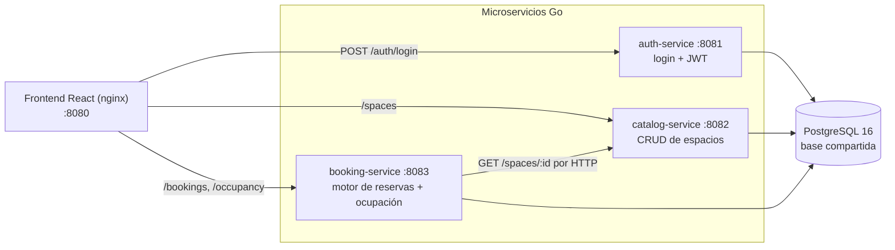

# OfficeSpace — Gestión híbrida inteligente de espacios

MVP web para que **Corporativo Alpha** digitalice la reserva de salas de juntas y
*hot desks*, reemplazando el Excel compartido que causaba reservas duplicadas,
espacios subutilizados y falta de control de acceso.

El sistema permite buscar disponibilidad en tiempo real, reservar sin solapamiento
de horarios, gestionar las reservas propias y administrar el catálogo de espacios
con un panel de ocupación del día.

Arquitectura de **microservicios en Go** con base de datos **PostgreSQL** compartida
y una **SPA en React**. La prevención de solapamiento está garantizada por la capa de
aplicación **y** por una restricción de exclusión en la base de datos.

## Demo

Demo en vivo: **https://officespace.spcter.cc**

Entra con una de las [cuentas de prueba](#credenciales-de-prueba) (p. ej.
`admin@corporativoalpha.com` / `Admin123`). La demo se sirve por un túnel de
Cloudflare; si no responde, es porque el entorno local que la alimenta está
apagado.

---

## Tabla de contenido

- [Demo](#demo)
- [Arquitectura](#arquitectura)
- [Stack](#stack)
- [Cómo levantarlo](#cómo-levantarlo)
- [Credenciales de prueba](#credenciales-de-prueba)
- [Documentación de la API (Swagger)](#documentación-de-la-api-swagger)
- [Guía de uso](#guía-de-uso)
- [Justificación arquitectónica](#justificación-arquitectónica)
- [Pruebas y QA](#pruebas-y-qa)
- [Documentación adicional](#documentación-adicional)
- [Licencia](#licencia)

---

## Arquitectura

Tres microservicios Go independientes (cada uno con su proceso, puerto, `Dockerfile`
y `go.mod`) más una SPA, sobre una única instancia de PostgreSQL.



| Servicio          | Puerto | Responsabilidad                                             |
|-------------------|--------|------------------------------------------------------------|
| `auth-service`    | 8081   | Login (bcrypt), emisión y contrato de JWT                  |
| `catalog-service` | 8082   | CRUD de espacios y búsqueda con filtros (escritura ADMIN)  |
| `booking-service` | 8083   | Motor de reservas, disponibilidad y ocupación del día      |
| `frontend`        | 8080   | SPA React servida por nginx (también puerta de enlace de la API) |
| `postgres`        | 5432   | Base de datos compartida (esquema en `init-db.sql`)        |

El diagrama de arquitectura completo y el ERD están en
[`docs/ARCHITECTURE.md`](docs/ARCHITECTURE.md).

## Stack

- **Backend:** Go 1.26, router `chi`, `pgx/v5`, `golang-jwt/v5`, `bcrypt`, Swagger con `swaggo`.
- **Frontend:** React 19 + Vite + TypeScript + Tailwind CSS v4 + React Router.
- **Base de datos:** PostgreSQL 16 con extensión `btree_gist`.
- **Orquestación:** Docker + docker-compose.
- **QA:** Newman/Postman + escenarios Gherkin.

## Cómo levantarlo

Requisitos: Docker y Docker Compose. No hace falta ningún paso de configuración.

```bash
docker compose up -d --wait
```

`docker compose` trae valores por defecto de desarrollo incorporados (sintaxis
`${VAR:-default}`), así que en una máquina recién clonada arranca sin crear ningún
archivo. Esto inicia PostgreSQL (que carga el esquema y la semilla desde
`shared-infra/init-db.sql`), los tres servicios Go y el frontend, encadenados con
healthchecks. Cuando todos los contenedores están `healthy`:

- **Frontend:** http://localhost:8080
- **APIs:** http://localhost:8081, http://localhost:8082, http://localhost:8083

### Personalizar puertos o credenciales (opcional)

Los valores por defecto son **solo para desarrollo**. Para cambiar puertos o usar tus
propias credenciales (y para producción), crea un archivo `.env` en la raíz y
sobrescribe lo que necesites: `POSTGRES_USER`, `POSTGRES_PASSWORD`, `POSTGRES_DB`,
`POSTGRES_PORT`, `DATABASE_URL`, `JWT_SECRET`, `JWT_EXPIRA_HORAS`,
`CORS_ALLOWED_ORIGINS`, `TZ`, `AUTH_PORT`, `CATALOG_PORT`, `BOOKING_PORT`,
`FRONTEND_PORT`. El `.env` no se versiona; tus valores tienen prioridad sobre los
defaults. `DATABASE_URL` usa el host interno `postgres` (nombre del servicio en la
red de Docker).

Para detener todo: `docker compose down` (agrega `-v` para borrar también los datos).

### Desarrollo sin Docker

Cada servicio Go corre con `go run ./cmd/server` (ver el README de cada servicio); el
frontend con `npm run dev` dentro de `frontend/`. Se necesita un PostgreSQL con el
esquema de `shared-infra/init-db.sql` cargado.

## Credenciales de prueba

Las contraseñas se almacenan hasheadas con bcrypt en la base; estas son las de la
semilla:

| Usuario                              | Contraseña | Rol           |
|--------------------------------------|------------|---------------|
| `admin@corporativoalpha.com`         | `Admin123` | ADMINISTRADOR |
| `carlos.mendez@corporativoalpha.com` | `User123`  | COLABORADOR   |
| `ana.torres@corporativoalpha.com`    | `User123`  | COLABORADOR   |

## Documentación de la API (Swagger)

Cada servicio expone Swagger UI en `/api-docs`. En local:

- auth-service: http://localhost:8081/api-docs
- catalog-service: http://localhost:8082/api-docs
- booking-service: http://localhost:8083/api-docs

A través de la demo en vivo (la puerta de enlace nginx reenvía `/api/<servicio>/` a
cada servicio):

- auth-service: https://officespace.spcter.cc/api/auth/api-docs/index.html
- catalog-service: https://officespace.spcter.cc/api/catalog/api-docs/index.html
- booking-service: https://officespace.spcter.cc/api/booking/api-docs/index.html

El contrato completo (endpoints y códigos HTTP) está en
[`docs/API_CONTRACT.md`](docs/API_CONTRACT.md). Todas las respuestas de error usan el
mismo sobre:

```json
{ "error": { "codigo": "RESERVA_SOLAPADA", "mensaje": "El espacio ya está reservado en ese horario." } }
```

## Guía de uso

1. **Iniciar sesión** en http://localhost:8080 con una cuenta de prueba. El sistema
   redirige según el rol.
2. **Buscar** (colaborador o admin): elige fecha y rango horario, filtra por tipo y
   capacidad mínima. Se muestran los espacios disponibles, con una pista que indica
   la ocupación del día y la franja que estás evaluando.
3. **Reservar:** pulsa "Reservar", confirma el número de asistentes y crea la
   reserva. Si el horario se solapa con otra reserva, el sistema lo rechaza con un
   mensaje claro (`409`).
4. **Mis reservas:** consulta tu historial y cancela reservas futuras (solo las
   tuyas). Al cancelar, el horario vuelve a quedar libre.
5. **Administración** (solo admin): estadísticas, dashboard de ocupación del día y
   CRUD de espacios.

## Justificación arquitectónica

**Microservicios con base de datos compartida.** El brief exige microservicios con
una base compartida. Cada servicio accede a la base por su propia capa de
repositorio, pero **no consulta tablas de dominio de otro servicio** para tomar
decisiones de negocio: `booking-service` valida la capacidad y existencia del
espacio **llamando por HTTP** a `catalog-service` (`GET /spaces/{id}`), no leyendo la
tabla `espacios`. Es un criterio de evaluación explícito y mantiene los dominios
desacoplados.

**Llaves foráneas por integridad + HTTP por lógica.** Se mantienen las FKs
`reservas.espacio_id → espacios.id` y `reservas.usuario_email → usuarios.email`. Una
FK es una garantía de integridad del modelo (evita reservas huérfanas), no una
consulta de lógica de negocio. Conviven deliberadamente con la validación por HTTP:
la FK solo impide estados corruptos.

**Anti-solapamiento garantizado en dos capas.** La validación a nivel de aplicación
(consultar y luego insertar) tiene una condición de carrera: dos peticiones
simultáneas para el mismo intervalo podrían pasar ambas el chequeo. Por eso, además
de validar en `booking-service`, la tabla `reservas` lleva una **restricción de
exclusión** de PostgreSQL que el motor garantiza de forma atómica:

```sql
EXCLUDE USING gist (
    espacio_id WITH =,
    tsrange( (fecha + hora_inicio), (fecha + hora_fin), '[)' ) WITH &&
) WHERE (estado = 'CONFIRMADA')
```

El rango `'[)'` implementa los **límites exclusivos** (10:00–11:00 y 11:00–12:00 no
se solapan) y el `WHERE` parcial hace que las reservas canceladas liberen el horario.
Tanto la app como la base devuelven `409` ante un conflicto.

**JWT por contrato, no por código acoplado.** `auth-service` emite los tokens;
`catalog-service` y `booking-service` los validan con el mismo `JWT_SECRET` mediante
su propio middleware. Lo único compartido es el contrato (secreto y claims), no
código de dominio.

**Esquema en `init-db.sql` (fuente única).** No hay migraciones por servicio: tres
servicios migrando las mismas tablas al arrancar generan condiciones de carrera. El
esquema, índices, restricciones y semilla viven en `shared-infra/init-db.sql`, que
PostgreSQL ejecuta una vez al inicializar el volumen.

## Pruebas y QA

```bash
# Pruebas unitarias de los servicios Go
cd auth-service && go test ./...
cd catalog-service && go test ./...
cd booking-service && go test ./...

# Colección de contrato y QA contra el stack local (41 aserciones)
cd qa/postman
npx newman run OfficeSpace.postman_collection.json -e OfficeSpace.postman_environment.json

# La misma colección contra la demo en vivo (a través del túnel)
npx newman run OfficeSpace.postman_collection.json -e OfficeSpace.postman_environment.tunnel.json
```

La colección es autocontenida (crea su propio espacio de prueba, ejerce el contrato
y limpia lo que genera), así que se puede ejecutar tanto en local como contra la
demo. Para explorar la API a mano, importa la colección y un entorno en la app de
Postman, o usa Swagger UI (sección anterior).

Los casos de prueba manuales (≥10) están en [`docs/TEST_CASES.md`](docs/TEST_CASES.md)
y la cobertura de las clases de bug del brief en [`qa/README.md`](qa/README.md).

## Documentación adicional

- [`docs/ARCHITECTURE.md`](docs/ARCHITECTURE.md) — decisiones, diagrama y ERD.
- [`docs/API_CONTRACT.md`](docs/API_CONTRACT.md) — contrato de la API.
- [`docs/TEST_CASES.md`](docs/TEST_CASES.md) — casos de prueba.

## Licencia

Distribuido bajo la licencia MIT. Consulta el archivo [LICENSE](LICENSE) para más
detalles.
