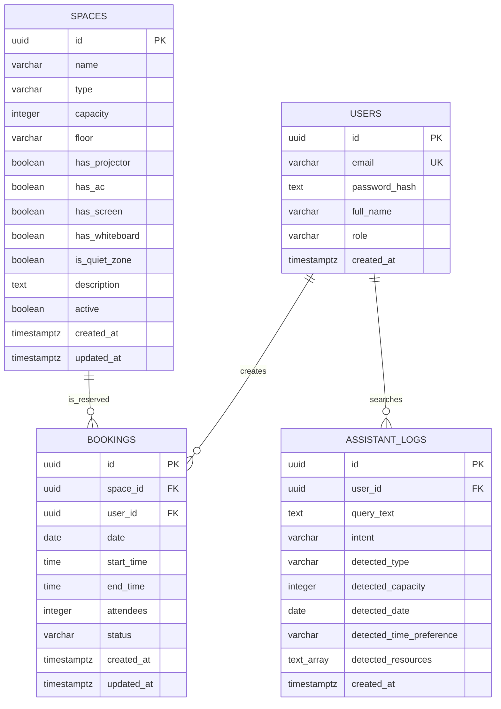

# OfficeSpace

**A HYBRID WORKPLACE SOLUTION**

OfficeSpace es una aplicacion web para gestionar espacios de oficina en entornos hibridos. El objetivo del producto no es solo reservar salas o escritorios, sino acompanar al colaborador con busqueda consultiva, reglas claras de disponibilidad, dashboard de negocio y un asistente interno llamado **Alpha Assistant**.

Frase de producto: **Reserva mejor. Ocupa mejor. Decide con datos.**

## Valor de negocio

OfficeSpace utiliza la fecha y hora actual del dispositivo para proponer automaticamente el siguiente horario valido de reserva. Esto reduce errores de captura, evita reservas en horarios invalidos y acelera el proceso para colaboradores en entornos hibridos. Ademas, el backend refuerza esta regla para garantizar consistencia temporal aunque el frontend sea manipulado.

## Problema de negocio

Las oficinas hibridas suelen tener baja visibilidad sobre ocupacion real, preferencias de uso y demanda por recursos como proyector, pantalla, pizarra o zonas silenciosas. Esto genera reservas manuales, espacios subutilizados y poca informacion para decidir como ajustar la capacidad de la oficina.

## Propuesta

OfficeSpace centraliza:

- Login con roles para administradores y colaboradores.
- Catalogo de salas, hot desks y espacios colaborativos.
- Busqueda de disponibilidad y reservas sin solapamiento.
- Dashboard de ocupacion y analitica.
- Alpha Assistant, un asistente basado en reglas que convierte lenguaje natural en filtros, busca espacios disponibles y permite reservar desde sugerencias.
- Registro de patrones de busqueda para analisis posterior en dashboard.

## Arquitectura

La solucion se organiza como microservicios reales con una base de datos PostgreSQL compartida para acelerar el desarrollo del hackathon y mantener una historia tecnica facil de defender:

- `auth-service`: login, perfil y JWT simple para sesion.
- `catalog-service`: administracion de espacios.
- `booking-service`: disponibilidad, reservas, dashboard y Alpha Assistant.
- `frontend`: interfaz web con HTML, CSS y JavaScript puro.
- `shared-infra`: scripts de base de datos y datos semilla.

Esta separacion permite evolucionar cada dominio sin mezclar responsabilidades, pero conserva una infraestructura simple para demo.

## Modelo de datos

El esquema logico esta documentado en [`docs/DATA_MODEL.md`](docs/DATA_MODEL.md). Incluye un diagrama ER en Mermaid con las entidades principales:

- `users`
- `spaces`
- `bookings`
- `assistant_logs`

Las relaciones centrales son:

- un usuario puede crear muchas reservas;
- un espacio puede tener muchas reservas;
- un usuario puede generar muchas busquedas registradas por Alpha Assistant.



## Stack tecnologico

- Frontend: HTML, CSS y JavaScript puro, sin React.
- Backend: Node.js con Express.
- Documentacion API: Swagger UI en cada servicio.
- Base de datos: PostgreSQL 16.
- Orquestacion local: Docker Compose.

## Levantar el proyecto

Desde la carpeta `officespace-advisor`:

```bash
docker compose up --build
```

URLs esperadas:

- Frontend: http://localhost:8080
- Auth service: http://localhost:3000/health
- Catalog service: http://localhost:3001/health
- Booking service: http://localhost:3002/health

Swagger:

- Auth Swagger: http://localhost:3000/api-docs
- Catalog Swagger: http://localhost:3001/api-docs
- Booking Swagger: http://localhost:3002/api-docs

## Credenciales de prueba

Administrador:

- Email: `admin@corporativoalpha.com`
- Password: `Admin123`
- Role: `ADMINISTRADOR`

Colaboradores:

- Email: `carlos.mendez@corporativoalpha.com`
- Password: `User123`
- Role: `COLABORADOR`

- Email: `ana.torres@corporativoalpha.com`
- Password: `User123`
- Role: `COLABORADOR`

## Estado actual

Esta version entrega un MVP funcional y defendible para el Escenario 1:

- Carpetas principales.
- Dockerfile por servicio.
- `docker-compose.yml`.
- PostgreSQL con tablas y datos semilla.
- Swagger UI interactivo por servicio.
- Endpoints `/health`.
- Auth funcional con `POST /login`, `GET /me`, JWT y validacion contra PostgreSQL.
- Middleware reutilizable para validar token y rol administrador.
- Catalogo funcional con `GET /spaces`, `GET /spaces/:id`, `POST /spaces`, `PUT /spaces/:id` y `DELETE /spaces/:id`.
- Filtros de espacios por tipo, capacidad minima, proyector, aire acondicionado, pantalla, pizarra y zona silenciosa.
- Control de roles en catalogo: colaboradores pueden consultar y solo administradores pueden crear, editar o eliminar.
- Motor de reservas con `GET /availability`, `POST /bookings`, `GET /bookings/my`, `DELETE /bookings/:id`, `GET /dashboard/today` y `GET /dashboard/analytics`.
- Validacion critica de no solapamiento por espacio: `new_start < existing_end AND new_end > existing_start`.
- Dashboard de ocupacion y analitica de reservas para administradores.
- Frontend funcional con login conectado, `localStorage`, redireccion por rol, busqueda de disponibilidad, confirmacion de reserva, mis reservas, dashboard, administracion de espacios y Alpha Assistant.
- Alpha Assistant funcional con interpretacion de lenguaje natural, filtros detectados, sugerencias reales de espacios disponibles, reserva desde sugerencias y registro en `assistant_logs`.

Nota de desarrollo local: si cambias el esquema de base de datos y necesitas reiniciar datos semilla desde cero, usa `docker compose down -v` antes de levantar nuevamente con `docker compose up --build`.

## Caracteristicas innovadoras

### Bot de sugerencias: Alpha Assistant

Alpha Assistant convierte consultas como "Necesito una sala para 5 personas manana en la manana con proyector" en filtros estructurados, consulta disponibilidad real y devuelve sugerencias concretas.

Esta innovacion se alinea con la opcion de **Bot de Sugerencias Inteligentes** del escenario:

- interpreta lenguaje natural en filtros de tipo, capacidad, fecha, horario y recursos;
- usa la misma logica de disponibilidad que el motor de reservas;
- excluye espacios con reservas `ACTIVE` solapadas;
- muestra tarjetas de espacios sugeridos en frontend;
- permite reservar directamente desde una sugerencia;
- registra busquedas en `assistant_logs` para analitica posterior.

Alcance defendible: el asistente recomienda espacios disponibles y reduce friccion de reserva. No implementa todavia optimizacion avanzada basada en historial individual, espacios menos utilizados u horarios de menor conflicto, por lo que se presenta como una version MVP integrada del bot.

### Panel de analisis para administradores

El dashboard de negocio usa reservas y busquedas del asistente para detectar demanda, recursos mas solicitados y patrones de ocupacion.

Esta innovacion se alinea con la opcion de **Panel de analisis** del escenario:

- ocupacion del dia y espacios disponibles;
- reservas totales y promedio de asistentes;
- espacios mas reservados;
- horarios pico;
- demanda por tipo de espacio;
- recursos mas solicitados por Alpha Assistant;
- busquedas recientes del asistente.

### Innovacion QA: CI/CD con pruebas automatizadas

El pipeline esta en [`.github/workflows/ci.yml`](.github/workflows/ci.yml). Se ejecuta en `push` y `pull_request`.

Esta innovacion se alinea con la opcion de **CI/CD con Pruebas Automatizadas** del escenario:

- instala dependencias de `auth-service`, `catalog-service` y `booking-service`;
- ejecuta `node --check` sobre los archivos JS de cada servicio;
- valida `docker compose config`;
- evita que errores de sintaxis o configuracion invalida lleguen a la rama principal de entrega.


## QA Strategy

La estrategia de QA esta documentada en [`docs/QA_STRATEGY.md`](docs/QA_STRATEGY.md). Cubre riesgos criticos del negocio, reglas de disponibilidad, autenticacion, permisos, dashboard, Alpha Assistant y el uso del "Buggy Controller" del reto como referencia de defectos prevenidos.

El punto mas critico es el motor de reservas, especialmente la regla de no solapamiento:

```text
new_start < existing_end AND new_end > existing_start
```

Esta regla permite reservas consecutivas y bloquea reservas que se cruzan en el mismo espacio.

## Casos de prueba

Los casos manuales estan en [`docs/TEST_CASES.md`](docs/TEST_CASES.md). Incluyen login, permisos, catalogo, reservas, capacidad, cancelaciones, dashboard y Alpha Assistant.

Casos clave:

- Login admin y colaborador.
- GET /spaces sin token debe devolver 401.
- POST /spaces como colaborador debe devolver 403.
- Reserva exitosa.
- Reserva solapada debe devolver 409.
- Reserva consecutiva debe permitirse.
- Alpha Assistant debe sugerir espacios disponibles y no recomendar espacios ocupados.
- Dashboard no debe estar disponible para colaboradores.

## Gherkin / BDD

Los escenarios BDD estan en [`docs/GHERKIN.md`](docs/GHERKIN.md). Estan escritos en espanol con formato Gherkin para expresar reglas de negocio de forma entendible por QA, desarrollo y stakeholders.

Incluyen escenarios para:

- rechazar reserva solapada;
- permitir reserva consecutiva;
- rechazar capacidad excedida;
- bloquear acciones admin a colaborador;
- reservar desde Alpha Assistant;
- ocultar Dashboard a usuarios no autenticados o colaboradores.

## Postman Collection

La coleccion basica de Postman esta en [`postman/OfficeSpace.postman_collection.json`](postman/OfficeSpace.postman_collection.json).

Variables incluidas:

- `baseAuthUrl = http://localhost:3000`
- `baseCatalogUrl = http://localhost:3001`
- `baseBookingUrl = http://localhost:3002`
- `token`
- `collaboratorToken`
- `spaceId`
- `bookingId`

La coleccion incluye requests para login, catalogo, disponibilidad, reservas, Alpha Assistant y dashboard analytics.

## CI/CD con GitHub Actions

El pipeline esta en [`.github/workflows/ci.yml`](.github/workflows/ci.yml). Se ejecuta en `push` y `pull_request`.

Validaciones incluidas:

- usar Node.js LTS;
- ejecutar `npm install` en `auth-service`, `catalog-service` y `booking-service`;
- ejecutar `node --check` sobre los archivos JS de cada servicio;
- ejecutar `docker compose config`.

Es un pipeline ligero y defendible para hackathon: previene errores de sintaxis, dependencias rotas y configuracion invalida de Compose sin levantar toda la aplicacion.

## Bugs prevenidos basados en Buggy Controller

El reporte de defectos prevenidos esta en [`docs/BUG_REPORT.md`](docs/BUG_REPORT.md). Documenta regresiones esperadas como:

- filtro de capacidad ignorado;
- solapamiento mal detectado;
- status code incorrecto ante conflicto;
- hora final menor que hora inicial;
- capacidad excedida;
- falta de autenticacion;
- cancelacion o eliminacion sin permisos.

Los estados usados son `Prevenido`, `Cubierto por prueba` y `No reproducido en version actual`.

## Validaciones basicas

Desde la carpeta `officespace-advisor`:

```bash
docker compose config
```

Validar sintaxis JS manualmente:

```bash
node --check auth-service/src/index.js
node --check catalog-service/src/index.js
node --check booking-service/src/index.js
```

Validar todos los JS de servicios en Linux/macOS o GitHub Actions:

```bash
find auth-service/src catalog-service/src booking-service/src -name "*.js" -print0 | xargs -0 -n1 node --check
```

Levantar la app para pruebas manuales:

```bash
docker compose up --build
```
