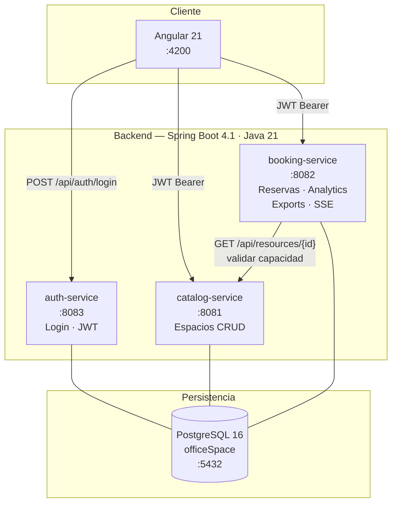

# OfficeSpace — Gestión Híbrida Inteligente

Sistema de reservas de espacios de trabajo para **Corporativo Alpha**. Permite a los colaboradores reservar salas y escritorios, y a los administradores gestionar el inventario y ver analíticas en tiempo real.

---

## Tabla de contenidos

1. [Requisitos previos](#requisitos-previos)
2. [Instalación y ejecución](#instalación-y-ejecución)
3. [Credenciales de prueba](#credenciales-de-prueba)
4. [Arquitectura del sistema](#arquitectura-del-sistema)
5. [Decisiones técnicas](#decisiones-técnicas)
6. [Documentación de API](#documentación-de-api)
7. [Guía de usuario](#guía-de-usuario)
8. [Pruebas](#pruebas)

---

## Requisitos previos

| Herramienta | Versión mínima | Uso |
|-------------|---------------|-----|
| [Docker](https://docs.docker.com/get-docker/) | 24+ | Contenedores de servicios y BD |
| [Docker Compose](https://docs.docker.com/compose/) | 2.20+ | Orquestación (incluido en Docker Desktop) |
| [Node.js](https://nodejs.org/) | 21+ | Solo si se corre el frontend fuera de Docker |
| [pnpm](https://pnpm.io/) | 9+ | Gestor de paquetes del frontend |
| Java 21 | 21+ | Solo si se corre el backend fuera de Docker |

> **Recomendado**: usar Docker Compose para levantar todo. No se necesita Node.js ni Java instalados localmente.

---

## Instalación y ejecución

### Opción A — Docker Compose (recomendada)

```bash
# 1. Clonar el repositorio
git clone <repo-url>
cd case1

# 2. Construir imágenes y levantar todos los servicios
docker compose up --build

# La primera vez toma ~3 min mientras descarga imágenes y compila los servicios.
# Una vez listo, verás: "Started BookingServiceApplication in X.XXX seconds"
```

Servicios disponibles tras el arranque:

| Servicio | URL |
|----------|-----|
| Frontend Angular | http://localhost:4200 |
| auth-service | http://localhost:8083 |
| catalog-service | http://localhost:8081 |
| booking-service | http://localhost:8082 |
| PostgreSQL | localhost:5433 |

#### Comandos útiles de Docker

```bash
# Levantar con imágenes ya construidas (más rápido)
docker compose up

# Ver logs de un servicio específico
docker compose logs -f booking-service

# Detener (conserva los datos)
docker compose down

# Detener y borrar todos los datos (base de datos limpia)
docker compose down -v

# Reconstruir solo un servicio
docker compose up --build booking-service
```

### Opción B — Ejecución local (sin Docker)

Requiere PostgreSQL 16 corriendo localmente:

```sql
-- Crear la base de datos
CREATE DATABASE "officeSpace";
```

Configurar las variables de entorno en cada servicio (o en `application.properties`):

```bash
export DB_URL=jdbc:postgresql://localhost:5432/officeSpace
export DB_USERNAME=postgres
export DB_PASSWORD=tu_contraseña
export JWT_SECRET=OiK5eUU+jUtW/q8GfEFa/yk0t3+6ggu0IvgpudoXQoBEUfBE13h1LRLzWbhtULLP9XWT3fIwkj3QIy2PrAB+Aw==
```

```bash
# Terminal 1 — auth-service
cd authService && ./mvnw spring-boot:run

# Terminal 2 — catalog-service
cd catalogService && ./mvnw spring-boot:run

# Terminal 3 — booking-service
cd bookingService && ./mvnw spring-boot:run

# Terminal 4 — Frontend Angular
cd officeSpace && pnpm install && pnpm start
```

---

## Credenciales de prueba

Los servicios ejecutan un **seeder automático** al primer arranque que crea estos usuarios y espacios de ejemplo.

### Usuarios

| Email | Contraseña | Rol |
|-------|------------|-----|
| `admin@corporativoalpha.com` | `Admin123` | `ADMIN` |
| `carlos.mendez@corporativoalpha.com` | `User123` | `COLLABORATOR` |
| `ana.torres@corporativoalpha.com` | `User123` | `COLLABORATOR` |

### Espacios de ejemplo (creados por el seeder)

- Sala de Juntas A (ROOM, cap. 10, Piso 1)
- Sala de Conferencias B (ROOM, cap. 20, Piso 2)
- Escritorio Colaborativo 01 (DESK, cap. 1, Planta Baja)
- Escritorio Colaborativo 02 (DESK, cap. 1, Planta Baja)

---

## Arquitectura del sistema



### Descripción de microservicios

| Servicio | Puerto | Responsabilidad |
|----------|--------|-----------------|
| `auth-service` | 8083 | Login, emisión y validación de JWT, seeder de usuarios |
| `catalog-service` | 8081 | CRUD de espacios (ROOM/DESK), soft-delete, filtros |
| `booking-service` | 8082 | Reservas, detección de solapamientos, analíticas, exportaciones, SSE |

---

## Decisiones técnicas

### ¿Por qué microservicios con base de datos compartida?

**Contexto del hackathon**: el tiempo disponible era limitado y el equipo era pequeño. Se eligió una arquitectura de microservicios **lógicamente separados pero con BD compartida** (shared database pattern) por las siguientes razones:

| Decisión | Justificación |
|----------|--------------|
| **Microservicios lógicos** | Separación de responsabilidades clara: auth no sabe de bookings, catalog no sabe de usuarios. Cada servicio tiene su propio dominio y puede evolucionar de forma independiente. |
| **Base de datos compartida** | Evita la complejidad operacional de múltiples bases de datos (backups, migraciones coordinadas, transacciones distribuidas) en un contexto de hackathon. En producción se separarían en esquemas o instancias distintas. |
| **JWT stateless** | Los 3 servicios validan el token localmente con el mismo `JWT_SECRET`. Elimina la dependencia en tiempo de request hacia `auth-service` — si cae auth, booking y catalog siguen funcionando para usuarios ya autenticados. |
| **Dual-ID pattern** | Cada entidad tiene un `id` interno (BIGSERIAL, usado en JOINs de JPA) y un `publicId` (UUID v4, expuesto en la API). Previene enumeración de IDs y desacopla la API del modelo interno. |
| **Soft delete en espacios** | Los espacios eliminados conservan el historial de reservas. Las reservas pasadas permanecen consultables aunque el espacio ya no exista. |
| **Una sola llamada inter-servicio** | `booking-service` consulta a `catalog-service` solo al crear una reserva (validación de capacidad). Se mantiene al mínimo para reducir latencia y acoplamiento. |

### Stack tecnológico

| Capa | Tecnología |
|------|-----------|
| Backend | Java 21 · Spring Boot 4.1.0 · Spring Security 7 · Spring Data JPA |
| Base de datos | PostgreSQL 16 · JSONB para features de espacios |
| Autenticación | JWT (jjwt 0.12.6) · roles `ADMIN` y `COLLABORATOR` |
| API docs | SpringDoc OpenAPI 2.8.9 (Swagger UI) |
| Frontend | Angular 21 · Standalone components · Tailwind CSS 4 · Signals |
| Testing backend | JUnit 5 · Mockito · H2 (modo PostgreSQL) |
| Testing frontend | Vitest · Angular Testing Utilities |
| Contenedores | Docker · Docker Compose |

---

## Documentación de API

### Swagger UI (interactiva)

| Servicio | Swagger UI |
|----------|-----------|
| auth-service | http://localhost:8083/swagger-ui.html |
| catalog-service | http://localhost:8081/swagger-ui.html |
| booking-service | http://localhost:8082/swagger-ui.html |

**Para probar endpoints protegidos en Swagger**: obtén el token con `POST /api/auth/login` → haz clic en **Authorize** → pega el token (sin el prefijo `Bearer`).

---

### auth-service · `localhost:8083`

#### `POST /api/auth/login` — Iniciar sesión

```bash
curl -s -X POST http://localhost:8083/api/auth/login \
  -H "Content-Type: application/json" \
  -d '{"email":"admin@corporativoalpha.com","password":"Admin123"}' | jq .
```

Respuesta:
```json
{
  "token": "eyJhbGciOiJIUzI1NiJ9...",
  "tokenType": "Bearer",
  "publicId": "550e8400-e29b-41d4-a716-446655440000",
  "email": "admin@corporativoalpha.com",
  "name": "Admin Alpha",
  "role": "ADMIN"
}
```

> Guarda el `token` para las peticiones siguientes: `export TOKEN=eyJhbGci...`

---

### catalog-service · `localhost:8081`

| Método | Endpoint | Acceso | Descripción |
|--------|----------|--------|-------------|
| GET | `/api/resources` | Público | Listar espacios activos |
| GET | `/api/resources/{publicId}` | Público | Detalle de un espacio |
| POST | `/api/resources` | ADMIN | Crear espacio |
| PUT | `/api/resources/{publicId}` | ADMIN | Actualizar espacio |
| DELETE | `/api/resources/{publicId}` | ADMIN | Desactivar espacio (soft delete) |
| POST | `/api/resources/import` | ADMIN | Importar espacios en bulk (JSON) |

#### Listar espacios con filtros

```bash
# Todos los espacios
curl http://localhost:8081/api/resources | jq .

# Solo salas con capacidad mínima de 8
curl "http://localhost:8081/api/resources?type=ROOM&minCapacity=8" | jq .
```

#### Crear un espacio (ADMIN)

```bash
curl -X POST http://localhost:8081/api/resources \
  -H "Authorization: Bearer $TOKEN" \
  -H "Content-Type: application/json" \
  -d '{
    "name": "Sala de Innovación",
    "type": "ROOM",
    "capacity": 12,
    "location": "Piso 3",
    "features": {
      "has_projector": true,
      "whiteboard": true,
      "monitors": 2
    }
  }' | jq .
```

---

### booking-service · `localhost:8082`

| Método | Endpoint | Acceso | Descripción |
|--------|----------|--------|-------------|
| POST | `/api/bookings` | Autenticado | Crear reserva |
| GET | `/api/bookings/my` | Autenticado | Mis reservas activas |
| GET | `/api/bookings/my/history` | Autenticado | Mi historial completo |
| DELETE | `/api/bookings/{publicId}` | Autenticado (dueño) | Cancelar propia reserva |
| DELETE | `/api/bookings/admin/{publicId}` | ADMIN | Cancelar cualquier reserva |
| GET | `/api/bookings/dashboard` | ADMIN | Todas las reservas del día |
| GET | `/api/bookings/history` | ADMIN | Historial global |
| GET | `/api/bookings/occupied` | Autenticado | IDs de espacios ocupados en un rango |
| GET | `/api/bookings/{publicId}/ical` | Autenticado | Descargar archivo .ics |
| GET | `/api/bookings/{publicId}/calendar-links` | Autenticado | Links Google/Outlook Calendar |
| GET | `/api/bookings/export/excel` | ADMIN | Exportar reservas a Excel (.xlsx) |
| GET | `/api/bookings/export/csv` | ADMIN | Exportar reservas a CSV |
| GET | `/api/notifications/subscribe` | Autenticado | Suscripción SSE (Server-Sent Events) |
| GET | `/api/analytics/dashboard` | ADMIN | KPIs y estadísticas |

#### Crear una reserva

```bash
curl -X POST http://localhost:8082/api/bookings \
  -H "Authorization: Bearer $TOKEN" \
  -H "Content-Type: application/json" \
  -d '{
    "spacePublicId": "uuid-del-espacio",
    "bookingDate": "2026-06-30",
    "startTime": "09:00",
    "endTime": "11:00",
    "attendees": 5,
    "notes": "Reunión de planificación sprint"
  }' | jq .
```

**Validaciones aplicadas al crear:**
- La fecha no puede ser pasada
- `endTime` debe ser posterior a `startTime`
- `attendees` no puede superar la capacidad del espacio
- No puede haber solapamiento de horario para el mismo espacio

#### Ver espacios ocupados (para filtrar disponibilidad)

```bash
curl "http://localhost:8082/api/bookings/occupied?date=2026-06-30&startTime=09:00&endTime=11:00" \
  -H "Authorization: Bearer $TOKEN" | jq .
```

#### Exportar historial a Excel

```bash
curl -OJ "http://localhost:8082/api/bookings/export/excel?from=2026-06-01&to=2026-06-30" \
  -H "Authorization: Bearer $TOKEN"
```

#### Analíticas (ADMIN)

```bash
curl http://localhost:8082/api/analytics/dashboard \
  -H "Authorization: Bearer $TOKEN" | jq .
```

---

## Guía de usuario

### Login

1. Navegar a http://localhost:4200
2. Ingresar email y contraseña (ver [credenciales de prueba](#credenciales-de-prueba))
3. Hacer clic en **Iniciar sesión**
4. El sistema redirige automáticamente:
   - Rol `ADMIN` → `/admin`
   - Rol `COLLABORATOR` → `/search`

> El botón **Usar demo** rellena automáticamente las credenciales de administrador.

---

### Buscar y reservar un espacio (Colaborador)

1. En la página **Buscar espacios** (`/search`):
   - Selecciona la **fecha** de la reserva
   - Selecciona la **hora de inicio** y **hora de fin**
   - Aplica filtros opcionales: tipo de espacio (Sala / Escritorio), capacidad mínima
   - Haz clic en **Buscar**

2. Los espacios se muestran como tarjetas:
   - **Verde** "Disponible" → se puede reservar
   - **Rojo** "Ocupado" → ya tiene una reserva en ese horario

3. Haz clic en **Reservar** en la tarjeta deseada

4. En el modal de reserva, completa:
   - Número de asistentes
   - Notas opcionales

5. Confirma la reserva

6. Recibirás una notificación en tiempo real (SSE) confirmando la reserva

---

### Ver mis reservas (Colaborador)

1. Navegar a **Mis reservas** (`/my-bookings`)
2. Pestaña **Activas**: reservas futuras con estado "Reservada" (azul)
3. Pestaña **Historial**: reservas pasadas y canceladas
4. Para cancelar una reserva activa futura: hacer clic en **Cancelar**

> Solo se puede cancelar reservas con fecha posterior a hoy. Las reservas del día actual no se pueden cancelar desde la interfaz.

---

### Administrar espacios y reservas (Admin)

La vista de administrador (`/admin`) tiene tres pestañas:

#### Pestaña "Reservas"

- Muestra todas las reservas del día actual
- Estado **"Reservada"** (azul) → tiene un usuario asignado, se puede cancelar
- Estado **"Disponible"** (verde) → cancelada, el espacio queda libre
- Estado **"Completada"** (gris) → ya ocurrió
- La columna **"Reservado por"** muestra nombre/email solo para reservas activas
- Botón **Cancelar** disponible solo para reservas en estado "Reservada"

#### Pestaña "Espacios"

- Lista todos los espacios con su estado (activo/inactivo)
- Crear nuevo espacio con el formulario lateral
- Editar o desactivar espacios existentes

#### Pestaña "Analíticas"

- KPIs: total de reservas, tasa de ocupación, espacios más populares
- Horas pico de uso
- Estadísticas por día de la semana

---

### Notificaciones en tiempo real (SSE)

El sistema envía notificaciones automáticas via Server-Sent Events:

| Evento | Cuándo |
|--------|--------|
| `booking_confirmed` | Al crear una reserva |
| `booking_cancelled` | Al cancelar una reserva |
| `space_released` | Cuando el admin cancela la reserva de otro usuario |
| `booking_reminder` | 15 minutos antes de que inicie una reserva |

Las notificaciones aparecen en la esquina superior de la pantalla con iconos de color según el tipo.

---

## Pruebas

### Tests de backend

```bash
# Ejecutar todos los tests de un servicio
cd authService && ./mvnw test
cd catalogService && ./mvnw test
cd bookingService && ./mvnw test

# Ejecutar una clase específica
cd bookingService && ./mvnw test -Dtest=BookingServiceTest

# Ejecutar un método específico
cd bookingService && ./mvnw test -Dtest=BookingServiceTest#shouldCreateBooking
```

| Servicio | Tests | Tipo |
|----------|-------|------|
| auth-service | 4 (3 unitarios + 1 contexto) | Mockito + H2 |
| catalog-service | 10 (9 unitarios + 1 contexto) | Mockito + H2 |
| booking-service | 14 (13 unitarios + 1 contexto) | Mockito + H2 |

### Tests de frontend

```bash
cd officeSpace

# Instalar dependencias (solo la primera vez)
pnpm install

# Ejecutar tests una vez
pnpm test

# Ejecutar tests en modo watch
pnpm test --watch
```

Resultado esperado: **104 tests pasando** en ~2.7 segundos (Vitest).

### Documentos de casos de prueba

| Documento | Descripción |
|-----------|-------------|
| [`TEST_CASES.md`](./TEST_CASES.md) | Casos de prueba para las APIs (curl, Postman) |
| [`UI_TEST_CASES.md`](./UI_TEST_CASES.md) | 21 casos de prueba manuales de la interfaz + 12 escenarios Gherkin BDD |

### Roles y permisos

| Permiso | ADMIN | COLLABORATOR |
|---------|-------|--------------|
| Ver espacios | ✅ | ✅ |
| Gestionar espacios (CRUD) | ✅ | ❌ |
| Crear reservas | ✅ | ✅ |
| Ver propias reservas | ✅ | ✅ |
| Cancelar propias reservas (futuras) | ✅ | ✅ |
| Cancelar cualquier reserva | ✅ | ❌ |
| Dashboard de reservas del día | ✅ | ❌ |
| Analíticas | ✅ | ❌ |
| Exportar a Excel/CSV | ✅ | ❌ |
