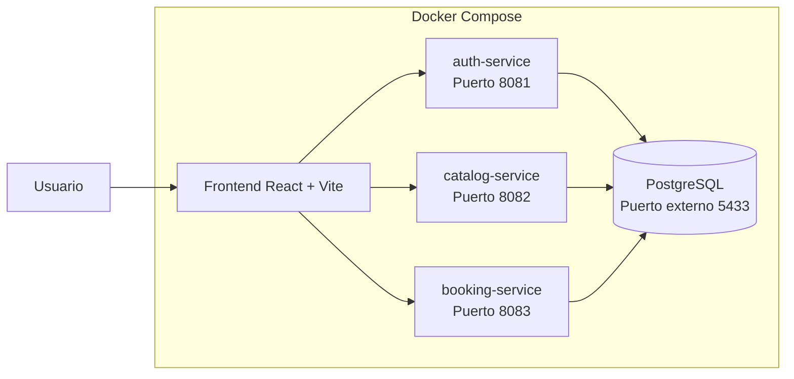

# OfficeSpace: Gestión Híbrida Inteligente

Aplicación web desarrollada para **Corporativo Alpha**, una empresa que está migrando a un modelo híbrido de trabajo presencial/remoto.

El sistema reemplaza un Excel compartido usado para reservar salas de juntas y escritorios tipo **hot desk**. El objetivo del MVP es evitar duplicidad de reservas, mejorar la visibilidad de espacios disponibles, controlar permisos por rol y permitir una administración básica de espacios y reservas.

---

## 1. Descripción del proyecto

**OfficeSpace** permite gestionar:

* Autenticación con JWT.
* Roles de usuario:

    * `ADMINISTRADOR`
    * `COLABORADOR`
* CRUD de espacios físicos.
* Activación y desactivación lógica de espacios.
* Búsqueda de espacios disponibles por fecha, horario, tipo y capacidad.
* Creación de reservas.
* Validación de reservas sin solapamiento.
* Validación de capacidad.
* Cancelación lógica de reservas futuras.
* Vista de reservas personales para colaboradores.
* Vista global de reservas para administradores.
* Dashboard diario para administrador.
* Dashboard personal para colaboradores.
* Documentación Swagger/OpenAPI.
* Ejecución completa con Docker Compose.

---

## 2. Arquitectura general

El sistema está construido con una arquitectura de **microservicios con base de datos compartida**.



---

## 3. Servicios del sistema

| Servicio          |                          Puerto | Responsabilidad                                            |
| ----------------- | ------------------------------: | ---------------------------------------------------------- |
| `frontend`        |                          `5173` | Aplicación web React                                       |
| `auth-service`    |                          `8081` | Login, generación de JWT y consulta de usuario autenticado |
| `catalog-service` |                          `8082` | Gestión de espacios físicos                                |
| `booking-service` |                          `8083` | Gestión de reservas, cancelaciones y dashboards            |
| `postgres`        | `5433` externo / `5432` interno | Base de datos compartida                                   |

---

## 4. Stack tecnológico

### Backend

* Java 17
* Spring Boot 3.5.x
* Spring Web
* Spring Security
* JWT con `com.auth0:java-jwt`
* Spring Data JPA
* Hibernate
* PostgreSQL 15
* Jakarta Validation
* Lombok
* Springdoc OpenAPI
* Maven

### Frontend

* React
* Vite
* JavaScript
* React Router DOM
* Fetch API
* LocalStorage para manejo de sesión

### Infraestructura

* Docker
* Docker Compose
* PostgreSQL compartido
* Dockerfile por microservicio

---

## 5. Estructura del proyecto

```text
officespace-started-2026/
│
├── auth-service/
│   ├── Dockerfile
│   ├── pom.xml
│   └── src/
│
├── catalog-service/
│   ├── Dockerfile
│   ├── pom.xml
│   └── src/
│
├── booking-service/
│   ├── Dockerfile
│   ├── pom.xml
│   └── src/
│
├── frontend/
│   ├── Dockerfile
│   ├── package.json
│   ├── public/
│   └── src/
│       ├── components/
│       ├── pages/
│       ├── services/
│       └── utils/
│
├── shared-infra/
│   └── init-db.sql
│
├── docs/
│   ├── ARCHITECTURE.md
│   ├── API_CONTRACT.md
│   ├── TEST_CASES.md
│   └── BUG_REPORT.md
│
├── docker-compose.yml
├── .env
└── README.md
```

---

## 6. Requisitos previos

Antes de ejecutar el proyecto, el equipo del tester debe tener instalado:

1. **Docker Desktop**
2. **Git**
3. Navegador web moderno:

    * Chrome
    * Edge
    * Firefox
4. Opcional para desarrollo local:

    * Java 17
    * Maven
    * Node.js 20+
    * IntelliJ IDEA
    * Insomnia o Postman

Para la ejecución recomendada con Docker Compose, no es necesario abrir IntelliJ ni ejecutar manualmente los servicios.

---

## 7. Variables de entorno

En la raíz del proyecto debe existir un archivo llamado:

```text
.env
```

Contenido esperado:

```env
OFFICESPACE_DB_NAME=officespace_db
OFFICESPACE_DB_USER=officespace_user
OFFICESPACE_DB_PASSWORD=officespace_password
OFFICESPACE_DB_PORT=5433

JWT_SECRET=officespace-secret-key-2026
JWT_ISSUER=officespace
```

Estas variables son usadas por `docker-compose.yml` para levantar PostgreSQL y los microservicios.

---

## 8. Ejecución recomendada con Docker Compose

### 8.1. Clonar el proyecto

```bash
git clone [URL_DEL_REPOSITORIO]
cd officespace-started-2026
```

Si la carpeta del proyecto tiene otro nombre, entrar a la carpeta raíz donde está el archivo `docker-compose.yml`.

---

### 8.2. Verificar que Docker Desktop esté corriendo

Abrir Docker Desktop y confirmar que aparezca:

```text
Engine running
```

También puede validarse desde terminal:

```bash
docker ps
```

Debe aparecer una tabla de contenedores. Puede estar vacía, pero no debe mostrar error de conexión al motor de Docker.

---

### 8.3. Levantar el proyecto completo

Desde la raíz del proyecto:

```bash
docker compose up --build
```

La primera ejecución puede tardar varios minutos porque Docker debe:

* Descargar imágenes base.
* Construir los microservicios.
* Instalar dependencias del frontend.
* Inicializar PostgreSQL.
* Ejecutar el script `shared-infra/init-db.sql`.

---

### 8.4. Ejecución en segundo plano

Cuando ya se haya verificado que todo funciona, también puede ejecutarse en segundo plano:

```bash
docker compose up --build -d
```

Para ver los contenedores activos:

```bash
docker ps
```

Resultado esperado:

```text
officespace-postgres
officespace-auth-service
officespace-catalog-service
officespace-booking-service
officespace-frontend
```

---

### 8.5. Detener el proyecto

```bash
docker compose down
```

---

### 8.6. Reiniciar desde cero borrando la base de datos

Usar este comando cuando se quiera recrear la base desde `init-db.sql`:

```bash
docker compose down -v --remove-orphans
docker compose up --build
```

El parámetro `-v` elimina el volumen de PostgreSQL. Esto borra reservas, espacios creados manualmente y cualquier dato de prueba posterior.

---

## 9. URLs locales

| Componente      | URL                   |
| --------------- | --------------------- |
| Frontend        | http://localhost:5173 |
| Auth Service    | http://localhost:8081 |
| Catalog Service | http://localhost:8082 |
| Booking Service | http://localhost:8083 |
| PostgreSQL      | localhost:5433        |

---

## 10. Swagger / OpenAPI

Cada microservicio expone documentación Swagger.

| Servicio        | Swagger UI                            | OpenAPI JSON                      |
| --------------- | ------------------------------------- | --------------------------------- |
| Auth Service    | http://localhost:8081/swagger-ui.html | http://localhost:8081/v3/api-docs |
| Catalog Service | http://localhost:8082/swagger-ui.html | http://localhost:8082/v3/api-docs |
| Booking Service | http://localhost:8083/swagger-ui.html | http://localhost:8083/v3/api-docs |

Si Swagger carga la interfaz, pero muestra:

```text
Failed to load API definition
```

verificar directamente:

```text
http://localhost:8081/v3/api-docs
http://localhost:8082/v3/api-docs
http://localhost:8083/v3/api-docs
```

Debe mostrarse un JSON OpenAPI.

---

## 11. Credenciales de prueba

### Administrador

```text
Email: admin@corporativoalpha.com
Password: Admin123
Rol: ADMINISTRADOR
```

### Colaborador 1

```text
Email: carlos.mendez@corporativoalpha.com
Password: User123
Rol: COLABORADOR
```

### Colaborador 2

```text
Email: ana.torres@corporativoalpha.com
Password: User123
Rol: COLABORADOR
```

---

## 12. Base de datos

El sistema usa PostgreSQL.

Base de datos:

```text
officespace_db
```

Usuario:

```text
officespace_user
```

Contraseña:

```text
officespace_password
```

Puerto externo:

```text
5433
```

Puerto interno del contenedor:

```text
5432
```

Tablas principales:

```text
users
spaces
bookings
```

---

## 13. Modelo de datos principal

### users

| Campo        | Descripción                      |
| ------------ | -------------------------------- |
| `id`         | Identificador del usuario        |
| `name`       | Nombre del usuario               |
| `email`      | Correo único                     |
| `password`   | Contraseña hasheada              |
| `role`       | `ADMINISTRADOR` o `COLABORADOR`  |
| `active`     | Indica si el usuario está activo |
| `created_at` | Fecha de creación                |
| `updated_at` | Fecha de actualización           |

### spaces

| Campo                  | Descripción                             |
| ---------------------- | --------------------------------------- |
| `id`                   | Identificador del espacio               |
| `name`                 | Nombre del espacio                      |
| `type`                 | `SALA_JUNTAS` o `ESCRITORIO_INDIVIDUAL` |
| `capacity`             | Capacidad máxima                        |
| `floor`                | Piso                                    |
| `location`             | Ubicación física                        |
| `has_projector`        | Tiene proyector                         |
| `has_air_conditioning` | Tiene aire acondicionado                |
| `has_whiteboard`       | Tiene pizarra                           |
| `has_monitor`          | Tiene monitor                           |
| `other_resources`      | Recursos adicionales                    |
| `status`               | `ACTIVO` o `INACTIVO`                   |

### bookings

| Campo          | Descripción                          |
| -------------- | ------------------------------------ |
| `id`           | Identificador de reserva             |
| `user_id`      | Usuario que creó la reserva          |
| `space_id`     | Espacio reservado                    |
| `booking_date` | Fecha de la reserva                  |
| `start_time`   | Hora de inicio                       |
| `end_time`     | Hora de fin                          |
| `attendees`    | Número de asistentes                 |
| `status`       | `ACTIVA`, `CANCELADA` o `FINALIZADA` |
| `created_at`   | Fecha de creación                    |
| `updated_at`   | Fecha de actualización               |

---

## 14. Reglas de negocio implementadas

### Autenticación

* El usuario debe iniciar sesión.
* El login genera un JWT.
* Los endpoints protegidos requieren token.
* Los endpoints administrativos requieren rol `ADMINISTRADOR`.

### Espacios

* El administrador puede crear espacios.
* El administrador puede desactivar espacios.
* El administrador puede reactivar espacios.
* Los espacios inactivos no deben aparecer como disponibles para reserva.
* Los colaboradores pueden consultar espacios disponibles.

### Reservas

* Un usuario autenticado puede crear reservas.
* Un colaborador puede ver sus propias reservas.
* Un administrador puede ver todas las reservas.
* Una reserva se cancela lógicamente cambiando su estado a `CANCELADA`.
* No se borra físicamente una reserva.

### Validación de solapamiento

Una reserva nueva se considera solapada si:

```text
nuevaInicio < existenteFin && nuevaFin > existenteInicio
```

Esto implementa intervalos semiabiertos:

```text
[inicio, fin)
```

Por lo tanto:

| Reserva existente | Nueva reserva | Resultado |
| ----------------- | ------------- | --------- |
| 09:00 - 10:00     | 09:30 - 10:30 | Rechazada |
| 09:00 - 10:00     | 08:30 - 09:30 | Rechazada |
| 09:00 - 10:00     | 09:15 - 09:45 | Rechazada |
| 09:00 - 10:00     | 10:00 - 11:00 | Permitida |
| 09:00 - 10:00     | 08:00 - 09:00 | Permitida |

### Validación temporal

* No se permiten reservas en el pasado.
* La hora de fin debe ser mayor que la hora de inicio.
* No se permiten reservas de duración cero.
* Se usan `LocalDate` y `LocalTime`, no comparación de strings.

### Validación de capacidad

* No se permite reservar un espacio para más asistentes que su capacidad.
* Si `attendees > capacity`, el backend responde `400 Bad Request`.

---

## 15. Endpoints principales

### Auth Service

Base URL:

```text
http://localhost:8081
```

| Método | Endpoint      | Rol         | Descripción                     |
| ------ | ------------- | ----------- | ------------------------------- |
| POST   | `/auth/login` | Público     | Inicia sesión                   |
| GET    | `/auth/me`    | Autenticado | Devuelve el usuario autenticado |

Ejemplo login:

```http
POST /auth/login
Content-Type: application/json
```

```json
{
  "email": "admin@corporativoalpha.com",
  "password": "Admin123"
}
```

Respuesta esperada:

```json
{
  "token": "jwt-token",
  "user": {
    "id": 1,
    "email": "admin@corporativoalpha.com",
    "name": "Administrador",
    "role": "ADMINISTRADOR"
  }
}
```

---

### Catalog Service

Base URL:

```text
http://localhost:8082
```

| Método | Endpoint            | Rol           | Descripción                   |
| ------ | ------------------- | ------------- | ----------------------------- |
| GET    | `/spaces`           | Autenticado   | Lista espacios                |
| GET    | `/spaces/{id}`      | Autenticado   | Consulta espacio por ID       |
| POST   | `/spaces`           | ADMINISTRADOR | Crea espacio                  |
| PUT    | `/spaces/{id}`      | ADMINISTRADOR | Actualiza espacio             |
| DELETE | `/spaces/{id}`      | ADMINISTRADOR | Desactiva espacio             |
| GET    | `/spaces/available` | Autenticado   | Consulta espacios disponibles |

Ejemplo búsqueda de disponibles:

```text
GET /spaces/available?date=2026-07-01&startTime=09:00&endTime=10:00&type=SALA_JUNTAS&minCapacity=4
```

---

### Booking Service

Base URL:

```text
http://localhost:8083
```

| Método | Endpoint                    | Rol           | Descripción            |
| ------ | --------------------------- | ------------- | ---------------------- |
| POST   | `/bookings`                 | Autenticado   | Crea reserva           |
| GET    | `/bookings/my`              | Autenticado   | Reservas propias       |
| GET    | `/bookings/my/dashboard`    | Autenticado   | Dashboard personal     |
| GET    | `/bookings`                 | ADMINISTRADOR | Todas las reservas     |
| GET    | `/bookings/today`           | ADMINISTRADOR | Reservas del día       |
| GET    | `/bookings/today/dashboard` | ADMINISTRADOR | Dashboard del día      |
| DELETE | `/bookings/{id}`            | Autenticado   | Cancela reserva futura |

Ejemplo creación de reserva:

```http
POST /bookings
Authorization: Bearer jwt-token
Content-Type: application/json
```

```json
{
  "spaceId": 101,
  "date": "2026-07-01",
  "startTime": "09:00",
  "endTime": "10:00",
  "attendees": 4
}
```

---

## 16. Códigos HTTP esperados

|                      Código | Uso                                   |
| --------------------------: | ------------------------------------- |
|                    `200 OK` | Consultas exitosas                    |
|               `201 Created` | Creación exitosa                      |
|            `204 No Content` | Cancelación o desactivación exitosa   |
|           `400 Bad Request` | Datos inválidos                       |
|          `401 Unauthorized` | Token ausente, inválido o expirado    |
|             `403 Forbidden` | El rol no tiene permisos              |
|             `404 Not Found` | Recurso inexistente                   |
|              `409 Conflict` | Conflicto de reserva por solapamiento |
| `500 Internal Server Error` | Error inesperado                      |

---

## 17. Formato de errores

Los errores se devuelven con estructura JSON consistente:

```json
{
  "timestamp": "2026-07-01T10:00:00",
  "status": 409,
  "error": "Conflict",
  "message": "El espacio ya está ocupado en ese horario",
  "path": "/bookings"
}
```

---

## 18. Guía de uso en frontend

Abrir:

```text
http://localhost:5173
```

### Login como administrador

1. Ingresar:

   ```text
   admin@corporativoalpha.com
   Admin123
   ```
2. El sistema redirige al panel de administración.
3. El administrador puede:

    * Ver dashboard del día.
    * Crear espacios.
    * Desactivar espacios.
    * Activar espacios.
    * Ver todas las reservas.
    * Cancelar reservas activas futuras.

### Login como colaborador

1. Ingresar:

   ```text
   carlos.mendez@corporativoalpha.com
   User123
   ```
2. El sistema redirige al buscador de espacios.
3. El colaborador puede:

    * Buscar espacios disponibles.
    * Crear reservas.
    * Ver sus reservas.
    * Ver su dashboard personal.
    * Cancelar sus propias reservas activas futuras.

---

## 19. Flujo recomendado de prueba para tester

### Flujo 1: Login administrador

1. Abrir `http://localhost:5173`.
2. Iniciar sesión con:

   ```text
   admin@corporativoalpha.com / Admin123
   ```
3. Resultado esperado:

    * Redirección a `/admin`.
    * Se muestra el panel de administración.

---

### Flujo 2: Crear espacio

1. Iniciar sesión como administrador.
2. Ir a `/admin`.
3. En el formulario “Crear espacio”, ingresar:

   ```text
   Nombre: Sala QA
   Tipo: Sala de juntas
   Capacidad: 4
   Piso: 1
   Ubicación: Edificio A - Piso 1
   ```
4. Presionar “Crear espacio”.
5. Resultado esperado:

    * Mensaje “Espacio creado correctamente”.
    * El espacio aparece en la tabla.

---

### Flujo 3: Desactivar y activar espacio

1. En `/admin`, ubicar un espacio activo.
2. Presionar “Desactivar”.
3. Resultado esperado:

    * Estado cambia a `INACTIVO`.
    * Botón cambia a “Activar”.
4. Presionar “Activar”.
5. Resultado esperado:

    * Estado cambia a `ACTIVO`.

---

### Flujo 4: Login colaborador

1. Cerrar sesión.
2. Iniciar sesión con:

   ```text
   carlos.mendez@corporativoalpha.com / User123
   ```
3. Resultado esperado:

    * Redirección a `/spaces`.
    * No debe aparecer el enlace “Administración”.

---

### Flujo 5: Buscar espacios disponibles

1. Iniciar sesión como colaborador.
2. Ir a “Buscar espacios”.
3. Ingresar:

   ```text
   Fecha: 2026-07-10
   Inicio: 09:00
   Fin: 10:00
   Tipo: Sala de juntas
   Capacidad mínima: 4
   Asistentes: 4
   ```
4. Presionar “Buscar”.
5. Resultado esperado:

    * Lista de espacios disponibles.

---

### Flujo 6: Crear reserva correcta

1. Después de buscar espacios disponibles, presionar “Reservar” sobre un espacio.
2. Resultado esperado:

    * Mensaje “Reserva creada correctamente”.
    * La reserva aparece en “Mis reservas”.

---

### Flujo 7: Reserva solapada

1. Crear una reserva:

   ```text
   Fecha: 2026-07-10
   Inicio: 09:00
   Fin: 10:00
   ```
2. Intentar crear otra reserva para el mismo espacio:

   ```text
   Fecha: 2026-07-10
   Inicio: 09:30
   Fin: 10:30
   ```
3. Resultado esperado:

    * Error `409 Conflict`.
    * Mensaje: “El espacio ya está ocupado en ese horario”.

---

### Flujo 8: Reserva consecutiva permitida

1. Crear una reserva:

   ```text
   09:00 - 10:00
   ```
2. Crear otra reserva para el mismo espacio:

   ```text
   10:00 - 11:00
   ```
3. Resultado esperado:

    * La segunda reserva se crea correctamente.

---

### Flujo 9: Capacidad excedida

1. Buscar o seleccionar un espacio con capacidad menor a los asistentes.
2. Intentar reservar, por ejemplo:

   ```text
   Capacidad del espacio: 4
   Asistentes solicitados: 6
   ```
3. Resultado esperado:

    * Error `400 Bad Request`.
    * Mensaje: “El número de asistentes excede la capacidad del espacio”.

---

### Flujo 10: Cancelar reserva propia

1. Iniciar sesión como colaborador.
2. Ir a “Mis reservas”.
3. Presionar “Cancelar” en una reserva activa futura.
4. Resultado esperado:

    * Estado cambia a `CANCELADA`.

---

### Flujo 11: Acceso no autorizado a administración

1. Iniciar sesión como colaborador.
2. Escribir manualmente:

   ```text
   http://localhost:5173/admin
   ```
3. Resultado esperado:

    * El sistema redirige a `/spaces`.

---

### Flujo 12: Ver todas las reservas como administrador

1. Iniciar sesión como administrador.
2. Ir a “Mis reservas”.
3. Resultado esperado:

    * La pantalla muestra el título “Todas las reservas”.
    * Se muestran reservas de todos los colaboradores.

---

## 20. Pruebas rápidas con Insomnia o Postman

### Login

```http
POST http://localhost:8081/auth/login
Content-Type: application/json
```

```json
{
  "email": "admin@corporativoalpha.com",
  "password": "Admin123"
}
```

### Crear reserva

```http
POST http://localhost:8083/bookings
Authorization: Bearer TOKEN
Content-Type: application/json
```

```json
{
  "spaceId": 101,
  "date": "2026-07-01",
  "startTime": "09:00",
  "endTime": "10:00",
  "attendees": 4
}
```

### Ver reservas propias

```http
GET http://localhost:8083/bookings/my
Authorization: Bearer TOKEN
```

### Cancelar reserva

```http
DELETE http://localhost:8083/bookings/1
Authorization: Bearer TOKEN
```

---

## 21. Modo desarrollo local opcional

Además de Docker Compose completo, se puede ejecutar en modo desarrollo.

### 21.1. Levantar solo PostgreSQL

```bash
docker compose up -d postgres
```

### 21.2. Ejecutar microservicios desde IntelliJ

Ejecutar manualmente:

```text
AuthServiceApplication
CatalogServiceApplication
BookingServiceApplication
```

Puertos esperados:

```text
auth-service: 8081
catalog-service: 8082
booking-service: 8083
```

### 21.3. Ejecutar frontend local

```bash
cd frontend
npm install
npm run dev
```

URL:

```text
http://localhost:5173
```

---

## 22. Solución de problemas comunes

### Problema: Docker no responde

Error típico:

```text
failed to connect to the docker API
```

Solución:

1. Abrir Docker Desktop.
2. Esperar a que diga `Engine running`.
3. Ejecutar:

   ```bash
   docker ps
   ```

---

### Problema: contraseña de PostgreSQL incorrecta

Error típico:

```text
password authentication failed for user "officespace_user"
```

Solución:

```bash
docker compose down -v --remove-orphans
docker compose up --build
```

Esto recrea PostgreSQL desde cero.

---

### Problema: el frontend muestra “Token inválido o expirado”

Solución:

1. Abrir navegador.
2. Presionar `F12`.
3. Ir a Console.
4. Ejecutar:

   ```javascript
   localStorage.clear()
   ```
5. Recargar la página.
6. Iniciar sesión de nuevo.

---

### Problema: Swagger muestra “Failed to load API definition”

Verificar primero:

```text
http://localhost:8081/v3/api-docs
http://localhost:8082/v3/api-docs
http://localhost:8083/v3/api-docs
```

Si esos endpoints no devuelven JSON, revisar que el microservicio correspondiente esté corriendo.

---

### Problema: puerto ocupado

Puertos usados por el sistema:

```text
5173
8081
8082
8083
5433
```

Verificar procesos activos o detener contenedores:

```bash
docker compose down
```

---

## 23. Comandos útiles

### Ver contenedores activos

```bash
docker ps
```

### Ver logs de PostgreSQL

```bash
docker logs officespace-postgres
```

### Ver logs del auth-service

```bash
docker logs officespace-auth-service
```

### Ver logs del catalog-service

```bash
docker logs officespace-catalog-service
```

### Ver logs del booking-service

```bash
docker logs officespace-booking-service
```

### Ver logs del frontend

```bash
docker logs officespace-frontend
```

### Reconstruir todo desde cero

```bash
docker compose down -v --remove-orphans
docker compose up --build
```

---

## 24. Estado actual del MVP

El MVP cumple con:

* Login con JWT.
* Roles `ADMINISTRADOR` y `COLABORADOR`.
* CRUD básico de espacios.
* Activación y desactivación de espacios.
* Búsqueda de espacios disponibles.
* Reservas sin solapamiento.
* Reservas consecutivas permitidas.
* Validación de capacidad.
* Validación de fechas pasadas.
* Cancelación lógica.
* Vista “Mis reservas”.
* Vista “Todas las reservas” para administrador.
* Dashboard administrador del día.
* Dashboard personal del colaborador.
* Swagger por microservicio.
* Docker Compose.
* Frontend funcional.

---

## 25. Limitaciones conocidas del MVP

* No incluye registro de usuarios.
* No incluye recuperación de contraseña.
* No incluye notificaciones por correo.
* No incluye despliegue en nube.
* No incluye API Gateway.
* No incluye descubrimiento de servicios.
* No incluye refresh token.
* No incluye paginación avanzada.
* No incluye calendario visual.
* No incluye edición completa de reservas desde frontend.

Estas limitaciones son aceptables para un MVP académico/hackathon y no afectan el flujo principal de reserva de espacios.

---

## 26. Próximas mejoras sugeridas

* Agregar calendario visual.
* Agregar edición de reservas.
* Agregar filtros avanzados en administrador.
* Agregar métricas de ocupación por espacio.
* Agregar horarios pico.
* Agregar tasa de cancelaciones.
* Agregar pruebas automatizadas con JUnit, MockMvc y Testcontainers.
* Agregar colección Postman o Insomnia exportable.
* Agregar API Gateway si el proyecto evoluciona.

---

## 27. Guion breve para demo funcional

1. Abrir el frontend.
2. Iniciar sesión como administrador.
3. Mostrar dashboard admin.
4. Crear un espacio.
5. Desactivar y reactivar un espacio.
6. Cerrar sesión.
7. Iniciar sesión como colaborador.
8. Buscar espacio disponible.
9. Crear reserva.
10. Mostrar “Mis reservas”.
11. Cancelar reserva.
12. Volver como administrador y mostrar todas las reservas.

---

## 28. Contacto del proyecto

Proyecto académico/hackathon:

```text
OfficeSpace: Gestión Híbrida Inteligente
Corporativo Alpha
```
