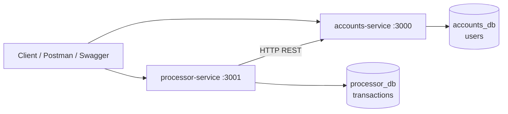

# NeoWallet P2P Payments

API-first fintech MVP for secure peer-to-peer payments

**Cliente:** FastPay

**Frase de producto:** Enviar dinero rapido es importante. No perder dinero es obligatorio.

## Problema de negocio

FastPay necesita un MVP de wallet P2P donde usuarios registrados puedan consultar saldo, recargar saldo de forma simulada, enviar dinero a otros usuarios y consultar historial de transacciones. En un producto fintech, la experiencia rapida importa, pero la confianza financiera importa mas: una transferencia nunca debe perder, crear, duplicar ni destruir dinero.

## Propuesta de valor

NeoWallet centraliza operaciones de saldo y transferencias P2P con trazabilidad, idempotencia, compensacion tipo Saga y auditoria. El MVP esta disenado para demostrar consistencia financiera, resiliencia ante reintentos y visibilidad operativa sin depender de frontend, KYC o procesadores externos.

## Regla critica

No se puede perder, crear, duplicar ni destruir dinero durante una transferencia P2P.

## Arquitectura

NeoWallet usa microservicios ligeros con persistencia separada por dominio:

- `accounts-service`: usuarios, balances, recargas simuladas y operaciones internas de debito/credito.
- `processor-service`: transferencias P2P, historial, idempotencia, compensacion, auditoria y reconciliacion.
- `accounts-db`: PostgreSQL para la tabla `users`.
- `processor-db`: PostgreSQL para la tabla `transactions`.
- Comunicacion HTTP/REST entre servicios.
- Docker Compose para levantar todo localmente.
- Swagger/OpenAPI y Postman para exploracion y pruebas API.



## Por que dos bases de datos

`accounts_db` y `processor_db` separan el dominio de cuentas del dominio de transacciones. Esto simula un patron real de microservicios: cada servicio posee sus datos, evita acoplamiento directo entre tablas y obliga a que las operaciones distribuidas se manejen con HTTP, estados, idempotencia y compensacion.

## Stack tecnologico

- Node.js
- Express
- PostgreSQL
- Docker Compose
- Swagger/OpenAPI
- Postman
- GitHub Actions
- `node:test`

## Como ejecutar

```bash
docker compose up --build
```

Ejecucion limpia desde cero:

```bash
docker compose down -v
docker compose up --build
```

## URLs

- Accounts health: `http://localhost:3000/health`
- Processor health: `http://localhost:3001/health`
- Accounts Swagger: `http://localhost:3000/api-docs`
- Processor Swagger: `http://localhost:3001/api-docs`

## Datos semilla

| Usuario | id | email | balance |
| --- | --- | --- | --- |
| Usuario A (Rico) | 1 | usuario.a@neowallet.com | 1000.00 |
| Usuario B (Pobre) | 2 | usuario.b@neowallet.com | 50.00 |
| Usuario C (Nuevo) | 3 | usuario.c@neowallet.com | 0.00 |

Total esperado del sistema: `1050.00`.

## Endpoints principales

### accounts-service

- `GET /accounts/:id`
- `POST /api/recharge`
- `POST /accounts/update-balance`

### processor-service

- `POST /api/transfer`
- `GET /api/transactions/:user_id`
- `GET /api/audit/money-conservation`
- `GET /api/audit/reconciliation`

## Ejemplos con curl

Consultar saldo:

```bash
curl http://localhost:3000/accounts/1
```

Recargar saldo:

```bash
curl -X POST http://localhost:3000/api/recharge \
  -H "Content-Type: application/json" \
  -d "{\"user_id\":1,\"amount\":150.50,\"payment_method\":\"SIMULATED_CARD\"}"
```

Transferencia exitosa:

```bash
curl -X POST http://localhost:3001/api/transfer \
  -H "Content-Type: application/json" \
  -d "{\"sender_id\":1,\"receiver_id\":2,\"amount\":100.00}"
```

Replay idempotente:

```bash
curl -X POST http://localhost:3001/api/transfer \
  -H "Content-Type: application/json" \
  -H "X-Idempotency-Key: idem-001" \
  -d "{\"sender_id\":1,\"receiver_id\":2,\"amount\":25.00}"

curl -X POST http://localhost:3001/api/transfer \
  -H "Content-Type: application/json" \
  -H "X-Idempotency-Key: idem-001" \
  -d "{\"sender_id\":1,\"receiver_id\":2,\"amount\":25.00}"
```

El segundo intento debe devolver `idempotent_replay: true`.

Fallo simulado con rollback:

```bash
curl -X POST http://localhost:3001/api/transfer \
  -H "Content-Type: application/json" \
  -H "X-Simulate-Credit-Failure: true" \
  -d "{\"sender_id\":1,\"receiver_id\":2,\"amount\":10.00}"
```

Historial:

```bash
curl http://localhost:3001/api/transactions/1
```

Auditoria:

```bash
curl http://localhost:3001/api/audit/money-conservation
```

Reconciliacion:

```bash
curl http://localhost:3001/api/audit/reconciliation
```

## Caracteristicas principales

- Consulta de saldo.
- Recarga simulada.
- Transferencia P2P.
- Historial de transacciones.
- Idempotencia con `X-Idempotency-Key`.
- Compensacion tipo Saga con estado `ROLLED_BACK`.
- Auditoria de conservacion de dinero.
- Reconciliacion por estados.
- Logs estructurados JSON.
- Swagger/OpenAPI.
- Coleccion Postman.
- CI/CD con GitHub Actions.

## Bonus implementados

- Historial de transacciones.
- Saga con compensacion.
- Health checks.
- Swagger/OpenAPI.
- Logs estructurados JSON.
- Reconciliacion/auditoria simple.
- Idempotencia como mejora fintech adicional.

## QA

Documentacion QA:

- [QA Strategy](docs/QA_STRATEGY.md)
- [Test Cases](docs/TEST_CASES.md)
- [Gherkin / BDD](docs/GHERKIN.md)
- [Bug Report](docs/BUG_REPORT.md)

Herramientas QA:

- [Postman Collection](postman/NeoWallet.postman_collection.json)
- Pruebas automatizadas con `node:test`
- CI/CD con [GitHub Actions](.github/workflows/ci.yml)

## Comandos de pruebas

```bash
cd accounts-service && npm test
```

```bash
cd processor-service && npm test
```

```bash
docker compose config
```

## Guia de demo rapida

Secuencia sugerida para 3 minutos:

1. Levantar Docker con `docker compose up --build`.
2. Abrir Swagger en `http://localhost:3000/api-docs` y `http://localhost:3001/api-docs`.
3. Consultar saldo de Usuario A y Usuario B.
4. Transferir `100.00` de Usuario A a Usuario B.
5. Verificar saldos: A `900.00`, B `150.00`.
6. Repetir una transferencia con `X-Idempotency-Key` y mostrar `idempotent_replay: true`.
7. Simular fallo de credito con `X-Simulate-Credit-Failure: true`.
8. Mostrar transaccion `ROLLED_BACK`.
9. Mostrar auditoria `CONSISTENT`.
10. Mostrar historial de transacciones.

Guia completa: [Demo Guide](docs/DEMO_GUIDE.md)

## Fuera de alcance

- Frontend.
- JWT/OAuth.
- KYC real.
- Procesadores externos.
- SPEI/Pix/PSE/tarjetas.
- Retiro bancario.
- Multiples monedas.

## Estado del proyecto

NeoWallet es un MVP funcional API-first para hackathon. Demuestra pagos P2P con consistencia financiera, trazabilidad, idempotencia, compensacion y auditoria usando una arquitectura simple y defendible.

