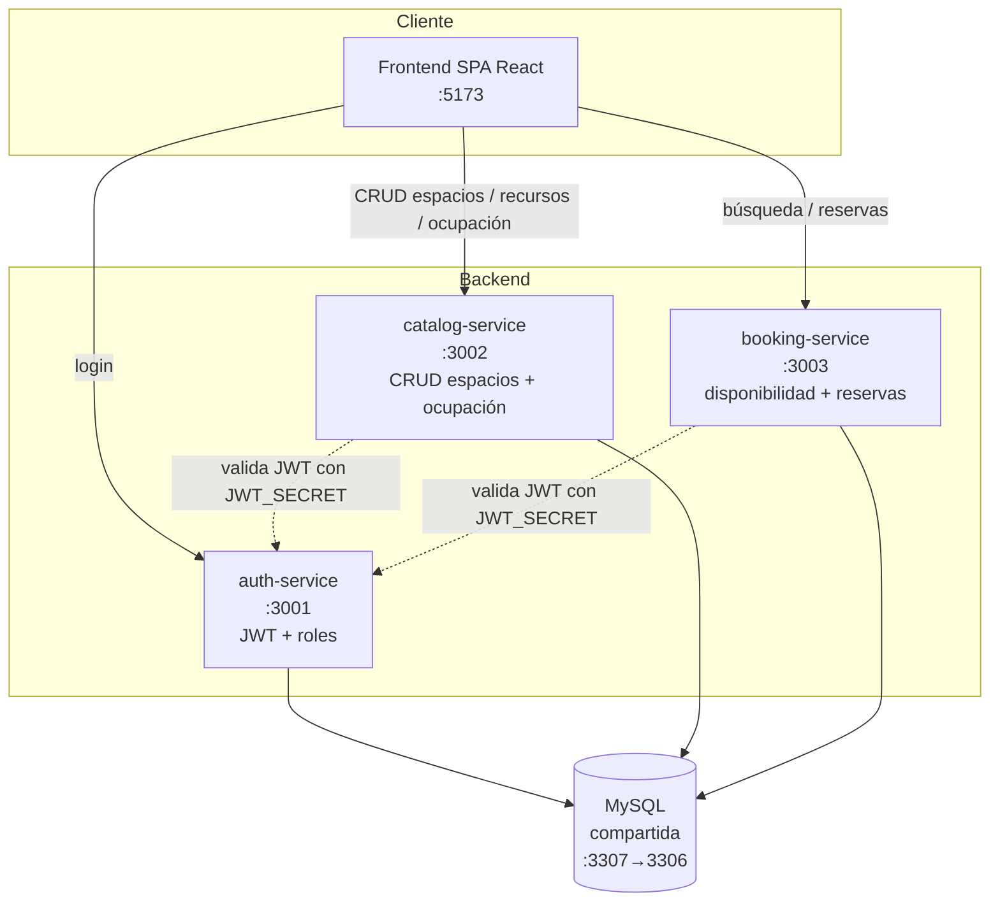
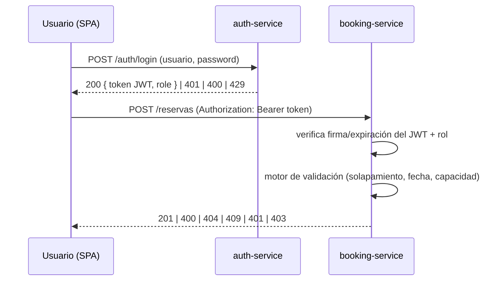

# OfficeSpace - Gestión Híbrida Inteligente

MVP de gestión de salas de juntas y escritorios compartidos (hot desks) para **"Corporativo Alpha"**, que reemplaza el Excel compartido por una aplicación web con control de acceso por roles, motor de reservas sin solapamientos y documentación de API.

Arquitectura de **microservicios** sobre Node.js + Express con una **base de datos MySQL compartida**, una **SPA en React (Vite)** y orquestación con **docker-compose**.

## Tabla de contenidos

1. [Requisitos previos](#requisitos-previos)
2. [Instalación y puesta en marcha](#instalación-y-puesta-en-marcha)
3. [Credenciales de prueba](#credenciales-de-prueba)
4. [Arquitectura del sistema](#arquitectura-del-sistema)
5. [Estructura del monorepo](#estructura-del-monorepo)
6. [Documentación de la API](#documentación-de-la-api)
7. [Guía de usuario](#guía-de-usuario)
8. [Pruebas](#pruebas)

---

## Requisitos previos

Para levantar el proyecto con Docker (recomendado) solo necesitas:

- **Docker Desktop** (incluye Docker Engine y `docker compose`) — versión 20+.
- **Git** (para clonar el repositorio).

Para desarrollo/pruebas fuera de Docker (opcional):

- **Node.js 20+** y **npm**.
- Una instancia de **MySQL 8** accesible.

> Nota: si tienes un MySQL local usando el puerto 3306, no hay conflicto: el contenedor de la base de datos se publica en el host en el puerto **3307** (internamente sigue usando 3306 en la red de Docker).

---

## Instalación y puesta en marcha

```bash
# 1. Clonar el repositorio
git clone https://github.com/ami1810/Hackathon.git
cd Hackathon

# 2. Crear el archivo de variables de entorno a partir de la plantilla
cp .env.example .env        # En Windows (PowerShell): Copy-Item .env.example .env

# 3. Levantar toda la pila (db + 3 servicios + frontend)
docker compose up --build
```

Cuando todos los contenedores estén arriba, abre el navegador en:

- **Frontend (SPA):** http://localhost:5173
- **Swagger / OpenAPI:** ver [Documentación de la API](#documentación-de-la-api)

Para detener todo: `Ctrl+C` y luego `docker compose down` (añade `-v` para borrar también los datos de la base de datos).

### Desarrollo del frontend sin Docker (opcional)

```bash
cd frontend
npm install
npm run dev      # Vite en http://localhost:5173
```

---

## Credenciales de prueba

Usuarios semilla cargados automáticamente al iniciar la base de datos:

| Email                                   | Contraseña | Rol           |
|-----------------------------------------|------------|---------------|
| `admin@corporativoalpha.com`            | `Admin123` | ADMINISTRADOR |
| `carlos.mendez@corporativoalpha.com`    | `User123`  | COLABORADOR   |
| `ana.torres@corporativoalpha.com`       | `User123`  | COLABORADOR   |

---

## Arquitectura del sistema

### Diagrama de alto nivel



### Flujo de autenticación y autorización



### Decisiones técnicas

- **Node.js + Express por servicio:** rápido de desarrollar, integración madura con `jsonwebtoken` y `swagger-ui-express`, y permite extraer la lógica crítica a módulos puros fáciles de probar.
- **Lógica crítica como funciones puras:** el motor de validación de reservas (detección de solapamiento con límites exclusivos, validación de fechas/capacidad, filtrado de disponibilidad, resolución de ocupación) está aislado del framework, lo que permite **pruebas basadas en propiedades** con `fast-check`.
- **JWT (HS256) con secreto compartido:** el `auth-service` firma el token con `JWT_SECRET`; `catalog` y `booking` lo verifican con el mismo secreto sin volver a consultar la base de datos. Esto desacopla los servicios y evita llamadas cruzadas en cada petición.
- **Frontend SPA en React (Vite):** enrutado por rol, cliente HTTP centralizado que adjunta el `Authorization: Bearer`, intercepta 401 y normaliza el contrato de error.
- **OpenAPI 3.0 por servicio:** documentación viva servida en `/api-docs`, validada por pruebas automáticas que exigen que toda ruta registrada esté documentada.

### ¿Por qué microservicios con base de datos compartida?

Para un MVP de hackathon se buscó un equilibrio entre **separación de responsabilidades** y **simplicidad operativa**:

- **Separación por dominio:** autenticación, catálogo y reservas son responsabilidades distintas con ciclos de cambio independientes. Tres servicios pequeños y cohesivos son más fáciles de entender y de repartir entre el equipo que un monolito.
- **Base de datos compartida (no una por servicio):** las entidades del dominio (usuarios, espacios, recursos y reservas) están **fuertemente relacionadas** por integridad referencial (una reserva referencia un espacio y un usuario; un espacio referencia recursos). Mantener una sola instancia MySQL:
  - Preserva las **claves foráneas y la consistencia transaccional** (p. ej. la verificación de solapamiento ocurre dentro de una transacción con bloqueo).
  - Evita la complejidad de **sagas / consistencia eventual** entre bases de datos separadas, que no aporta valor en el alcance de un MVP.
  - Simplifica el `docker-compose` y el arranque.
- **Compromiso consciente:** una DB compartida acopla los servicios a un esquema común. Es un trade-off aceptable para el MVP; en una evolución posterior se podría separar por dominio si la escala lo justifica.

---

## Estructura del monorepo

```
.
├── auth-service/      # Autenticación (JWT + roles) — Express
├── catalog-service/   # CRUD de espacios, recursos y tablero de ocupación — Express
├── booking-service/   # Disponibilidad + motor de validación de reservas — Express
├── frontend/          # SPA en React (Vite)
├── shared/            # Módulos compartidos (contrato de error, middleware JWT/roles)
├── db/init/           # Scripts de migración (esquema) y seed (usuarios + 15 recursos)
├── docs/              # Casos de prueba, colección Postman
├── tests/bdd/         # Escenarios BDD en Gherkin
├── docker-compose.yml # Orquestación: db, auth, catalog, booking, frontend
├── .env.example       # Plantilla de variables de entorno
└── .env               # Variables locales (NO se versiona)
```

### Servicios y puertos

| Servicio          | Puerto (host) | Responsabilidad                                    |
|-------------------|---------------|----------------------------------------------------|
| `db` (MySQL)      | 3307 → 3306   | Base de datos compartida                           |
| `auth-service`    | 3001          | Login, emisión y verificación de Token_JWT         |
| `catalog-service` | 3002          | CRUD de espacios, recursos y tablero de ocupación  |
| `booking-service` | 3003          | Búsqueda de disponibilidad y reservas              |
| `frontend`        | 5173          | SPA (login, búsqueda, confirmación, administración)|

### Variables de entorno

Copia `.env.example` a `.env`. Claves principales:

- `JWT_SECRET`: clave simétrica (HS256) compartida para firmar y verificar el Token_JWT.
- `JWT_EXPIRES_IN`: validez del token en segundos (3600 = 1 hora).
- `MYSQL_*` / `DB_*`: credenciales y conexión a la base de datos MySQL compartida.

---

## Documentación de la API

Cada servicio expone su especificación **OpenAPI 3.0 / Swagger UI** (con los contenedores en marcha):

| Servicio          | Swagger UI                          | OpenAPI JSON                         |
|-------------------|-------------------------------------|--------------------------------------|
| `auth-service`    | http://localhost:3001/api-docs      | http://localhost:3001/api-docs.json  |
| `catalog-service` | http://localhost:3002/api-docs      | http://localhost:3002/api-docs.json  |
| `booking-service` | http://localhost:3003/api-docs      | http://localhost:3003/api-docs.json  |

### Endpoints principales

**auth-service (:3001)**

| Método | Ruta            | Descripción                              | Auth |
|--------|-----------------|------------------------------------------|------|
| POST   | `/auth/login`   | Inicia sesión y emite un Token_JWT       | —    |
| GET    | `/auth/verify`  | Verifica un token y devuelve sus claims  | JWT  |

**catalog-service (:3002)**

| Método | Ruta             | Descripción                          | Auth          |
|--------|------------------|--------------------------------------|---------------|
| GET    | `/espacios`      | Lista espacios con sus recursos      | JWT           |
| POST   | `/espacios`      | Crea un espacio                      | ADMINISTRADOR |
| PUT    | `/espacios/{id}` | Edita un espacio                     | ADMINISTRADOR |
| DELETE | `/espacios/{id}` | Elimina un espacio                   | ADMINISTRADOR |
| GET    | `/recursos`      | Catálogo de recursos (15)            | JWT           |
| GET    | `/ocupacion`     | Tablero de ocupación del día         | ADMINISTRADOR |

**booking-service (:3003)**

| Método | Ruta                | Descripción                                   | Auth          |
|--------|---------------------|-----------------------------------------------|---------------|
| GET    | `/disponibilidad`   | Busca espacios libres (filtros opcionales)    | COLABORADOR   |
| POST   | `/reservas`         | Crea una reserva                              | COLABORADOR   |
| GET    | `/reservas/mias`    | Lista las reservas del solicitante            | COLABORADOR   |
| PUT    | `/reservas/{id}`    | Edita una reserva (colaborador: propia · admin: cualquiera) | COLABORADOR/ADMIN |
| PUT    | `/reservas/{id}/asistencia` | Registra asistencia (`show`/`no-show`) dentro de la ventana horaria | COLABORADOR |
| DELETE | `/reservas/{id}`    | Cancela (colaborador) / elimina (admin)       | COLABORADOR/ADMIN |
| GET    | `/reservas`         | Lista **todas** las reservas                  | ADMINISTRADOR |
| GET    | `/agenda`           | Reuniones programadas por espacio (próximas)  | COLABORADOR   |

### Ejemplos de uso con `curl`

```bash
# 1. Login (obtener token)
curl -X POST http://localhost:3001/auth/login \
  -H "Content-Type: application/json" \
  -d '{"usuario":"carlos.mendez@corporativoalpha.com","password":"User123"}'
# -> { "token": "<JWT>", "role": "COLABORADOR", "nombre": "Carlos Méndez", "expiresIn": 3600 }

TOKEN="<pega-aqui-el-token>"

# 2. Buscar disponibilidad (con filtro de recursos 1 y 6)
curl "http://localhost:3003/disponibilidad?fecha=2026-12-01&horaInicio=09:00&horaFin=10:00&capacidadMin=4&recursos=1,6" \
  -H "Authorization: Bearer $TOKEN"

# 3. Crear una reserva
curl -X POST http://localhost:3003/reservas \
  -H "Authorization: Bearer $TOKEN" \
  -H "Content-Type: application/json" \
  -d '{"idEspacio":2,"fechaInicio":"2026-12-01T09:00:00Z","fechaFin":"2026-12-01T10:00:00Z","asistentes":4}'

# 4. Ver mis reservas
curl http://localhost:3003/reservas/mias -H "Authorization: Bearer $TOKEN"

# 5. (ADMIN) Crear un espacio
ADMIN=$(curl -s -X POST http://localhost:3001/auth/login -H "Content-Type: application/json" \
  -d '{"usuario":"admin@corporativoalpha.com","password":"Admin123"}' | sed -E 's/.*"token":"([^"]+)".*/\1/')
curl -X POST http://localhost:3002/espacios \
  -H "Authorization: Bearer $ADMIN" -H "Content-Type: application/json" \
  -d '{"nombre":"Sala Gamma","tipo":"Sala de juntas","capacidad":12,"piso":3,"ubicacion":"Ala oeste","recursos":[1,2,6]}'
```

> También se incluye una **colección de Postman** lista para importar en [`docs/postman_collection.json`](docs/postman_collection.json).

---

## Guía de usuario

### Cómo iniciar sesión

1. Abre http://localhost:5173 — se mostrará la pantalla de **Iniciar sesión**.
2. Escribe tu **usuario** (email) y **contraseña** (ver [credenciales de prueba](#credenciales-de-prueba)).
3. Pulsa **Entrar**.
   - Si eres **ADMINISTRADOR**, se te redirige a la **vista de administración**.
   - Si eres **COLABORADOR**, se te redirige al **panel de búsqueda**.
4. En la **barra superior** verás, a la derecha, tu **nombre de usuario** y el botón **Cerrar sesión** (disponible en ambos roles).

> **Protección por rol:** las vistas están protegidas según el rol. Si un COLABORADOR intenta entrar a `/admin` (por ejemplo, editando la URL), es **redirigido** automáticamente a su panel; además, el backend rechaza con `403` cualquier operación administrativa hecha sin rol ADMINISTRADOR. La autorización real se valida en el servidor (el JWT lleva el rol), no solo en la interfaz.

### Cómo buscar y reservar un espacio (COLABORADOR)

1. En el **panel de búsqueda**, indica **fecha**, **hora de inicio** y **hora de fin**.
2. (Opcional) Filtra por **tipo de espacio**, **cantidad de personas para la reunión** y **recursos** (marca con palomita los recursos que necesitas). El sistema muestra únicamente los espacios cuya **capacidad cubre** la cantidad de personas indicada.
3. Pulsa **Buscar**. Verás la lista de espacios disponibles (o un mensaje de "sin resultados").
4. Pulsa **Reservar** en el espacio deseado.
5. En la **confirmación**, indica el número de **asistentes** (entre 1 y la capacidad del espacio) y pulsa **Confirmar Reserva**.
6. Verás un mensaje de éxito y un enlace **Ver Mis Reservas**.
7. En **Mis reservas** puedes **editar** (fecha/hora/asistentes) o **cancelar** tus reservas futuras, y **registrar tu asistencia** cuando estés cerca del horario (ver más abajo).

> El sistema impide solapamientos: si el espacio ya está ocupado en ese rango, no aparecerá en la búsqueda y cualquier intento de reservarlo se rechaza con código `409`.

### Cómo ver las salas y sus reuniones (COLABORADOR)

1. En la barra superior, entra a **Salas**.
2. Verás todas las salas existentes; cada una indica si **tiene reuniones programadas** próximas o está libre.
3. Pulsa una sala para abrir su **detalle** (la URL usa el **nombre de la sala**, p. ej. `/salas/01`, para que coincida con lo que ves): información de la sala, sus **características** (recursos) y las **reuniones programadas en orden de fecha próxima**.
4. Desde el detalle puedes **Agregar reservación** para esa sala indicando fecha, hora de inicio/fin y asistentes. El sistema verifica que **no se solape** con las reuniones existentes (rechaza con `409` si choca).

### Estado de asistencia (ambos roles)

Cada reserva tiene un **estado de asistencia** visible para colaboradores y administradores:

- **SHOW** (asistió) se muestra en **rojo**.
- **NO_SHOW** (no asistió) se muestra en **gris**.
- "Sin registro" cuando aún no se ha marcado.

**Registro de asistencia (COLABORADOR):** en *Mis reservas*, los botones **Marcar SHOW** / **Marcar NO_SHOW** se habilitan **únicamente** dentro de la ventana horaria de la reserva: desde **15 minutos antes** del inicio y hasta el **fin** de la misma. Fuera de esa ventana el registro se rechaza (`400`), para evitar marcas erróneas a destiempo. El administrador puede visualizar el estado de asistencia de todas las reservas.

### Cómo administrar espacios (ADMINISTRADOR)

1. En la **vista de administración** verás el **Tablero de ocupación** del día (ocupado/libre por espacio).
2. En la tabla de **Espacios** puedes:
   - **Crear espacio:** rellena nombre, tipo, capacidad, piso, ubicación y marca los **recursos** (checklist). Pulsa **Guardar**.
   - **Editar:** modifica los datos y guarda.
   - **Eliminar:** se pide **confirmación explícita** antes de borrar.
3. En **Todas las reservas** puedes ver las reservas de todo el corporativo, **editarlas** (fecha/hora/asistentes, con verificación de solapamiento) y **eliminarlas** (individualmente o con **Eliminar todas**).

---

## Reglas de negocio

- **Sin solapamientos (límites exclusivos):** dos reservas del mismo espacio no pueden intersecarse. Una reserva de 10:00–11:00 es válida tras otra de 09:00–10:00 (los límites son exclusivos). Un solapamiento se rechaza con `409`.
- **No en el pasado:** no se permiten reservas cuyo inicio sea anterior al instante actual (`400`).
- **Capacidad:** el número de asistentes no puede superar la capacidad del espacio (`400`).
- **Búsqueda por cantidad requerida:** al buscar, el usuario indica la **cantidad de personas para la reunión**; el sistema devuelve únicamente los espacios cuya **capacidad puede cubrir** esa cantidad (capacidad ≥ cantidad).
- **Propiedad de la reserva:** un colaborador solo puede editar/cancelar sus propias reservas (`403` en caso contrario). El administrador puede **editar y eliminar cualquier reserva**.
- **Alta desde el detalle de sala:** cualquier usuario autenticado puede crear una reservación desde el detalle de una sala; se aplica la misma verificación de solapamiento (`409` si choca).
- **Estado de asistencia:** cada reserva tiene un estado de asistencia (`show`/`no-show`). Se muestra **SHOW en rojo** y **NO_SHOW en gris** en ambos roles.
- **Ventana de registro de asistencia:** el colaborador solo puede registrar la asistencia de su reserva desde **15 minutos antes** del inicio hasta el **fin** de la misma; fuera de esa ventana se rechaza (`400`).
- **Salas y agenda:** cualquier usuario autenticado puede ver las salas y sus reuniones programadas (próximas), ordenadas por fecha. La URL del detalle usa el **nombre** de la sala.
- **Identificadores visibles:** en toda la interfaz el espacio se muestra por su **nombre/identificador asignado por el administrador** (no por el id interno de base de datos).
- **Seguridad por rol:** las rutas del frontend están protegidas (un COLABORADOR es redirigido fuera de `/admin`) y el backend valida el rol del JWT en cada operación (`401` sin token válido, `403` sin permisos). La barra superior muestra el **nombre del usuario** autenticado.

## Pruebas

El proyecto incluye tres niveles de pruebas:

### 1. Pruebas automatizadas (unitarias + basadas en propiedades)

Cada servicio usa **Vitest** y **fast-check** (property-based testing). La lógica crítica (solapamiento, disponibilidad, validaciones, autenticación) se valida con propiedades universales.

```bash
cd auth-service     && npm install && npm test
cd ../catalog-service && npm install && npm test
cd ../booking-service && npm install && npm test
cd ../frontend        && npm install && npm test
```

> Resumen aproximado: auth 45, catalog 47, booking ~98 (+5 de integración que requieren MySQL), frontend 78 pruebas.

### 2. Casos de prueba manuales

Documento con **más de 10 casos de prueba** (precondiciones, pasos y resultado esperado) en [`docs/CASOS_DE_PRUEBA.md`](docs/CASOS_DE_PRUEBA.md).

### 3. BDD (Gherkin) y Postman

- Escenarios críticos en **Gherkin** bajo [`tests/bdd/`](tests/bdd/).
- Colección de **Postman/Newman** en [`docs/postman_collection.json`](docs/postman_collection.json) para pruebas de API.
