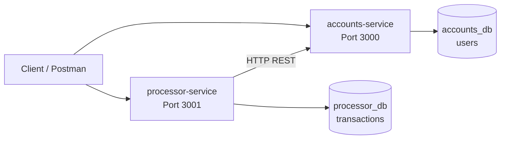
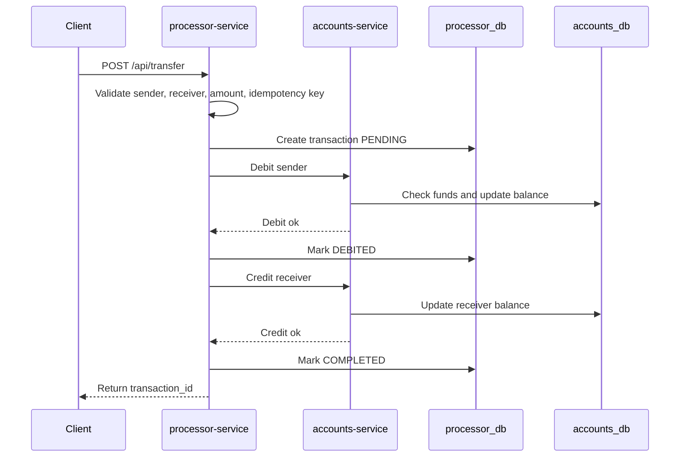
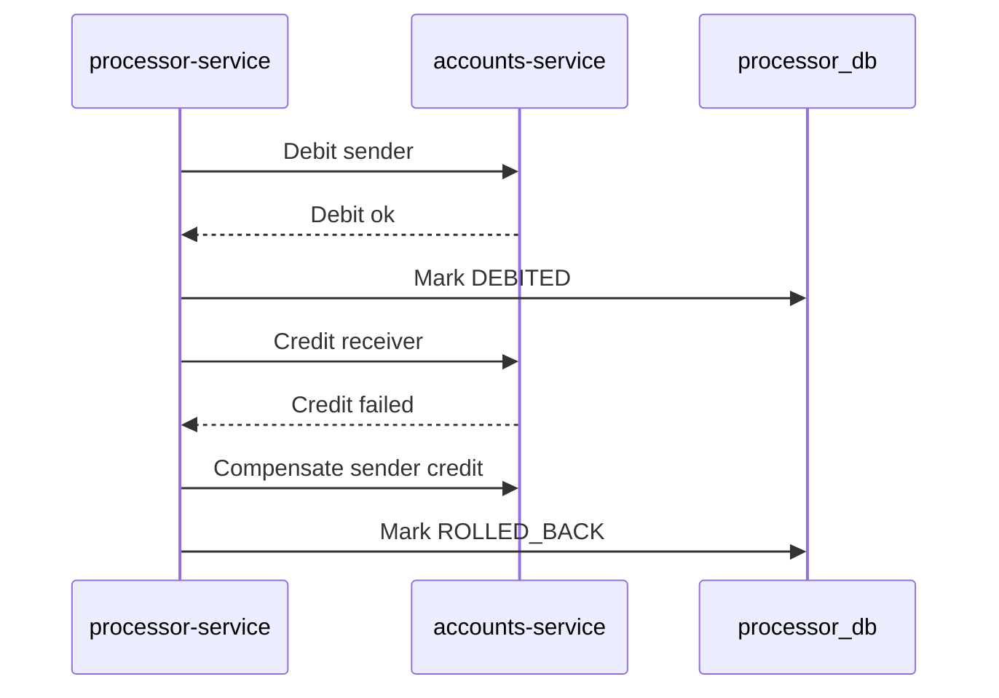

# Architecture

NeoWallet usa una arquitectura de microservicios ligera con dos servicios Node.js/Express y dos bases de datos PostgreSQL separadas.

## accounts-service

Responsabilidades:

- Gestionar usuarios.
- Consultar saldos.
- Preparar recarga simulada.
- Preparar actualizaciones internas de balance mediante debito o credito.

Endpoints:

- `GET /health`
- `GET /api-docs`
- `GET /accounts/:id`
- `POST /api/recharge`
- `POST /accounts/update-balance`

En fase 1.1, `GET /accounts/:id` ya consulta PostgreSQL. Los endpoints de recarga y actualizacion de balance quedan documentados como placeholders para la siguiente fase.

## processor-service

Responsabilidades:

- Orquestar transferencias P2P.
- Registrar transacciones.
- Manejar estados de transaccion.
- Preparar historial de transacciones.

Endpoints:

- `GET /health`
- `GET /api-docs`
- `POST /api/transfer`
- `GET /api/transactions/:user_id`

En fase 1.1, `GET /api/transactions/:user_id` ya consulta PostgreSQL. `POST /api/transfer` queda como placeholder documentado para implementar transferencia, idempotencia y Saga.

## Bases de datos

### accounts_db

Tabla principal: `users`.

Guarda usuarios y balances. La restriccion `CHECK (balance >= 0)` evita que un saldo quede negativo a nivel de base de datos.

### processor_db

Tabla principal: `transactions`.

Guarda el rastro de cada transferencia con:

- `transaction_id`
- `sender_id`
- `receiver_id`
- `amount`
- `status`
- `idempotency_key`
- `error_message`

La tabla tiene una restriccion para permitir solo estados validos.

## Flujo esperado de transferencia P2P

Si el credito falla despues del debito, la fase final debe ejecutar una compensacion:

## Comunicacion HTTP

Los servicios no comparten memoria ni tablas. `processor-service` se comunica con `accounts-service` por HTTP usando `ACCOUNTS_SERVICE_URL`.

Esta separacion permite que cada servicio pueda crecer de forma independiente, aunque obliga a tratar cuidadosamente fallos parciales y reintentos.

## Decisiones tecnicas

- Node.js y Express para mantener el codigo simple.
- PostgreSQL por consistencia transaccional y restricciones SQL.
- Docker Compose para levantar todo el entorno local.
- Swagger UI en ambos servicios para exploracion rapida.
- Dos bases de datos para mantener ownership por servicio.
- SQL explicito para que el modelo sea facil de auditar.

## Riesgos principales

- Perdida de dinero durante fallos parciales.
- Race conditions en debitos simultaneos.
- Fallos de comunicacion entre servicios.
- Duplicidad por reintentos del cliente.
- Saldos negativos por errores de validacion.

## Mitigaciones planeadas

- Validaciones de monto, usuarios y auto-transferencia.
- Restricciones SQL como `CHECK (balance >= 0)`.
- Idempotencia con `X-Idempotency-Key`.
- Estados de transaccion auditables.
- Saga con compensacion.
- Logs estructurados.
- Pruebas automatizadas de casos criticos.

