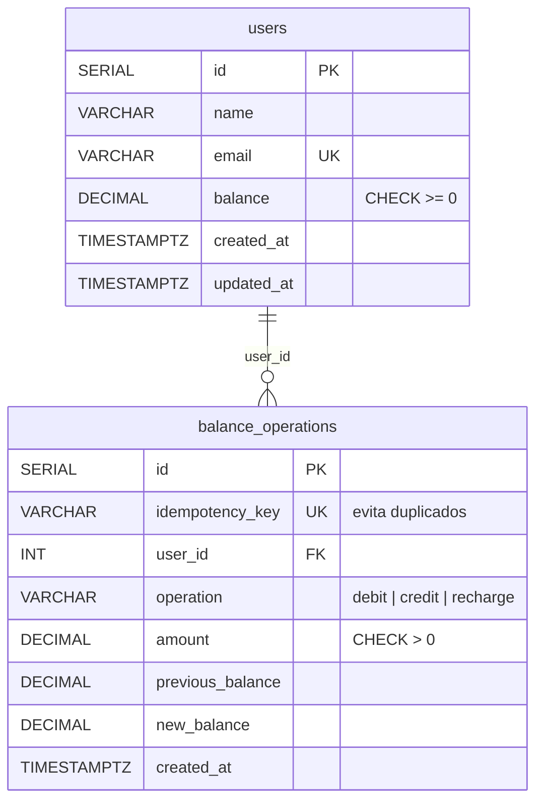
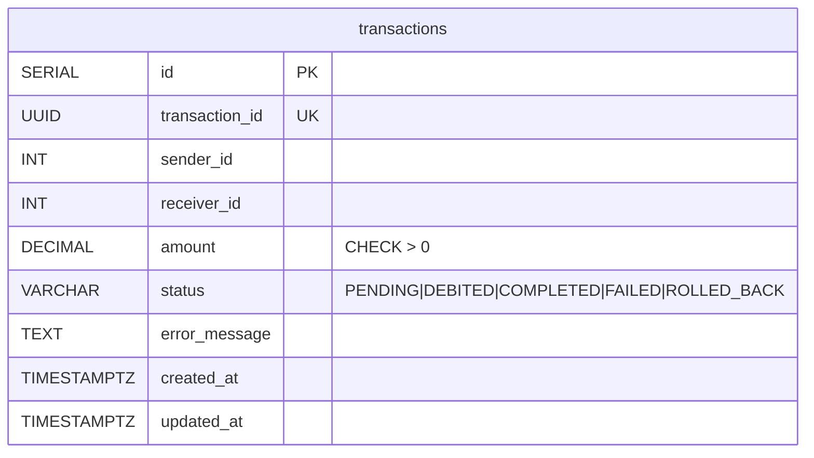
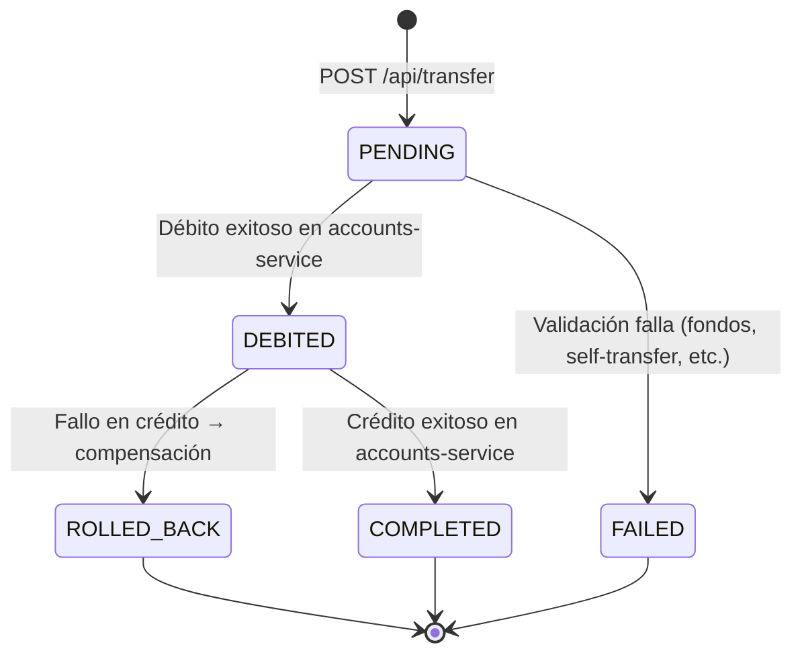

# Arquitectura de NeoWallet

## Decisiones de arquitectura

### Lenguaje: Go 1.22+
Go ofrece manejo limpio de concurrencia, fundamental para procesar transferencias con seguridad ante condiciones de carrera. Su tooling es consistente y el equipo tiene experiencia previa.

### Base de datos por servicio (database-per-service)
Cada microservicio es el único dueño de su base de datos:

- **accounts-service** → `accounts_db`: usuarios, saldos, ledger de idempotencia.
- **processor-service** → `processor_db`: transacciones y máquina de estados.

Ningún servicio accede directamente a la base de datos del otro. El procesador consulta y muta los saldos exclusivamente vía HTTP (`accounts-service`). Esta separación obliga a resolver la consistencia distribuida con un patrón Saga, no con una transacción ACID única.

### Patrón Saga orquestada (orchestration-based)
La transferencia P2P se implementa como una saga donde `processor-service` es el orquestador:

```
PENDING → DEBITED → COMPLETED
          ↘ FAILED
                  ↘ ROLLED_BACK (compensación)
```

Si el crédito falla después de que el débito fue exitoso, se ejecuta una **compensación** que devuelve el monto al remitente. Gracias a la idempotencia, esta compensación puede reintentarse sin riesgo de duplicar el movimiento.

### Invariante del dinero
> **La suma de todos los `balance` en `accounts_db` es constante, salvo por recargas (que son entrada de dinero externo).**

Esto implica:
- Transferencia exitosa: A baja, B sube → suma igual.
- Transferencia compensada (ROLLED_BACK): A vuelve a su saldo original → suma igual.
- Recarga: suma aumenta (dinero externo simulado).

Este invariante se verifica con un test dedicado que ejecuta una batería de transferencias (incluyendo fallos) y afirma que la suma total no cambió antes y después (descontando recargas).

### Tipo de dato para dinero: DECIMAL(10,2) + shopspring/decimal
**Prohibido `float32`/`float64` para cualquier operación monetaria.** Todo monto se representa con precisión decimal exacta en Go (`shopspring/decimal`) y en PostgreSQL (`DECIMAL(10,2)`).

### Idempotencia
Toda operación que modifica un saldo (`debit`, `credit`, `recharge`) usa una clave de idempotencia única (`idempotency_key`). La tabla `balance_operations` registra cada operación aplicada; si la misma clave reaparece, se devuelve el resultado previo sin volver a aplicar el movimiento. Esto hace que un reintento por timeout de red no duplique un débito ni un crédito.

### Manejo de tiempo: UTC, ISO 8601
Todos los timestamps se almacenan y registran en UTC (ISO 8601). Un sistema de pagos es inherentemente multi-región; UTC evita ambigüedad.

---

## Diagrama de secuencia de la Saga (transferencia)

```mermaid
sequenceDiagram
    actor Cliente
    participant PS as processor-service
    participant AS as accounts-service
    participant PDB as processor_db
    participant ADB as accounts_db

    Cliente->>PS: POST /api/transfer {sender, receiver, amount}
    PS->>PS: Validar (self-transfer, monto, decimales)
    PS->>AS: GET /accounts/{sender} (validar existencia y fondos)
    AS->>ADB: SELECT balance FROM users WHERE id=$1
    ADB-->>AS: balance >= amount?
    AS-->>PS: OK / error
    PS->>AS: GET /accounts/{receiver} (validar existencia)
    AS-->>PS: OK / error
    PS->>PDB: INSERT transaction (status=PENDING)
    PDB-->>PS: transaction_id

    Note over PS,AS: Paso 1: Débito
    PS->>AS: POST /update-balance {debit, idempotency_key=txid:debit}
    AS->>ADB: BEGIN; verificar idempotencia; UPDATE ... WHERE balance>=$1; INSERT balance_operations; COMMIT
    ADB-->>AS: previous_balance, new_balance
    AS-->>PS: OK → estado DEBITED

    Note over PS,AS: Paso 2: Crédito
    PS->>AS: POST /update-balance {credit, idempotency_key=txid:credit}
    AS->>ADB: BEGIN; verificar idempotencia; UPDATE balance+=$1; INSERT balance_operations; COMMIT
    ADB-->>AS: previous_balance, new_balance
    AS-->>PS: OK → estado COMPLETED

    Note over PS,AS: Compensación (si crédito falla)
    PS->>AS: POST /update-balance {credit, idempotency_key=txid:compensate}
    AS->>ADB: BEGIN; verificar idempotencia; UPDATE balance+=$1; INSERT balance_operations; COMMIT
    ADB-->>AS: OK
    AS-->>PS: OK → estado ROLLED_BACK

    PS->>PDB: UPDATE transaction status
    PS-->>Cliente: 200 {transaction_id, status}
```

---

## Diagramas Entidad-Relación (ERD)

### accounts_db



### processor_db



---

## Máquina de estados de la transferencia

