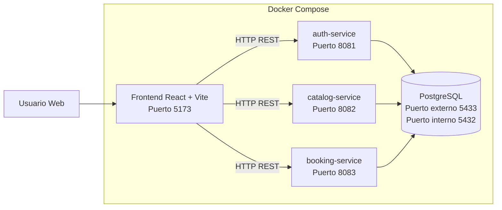
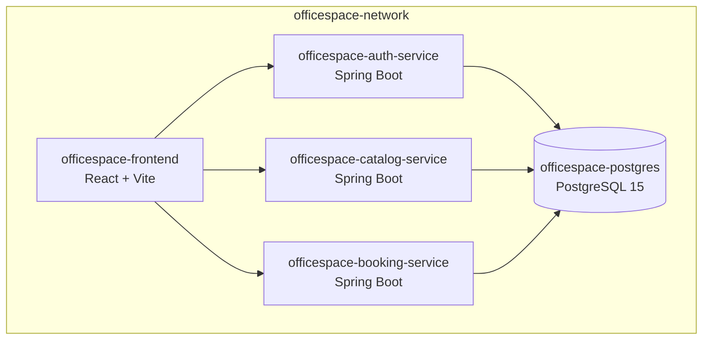
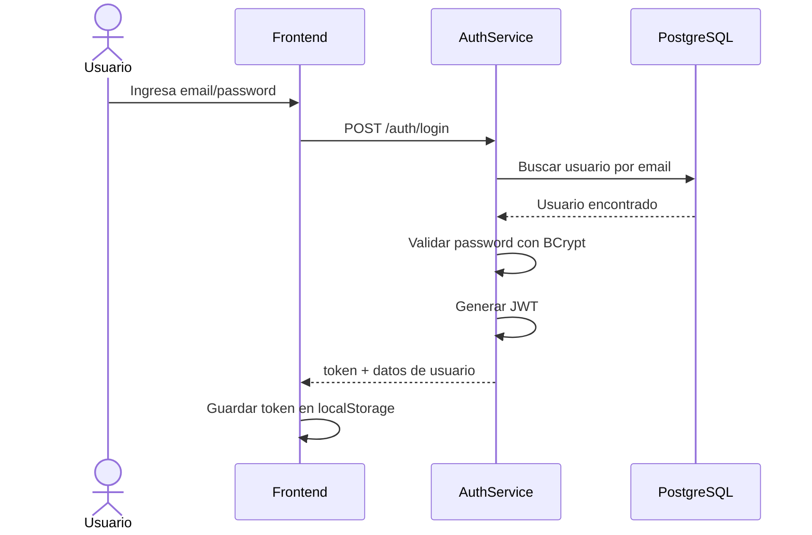
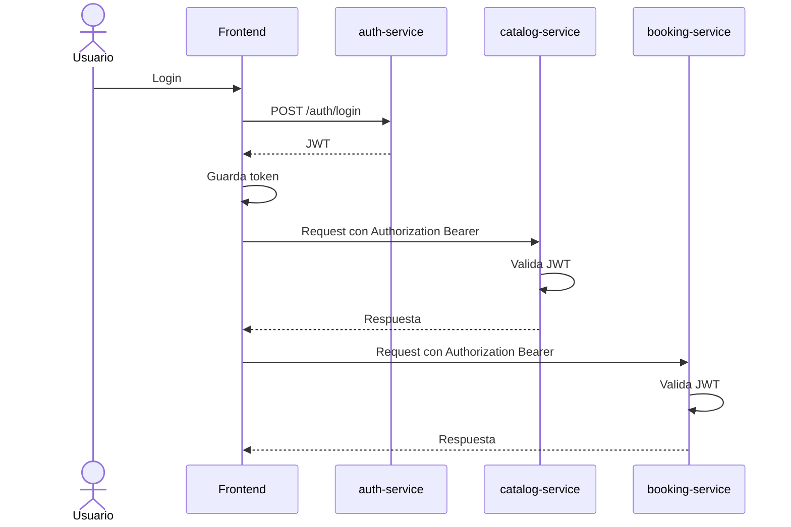
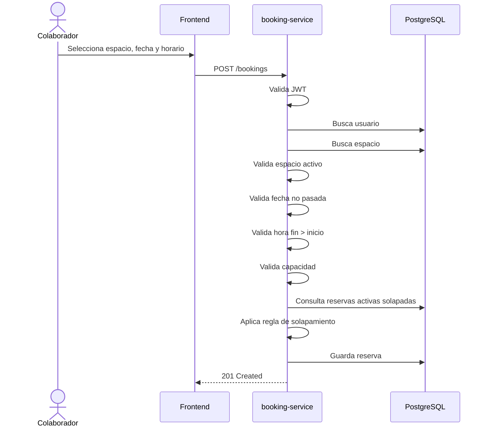
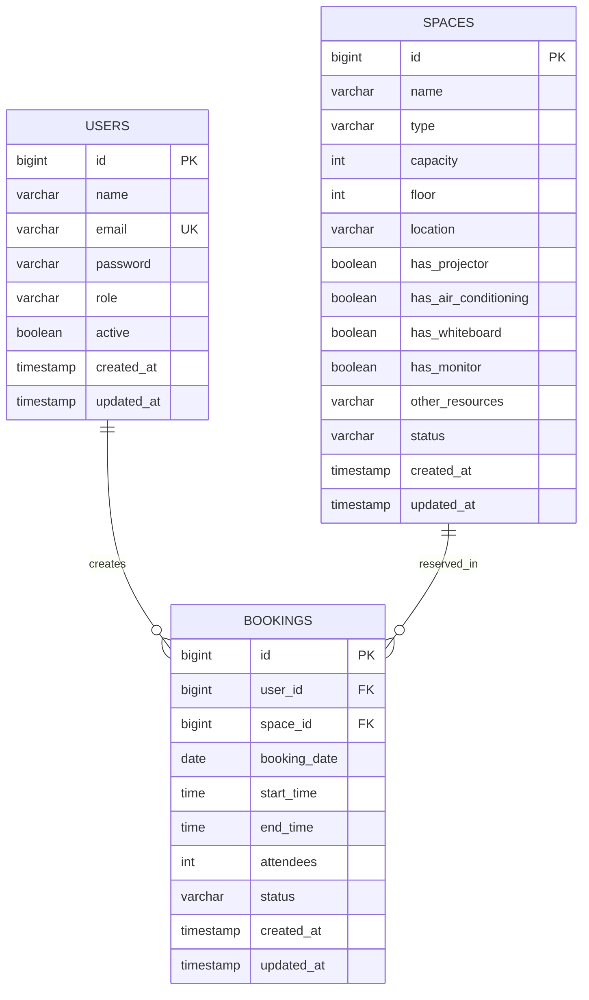

# ARCHITECTURE.md

# OfficeSpace: Gestión Híbrida Inteligente

## Documento de Arquitectura Técnica

---

## 1. Propósito del documento

Este documento describe la arquitectura técnica del MVP **OfficeSpace: Gestión Híbrida Inteligente**, una aplicación web para la empresa ficticia **Corporativo Alpha**.

El objetivo del sistema es digitalizar la reserva de salas de juntas y escritorios tipo **hot desk**, reemplazando un archivo Excel compartido que generaba problemas como:

* Reservas duplicadas.
* Falta de visibilidad de disponibilidad.
* No-shows sin control.
* Ausencia de roles.
* Falta de trazabilidad.
* Dificultad para consultar ocupación diaria.

---

## 2. Objetivo del sistema

OfficeSpace permite:

* Autenticar usuarios mediante JWT.
* Diferenciar permisos entre `ADMINISTRADOR` y `COLABORADOR`.
* Administrar espacios físicos.
* Buscar espacios disponibles por fecha, horario, tipo y capacidad.
* Crear reservas sin solapamiento.
* Cancelar reservas futuras.
* Consultar reservas personales.
* Consultar todas las reservas desde el rol administrador.
* Mostrar dashboards básicos de ocupación.
* Exponer documentación OpenAPI/Swagger por microservicio.
* Ejecutar toda la solución mediante Docker Compose.

---

## 3. Estilo arquitectónico

El sistema utiliza una arquitectura de:

```text
Microservicios con base de datos compartida
```

La aplicación se divide en servicios independientes, cada uno con una responsabilidad clara:

* `auth-service`
* `catalog-service`
* `booking-service`
* `frontend`
* `postgres`

Todos los servicios backend se conectan a una misma base de datos PostgreSQL.

---

## 4. Diagrama general de arquitectura



---

## 5. Justificación de arquitectura

### 5.1. ¿Por qué microservicios?

Se eligió una arquitectura por microservicios porque el requerimiento pedía explícitamente separar el sistema en servicios independientes.

Cada microservicio tiene una responsabilidad concreta:

| Microservicio     | Responsabilidad                                    |
| ----------------- | -------------------------------------------------- |
| `auth-service`    | Autenticación y generación de JWT                  |
| `catalog-service` | Administración y consulta de espacios              |
| `booking-service` | Reservas, cancelaciones, solapamiento y dashboards |

Esta división permite que cada módulo sea más fácil de entender, probar y evolucionar.

---

### 5.2. ¿Por qué base de datos compartida?

Aunque en una arquitectura de microservicios más estricta cada servicio tendría su propia base de datos, para este MVP se usa una base compartida por estas razones:

* Reduce complejidad.
* Facilita la entrega académica/hackathon.
* Evita sincronización entre bases.
* Permite validar reglas de negocio rápidamente.
* Cumple con el requerimiento de microservicios con base compartida.

La base compartida se llama:

```text
officespace_db
```

---

### 5.3. ¿Por qué Spring Boot?

Spring Boot permite construir APIs REST de forma rápida y estructurada.

Se usa para:

* Controladores REST.
* Validaciones.
* Seguridad con JWT.
* Acceso a datos con JPA.
* Manejo global de errores.
* Documentación Swagger/OpenAPI.
* Pruebas automatizadas futuras.

---

### 5.4. ¿Por qué PostgreSQL?

PostgreSQL se usa porque:

* Es robusto.
* Soporta constraints.
* Soporta tipos `DATE`, `TIME` y `TIMESTAMP`.
* Es adecuado para reglas de reservas.
* Funciona fácilmente con Docker.
* Permite inicialización mediante `init-db.sql`.

---

### 5.5. ¿Por qué JWT?

JWT permite que los microservicios validen al usuario sin mantener sesión en servidor.

El token contiene claims como:

```json
{
  "userId": 2,
  "email": "carlos.mendez@corporativoalpha.com",
  "role": "COLABORADOR",
  "iss": "officespace",
  "exp": 1780000000
}
```

Cada microservicio valida el token usando el mismo secreto compartido:

```text
JWT_SECRET=officespace-secret-key-2026
```

---

## 6. Vista de contenedores



---

## 7. Microservicios

---

## 7.1. auth-service

### Puerto

```text
8081
```

### Responsabilidades

* Login.
* Validación de credenciales.
* Generación de JWT.
* Consulta del usuario autenticado.
* Exposición de Swagger.

### Endpoints

| Método | Endpoint      | Descripción                  |
| ------ | ------------- | ---------------------------- |
| POST   | `/auth/login` | Inicia sesión                |
| GET    | `/auth/me`    | Devuelve usuario autenticado |

### Tablas utilizadas

```text
users
```

### Flujo de login



---

## 7.2. catalog-service

### Puerto

```text
8082
```

### Responsabilidades

* Crear espacios.
* Consultar espacios.
* Filtrar espacios por tipo, capacidad, piso y recursos.
* Actualizar espacios.
* Desactivar espacios.
* Reactivar espacios.
* Consultar disponibilidad de espacios.
* Exposición de Swagger.

### Endpoints

| Método | Endpoint            | Descripción                   |
| ------ | ------------------- | ----------------------------- |
| GET    | `/spaces`           | Lista espacios                |
| GET    | `/spaces/{id}`      | Consulta espacio por ID       |
| POST   | `/spaces`           | Crea espacio                  |
| PUT    | `/spaces/{id}`      | Actualiza espacio             |
| DELETE | `/spaces/{id}`      | Desactiva espacio             |
| GET    | `/spaces/available` | Consulta espacios disponibles |

### Tablas utilizadas

```text
spaces
bookings
```

La tabla `bookings` se consulta para determinar disponibilidad. La lógica de disponibilidad usa reservas activas.

---

## 7.3. booking-service

### Puerto

```text
8083
```

### Responsabilidades

* Crear reservas.
* Validar fecha.
* Validar horario.
* Validar capacidad.
* Validar solapamiento.
* Cancelar reservas.
* Consultar reservas propias.
* Consultar todas las reservas como administrador.
* Mostrar dashboard personal.
* Mostrar dashboard diario de administrador.
* Exposición de Swagger.

### Endpoints

| Método | Endpoint                    | Descripción                      |
| ------ | --------------------------- | -------------------------------- |
| POST   | `/bookings`                 | Crea reserva                     |
| GET    | `/bookings/my`              | Reservas del usuario autenticado |
| GET    | `/bookings/my/dashboard`    | Dashboard personal               |
| GET    | `/bookings`                 | Todas las reservas, solo admin   |
| GET    | `/bookings/today`           | Reservas del día, solo admin     |
| GET    | `/bookings/today/dashboard` | Dashboard del día, solo admin    |
| DELETE | `/bookings/{id}`            | Cancela reserva                  |

### Tablas utilizadas

```text
users
spaces
bookings
```

---

## 8. Frontend

### Tecnología

```text
React + Vite + JavaScript
```

### Puerto

```text
5173
```

### Estructura

```text
frontend/
├── public/
├── src/
│   ├── components/
│   ├── pages/
│   ├── services/
│   └── utils/
├── package.json
└── Dockerfile
```

### Pantallas principales

| Pantalla        | Ruta           | Descripción                          |
| --------------- | -------------- | ------------------------------------ |
| Login           | `/login`       | Inicio de sesión                     |
| Buscar espacios | `/spaces`      | Búsqueda y reserva                   |
| Mis reservas    | `/bookings/my` | Reservas propias o todas si es admin |
| Administración  | `/admin`       | Panel de administración              |

### Control de sesión

El frontend guarda el JWT y los datos del usuario en `localStorage`.

Claves utilizadas:

```text
officespace_token
officespace_user
```

---

## 9. Seguridad

### 9.1. Endpoints públicos

```text
POST /auth/login
/swagger-ui.html
/swagger-ui/**
/v3/api-docs
/v3/api-docs/**
```

### 9.2. Endpoints protegidos

Todos los demás endpoints requieren token JWT.

### 9.3. Control por roles

| Acción                  | ADMINISTRADOR | COLABORADOR |
| ----------------------- | ------------: | ----------: |
| Login                   |            Sí |          Sí |
| Ver espacios            |            Sí |          Sí |
| Buscar disponibilidad   |            Sí |          Sí |
| Crear espacio           |            Sí |          No |
| Actualizar espacio      |            Sí |          No |
| Desactivar espacio      |            Sí |          No |
| Activar espacio         |            Sí |          No |
| Crear reserva           |            Sí |          Sí |
| Ver reservas propias    |            Sí |          Sí |
| Ver todas las reservas  |            Sí |          No |
| Dashboard global        |            Sí |          No |
| Dashboard personal      |            Sí |          Sí |
| Cancelar reserva propia |            Sí |          Sí |
| Cancelar reserva ajena  |            Sí |          No |

---

## 10. Flujo de autenticación



---

## 11. Flujo de creación de reserva



---

## 12. Regla crítica de solapamiento

Una reserva nueva se solapa con una existente si:

```text
nuevaInicio < existenteFin && nuevaFin > existenteInicio
```

Ejemplo:

Reserva existente:

```text
09:00 - 10:00
```

Casos rechazados:

```text
09:00 - 10:00
09:30 - 10:30
08:30 - 09:30
08:00 - 11:00
09:15 - 09:45
```

Casos permitidos:

```text
08:00 - 09:00
10:00 - 11:00
```

Esto se debe a que el intervalo se maneja como semiabierto:

```text
[inicio, fin)
```

---

## 13. Modelo entidad-relación



---

## 14. Modelo de base de datos

### users

| Campo        | Tipo         | Restricciones    |
| ------------ | ------------ | ---------------- |
| `id`         | BIGSERIAL    | PK               |
| `name`       | VARCHAR(120) | NOT NULL         |
| `email`      | VARCHAR(160) | NOT NULL, UNIQUE |
| `password`   | VARCHAR(255) | NOT NULL         |
| `role`       | VARCHAR(30)  | CHECK            |
| `active`     | BOOLEAN      | NOT NULL         |
| `created_at` | TIMESTAMP    | NOT NULL         |
| `updated_at` | TIMESTAMP    | NOT NULL         |

### spaces

| Campo                  | Tipo         | Restricciones      |
| ---------------------- | ------------ | ------------------ |
| `id`                   | BIGSERIAL    | PK                 |
| `name`                 | VARCHAR(120) | NOT NULL           |
| `type`                 | VARCHAR(40)  | CHECK              |
| `capacity`             | INT          | CHECK capacity > 0 |
| `floor`                | INT          | NOT NULL           |
| `location`             | VARCHAR(160) | NOT NULL           |
| `has_projector`        | BOOLEAN      | NOT NULL           |
| `has_air_conditioning` | BOOLEAN      | NOT NULL           |
| `has_whiteboard`       | BOOLEAN      | NOT NULL           |
| `has_monitor`          | BOOLEAN      | NOT NULL           |
| `other_resources`      | VARCHAR(255) | NULL               |
| `status`               | VARCHAR(20)  | CHECK              |

### bookings

| Campo          | Tipo        | Restricciones       |
| -------------- | ----------- | ------------------- |
| `id`           | BIGSERIAL   | PK                  |
| `user_id`      | BIGINT      | FK                  |
| `space_id`     | BIGINT      | FK                  |
| `booking_date` | DATE        | NOT NULL            |
| `start_time`   | TIME        | NOT NULL            |
| `end_time`     | TIME        | NOT NULL            |
| `attendees`    | INT         | CHECK attendees > 0 |
| `status`       | VARCHAR(20) | CHECK               |
| `created_at`   | TIMESTAMP   | NOT NULL            |
| `updated_at`   | TIMESTAMP   | NOT NULL            |

---

## 15. Índices

La base de datos define índices para mejorar consultas frecuentes:

```sql
CREATE INDEX IF NOT EXISTS idx_bookings_space_date_time
ON bookings(space_id, booking_date, start_time, end_time);

CREATE INDEX IF NOT EXISTS idx_bookings_user
ON bookings(user_id);

CREATE INDEX IF NOT EXISTS idx_bookings_status
ON bookings(status);

CREATE INDEX IF NOT EXISTS idx_spaces_type_capacity_status
ON spaces(type, capacity, status);
```

---

## 16. Manejo de errores

Los microservicios devuelven errores con estructura común:

```json
{
  "timestamp": "2026-07-01T10:00:00",
  "status": 409,
  "error": "Conflict",
  "message": "El espacio ya está ocupado en ese horario",
  "path": "/bookings"
}
```

Códigos relevantes:

| Código | Significado              |
| -----: | ------------------------ |
|    400 | Datos inválidos          |
|    401 | Token ausente o inválido |
|    403 | Rol insuficiente         |
|    404 | Recurso no encontrado    |
|    409 | Conflicto de reserva     |
|    500 | Error inesperado         |

---

## 17. Decisiones técnicas importantes

### 17.1. No se usa API Gateway

No se agregó API Gateway para evitar complejidad innecesaria en el MVP.

El frontend consume directamente:

```text
auth-service
catalog-service
booking-service
```

### 17.2. No se usa Service Discovery

No se usa Eureka ni Consul porque los servicios se definen explícitamente en Docker Compose.

### 17.3. No se usa mensajería

No se usa Kafka ni RabbitMQ porque el flujo de reservas es síncrono y puede resolverse mediante REST y base compartida.

### 17.4. No se usa registro de usuarios

Los usuarios se precargan desde `init-db.sql`, porque el requerimiento no exige registro de usuarios.

### 17.5. No se borran reservas físicamente

La cancelación cambia:

```text
ACTIVA → CANCELADA
```

Esto conserva trazabilidad y permite auditoría básica.

---

## 18. Calidad de código

Cada microservicio mantiene separación por capas:

```text
config
controller
dto
entity
exception
mapper
repository
security
service
validator
```

El objetivo es evitar lógica de negocio en los controladores.

### Responsabilidades por capa

| Capa         | Responsabilidad                      |
| ------------ | ------------------------------------ |
| `controller` | Recibe requests y devuelve responses |
| `service`    | Ejecuta casos de uso                 |
| `repository` | Acceso a base de datos               |
| `dto`        | Entrada y salida de API              |
| `entity`     | Mapeo de tablas                      |
| `security`   | JWT y permisos                       |
| `exception`  | Manejo de errores                    |
| `validator`  | Reglas críticas de negocio           |

---

## 19. Despliegue local

Todo el sistema puede ejecutarse con:

```bash
docker compose up --build
```

Servicios esperados:

```text
officespace-postgres
officespace-auth-service
officespace-catalog-service
officespace-booking-service
officespace-frontend
```

---

## 20. Limitaciones conocidas

El MVP no incluye:

* Registro de usuarios.
* Recuperación de contraseña.
* Refresh token.
* API Gateway.
* Service Discovery.
* Notificaciones por correo.
* Calendario visual.
* Edición completa de reservas desde frontend.
* Paginación avanzada.
* Despliegue en nube.

Estas limitaciones son aceptables para la etapa de MVP académico/hackathon.

---

## 21. Posibles mejoras futuras

* Dashboard con gráficos.
* Métricas de ocupación por espacio.
* Horarios pico.
* Tasa de cancelaciones.
* Calendario visual.
* Notificaciones por correo.
* Recordatorio de reservas.
* Control de no-shows.
* API Gateway.
* Separación de bases de datos por microservicio.
* Testcontainers para pruebas de integración.
* Pipeline CI/CD.

---

## 22. Conclusión

La arquitectura propuesta cumple con el objetivo de construir un MVP funcional, claro y demostrable.

El sistema prioriza:

* Correctitud funcional.
* Separación de responsabilidades.
* Seguridad básica con JWT.
* Reglas de negocio críticas.
* Ejecución reproducible con Docker.
* Documentación técnica suficiente para evaluación.

OfficeSpace resuelve el problema principal de Corporativo Alpha: evitar duplicidad de reservas y mejorar la visibilidad de espacios disponibles en un entorno híbrido de trabajo.
