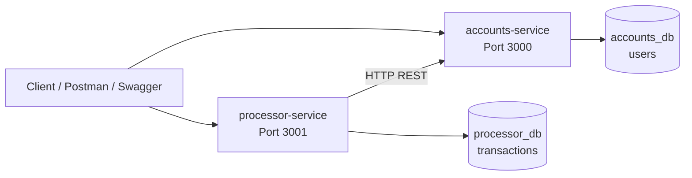
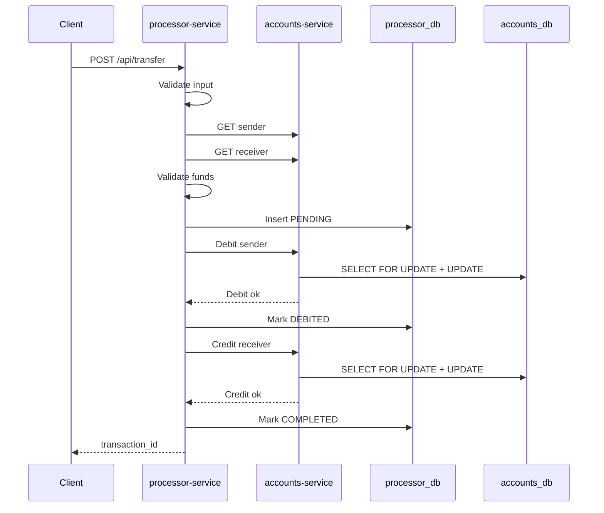
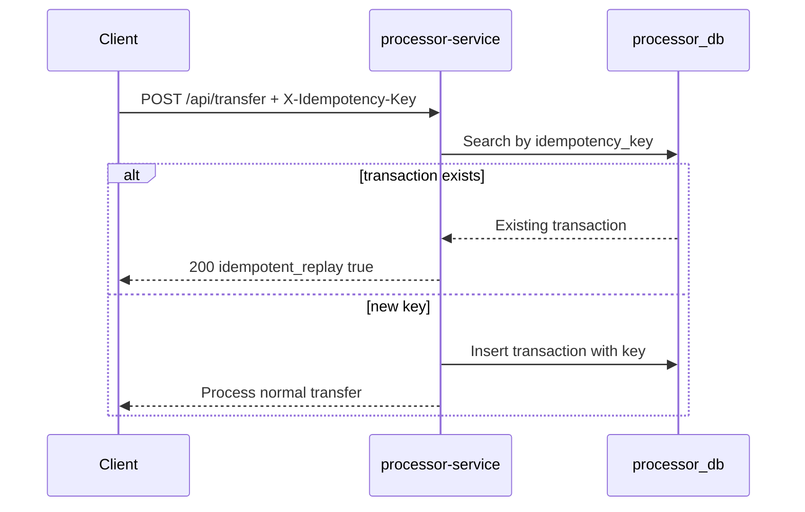
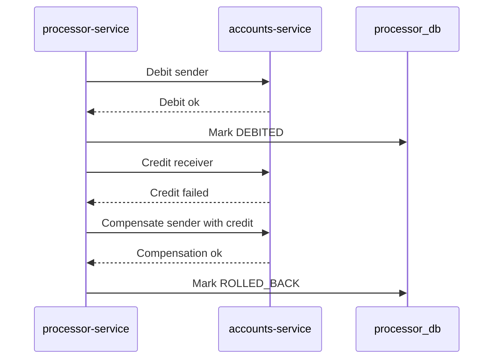
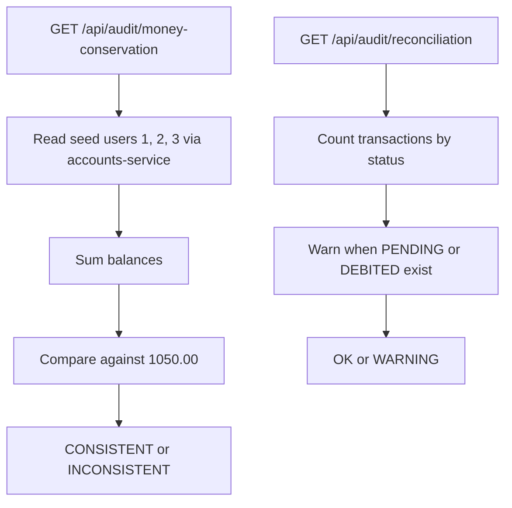

# Architecture

NeoWallet usa una arquitectura de microservicios ligera con dos servicios Node.js/Express y dos bases de datos PostgreSQL separadas.

## Componentes

### accounts-service

Responsabilidades:

- Consultar usuarios y saldos.
- Recargar saldo de forma simulada.
- Ejecutar debitos y creditos internos con transacciones SQL.
- Proteger contra saldos negativos con validaciones y constraints.

### processor-service

Responsabilidades:

- Orquestar transferencias P2P.
- Registrar transacciones y estados.
- Aplicar idempotencia.
- Ejecutar compensacion tipo Saga.
- Exponer historial, auditoria y reconciliacion.

## Bases de datos

`accounts_db` contiene `users`, con `balance DECIMAL(10,2)` y `CHECK (balance >= 0)`.

`processor_db` contiene `transactions`, con:

- `transaction_id` unico.
- `sender_id` y `receiver_id`.
- `amount DECIMAL(10,2)` con `CHECK (amount > 0)`.
- `status` restringido a `PENDING`, `DEBITED`, `COMPLETED`, `FAILED`, `ROLLED_BACK`.
- `idempotency_key` con indice unico parcial cuando no es `NULL`.
- Indices para `sender_id`, `receiver_id` y `created_at`.

## Flujo de transferencia

## Flujo de idempotencia

## Flujo de compensacion Saga

## Flujo de auditoria y reconciliacion

## Riesgos y mitigaciones

| Riesgo | Mitigacion |
| --- | --- |
| Perdida de dinero | Saga con compensacion y auditoria de total |
| Duplicidad por reintentos | `X-Idempotency-Key` e indice unico parcial |
| Race conditions | `SELECT ... FOR UPDATE` en updates de balance |
| Fallos de comunicacion | Estados `FAILED`/`ROLLED_BACK`, health checks y logs |
| Inputs invalidos | Validadores estrictos y SQL parametrizado |
| Baja observabilidad | Logs JSON, Swagger, Postman y reconciliacion |

## Decisiones tecnicas

- Node.js y Express mantienen el codigo simple para hackathon.
- PostgreSQL aporta transacciones, constraints e indices.
- Docker Compose levanta todo localmente.
- Swagger y Postman facilitan demo y QA.
- GitHub Actions ejecuta checks ligeros sin levantar toda la app.

