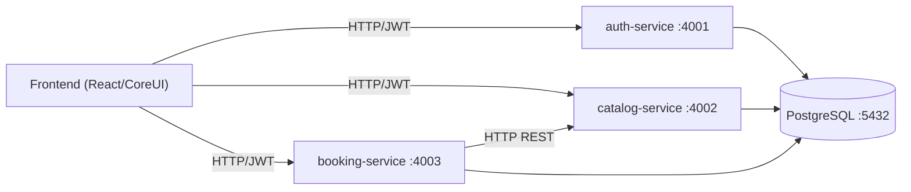
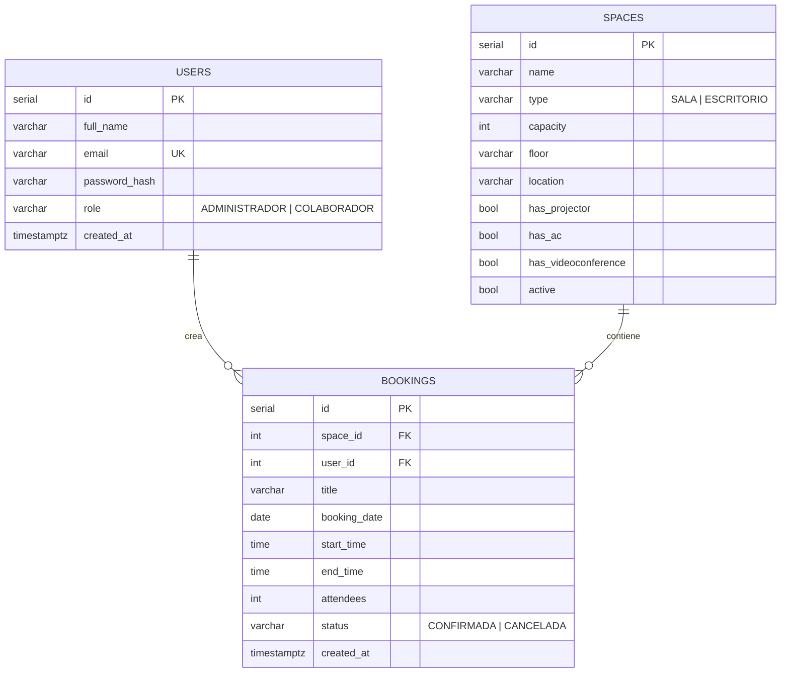

# Arquitectura — IBM OfficeSpace

## 1. Decisión arquitectónica: Microservicios con Base de Datos Compartida

El sistema se implementa como **microservicios independientes que comparten una
única base de datos PostgreSQL**. Es una arquitectura híbrida elegida por:

- **Separación de responsabilidades**: cada servicio tiene un dominio claro.
- **Despliegue y escalado independientes**: cada uno con su proceso, puerto y `Dockerfile`.
- **Simplicidad transaccional**: al compartir la BD, las validaciones críticas
  (no-solapamiento) se resuelven con transacciones ACID, sin sagas distribuidas.
- **Velocidad de desarrollo y depuración** para un MVP.



### Responsabilidades por servicio

| Servicio | Dominio | Endpoints clave |
|----------|---------|-----------------|
| **auth-service** | Usuarios y autenticación | `POST /auth/login`, `GET /auth/me`, `GET /auth/users` |
| **catalog-service** | Espacios (salas/escritorios) | `GET/POST/PUT/DELETE /spaces` |
| **booking-service** | Reservas, disponibilidad, analíticas, sugerencias | `GET /availability`, `POST /bookings`, `GET /bookings/me`, `DELETE /bookings/:id`, `GET /bookings/occupancy`, `GET /bookings/analytics`, `GET /bookings/suggestions` |

### Comunicación entre servicios

- El **frontend** habla con cada servicio vía REST y adjunta el **JWT** (`Authorization: Bearer`).
- El **booking-service** consulta el **catalog-service por HTTP** (`GET /spaces`) para
  obtener los espacios candidatos en la búsqueda de disponibilidad y en las sugerencias.
- Para la operación crítica de crear una reserva, el booking-service lee la capacidad del
  espacio directamente de la BD compartida **dentro de la transacción**, garantizando
  consistencia.

### Seguridad / JWT

- El `auth-service` **firma** el token (HS256) con `JWT_SECRET`.
- Los demás servicios **verifican** el token con el mismo secreto compartido (variable de
  entorno). Cada servicio tiene su propia copia del middleware (sin acoplar código).
- Rutas de escritura de espacios y de gestión exigen rol `ADMINISTRADOR`.

### Organización del código dentro de cada servicio

Cada servicio sigue una estructura por capas: `routes/` (definición de endpoints +
documentación OpenAPI) → `controllers/` (orquestación y reglas de negocio) →
`config/db.js` (acceso a PostgreSQL) → `validators/` (reglas puras, sin BD).

**Decisión consciente — sin capa `models/` separada:** al tratarse de un MVP con una
base de datos compartida y consultas SQL sencillas, el acceso a datos se mantiene en
los controllers usando el *pool* parametrizado de `config/db.js`. Separar un ORM o una
capa de modelos añadiría complejidad sin beneficio real a esta escala. La lógica de
negocio que sí merece aislarse y probarse (el motor de reglas de reserva) ya vive
desacoplada en `booking-service/src/validators/` con sus tests unitarios. Si el sistema
creciera, el siguiente paso natural sería extraer un `models/` por entidad
(`userModel`, `spaceModel`, `bookingModel`) sin tocar controllers ni rutas.

---

## 2. La regla crítica: NO solapamiento

Se aplica en **dos capas** para máxima robustez:

1. **Capa de aplicación** (booking-service): dentro de una transacción se bloquea la fila
   del espacio (`SELECT ... FOR UPDATE`), se validan las reglas de negocio y se consulta
   si existe una reserva que choque con el intervalo, devolviendo **`409 Conflict`** claro.

2. **Capa de base de datos** (PostgreSQL): una restricción `EXCLUDE USING gist` impide
   físicamente dos reservas confirmadas solapadas del mismo espacio, incluso ante
   condiciones de carrera concurrentes:

   ```sql
   EXCLUDE USING gist (
     space_id WITH =,
     tsrange((booking_date + start_time), (booking_date + end_time)) WITH &&
   ) WHERE (status = 'CONFIRMADA')
   ```

   Se usa el rango `[inicio, fin)` (inferior inclusivo, superior **exclusivo**): por eso
   `10:00–11:00` y `11:00–12:00` **no** se consideran solapadas (reservas consecutivas válidas).

Otras reglas validadas: capacidad ≥ asistentes, `fin > inicio`, y fecha/hora no en el pasado.

---

## 3. Modelo de datos (Entidad–Relación)



Índices de apoyo: `(space_id, booking_date)` y `(user_id)` en `bookings`; `(type)` en `spaces`.

---

## 4. Frontend

- **React 19 + Vite + CoreUI 5**, tematizado con **IBM Carbon** (variables Sass
  sobrescritas: `$primary = #0f62fe`, tipografía **IBM Plex**, esquinas casi rectas).
- **Rutas protegidas** por sesión y por rol (`ProtectedRoute`).
- **i18n propio** (sin dependencias) con 5 idiomas y persistencia en `localStorage`.
- **Capa de API** centralizada (`src/api`) que inyecta el JWT y normaliza errores.
- **Animaciones** con Framer Motion (login: haz de luz + palabras rotativas).
- **Asistente de voz** con Web Speech API (STT + TTS) y un motor de intención local.
