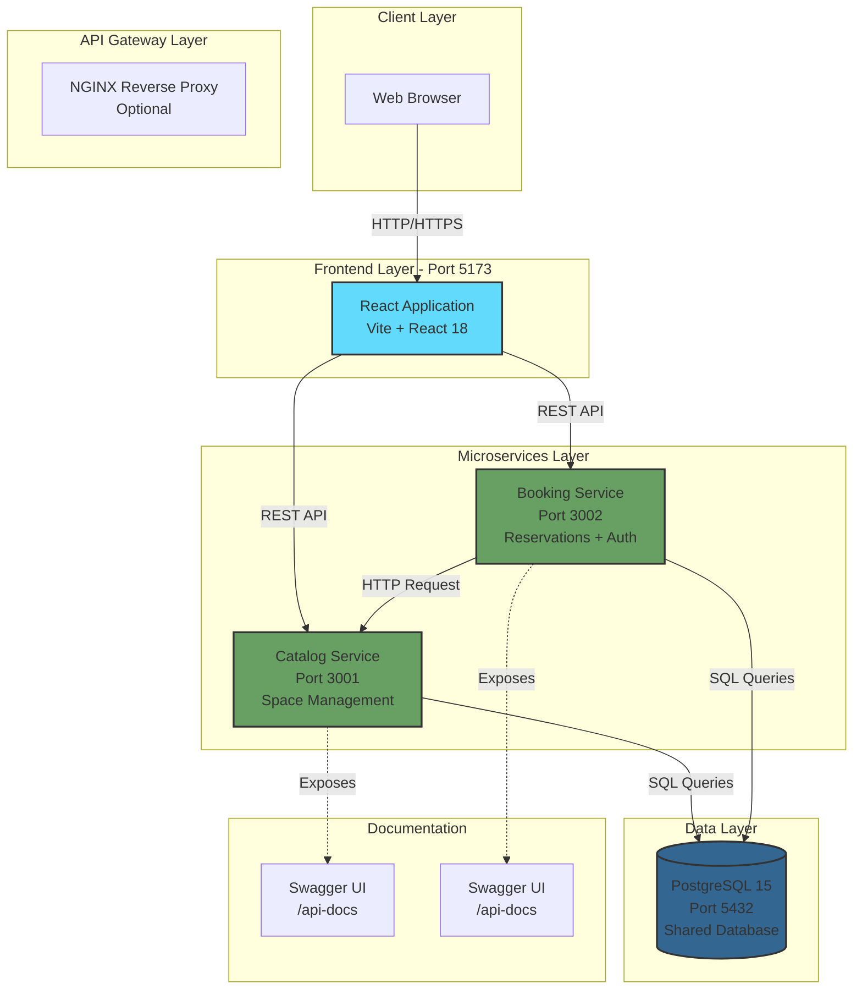
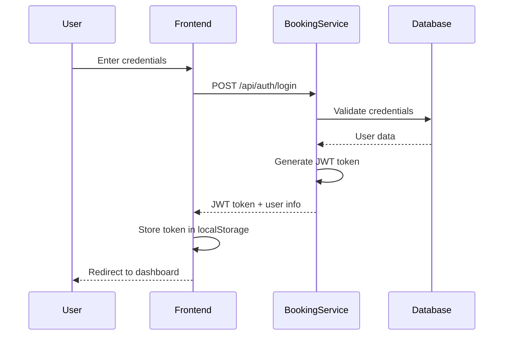
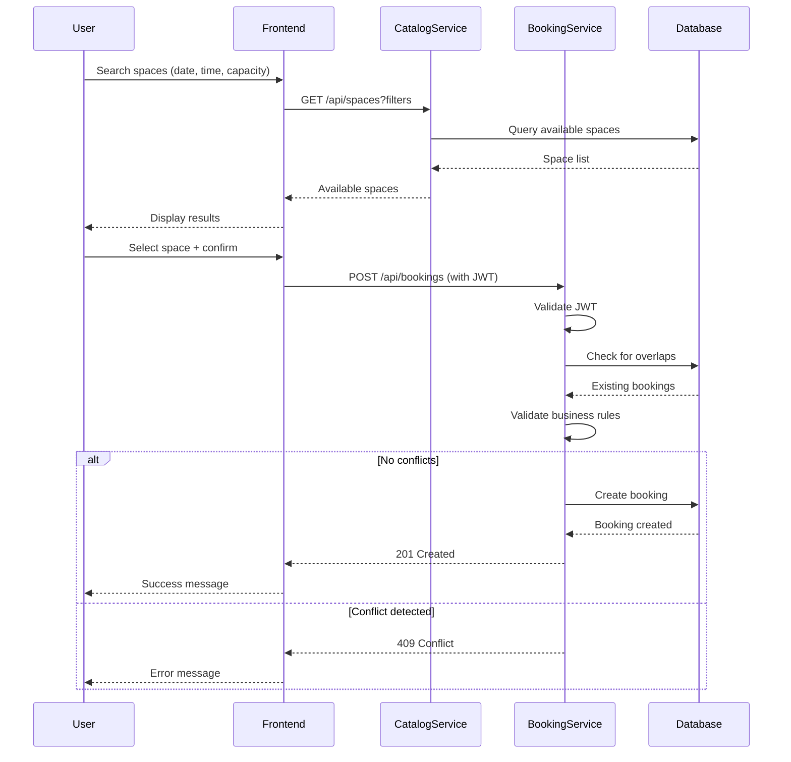
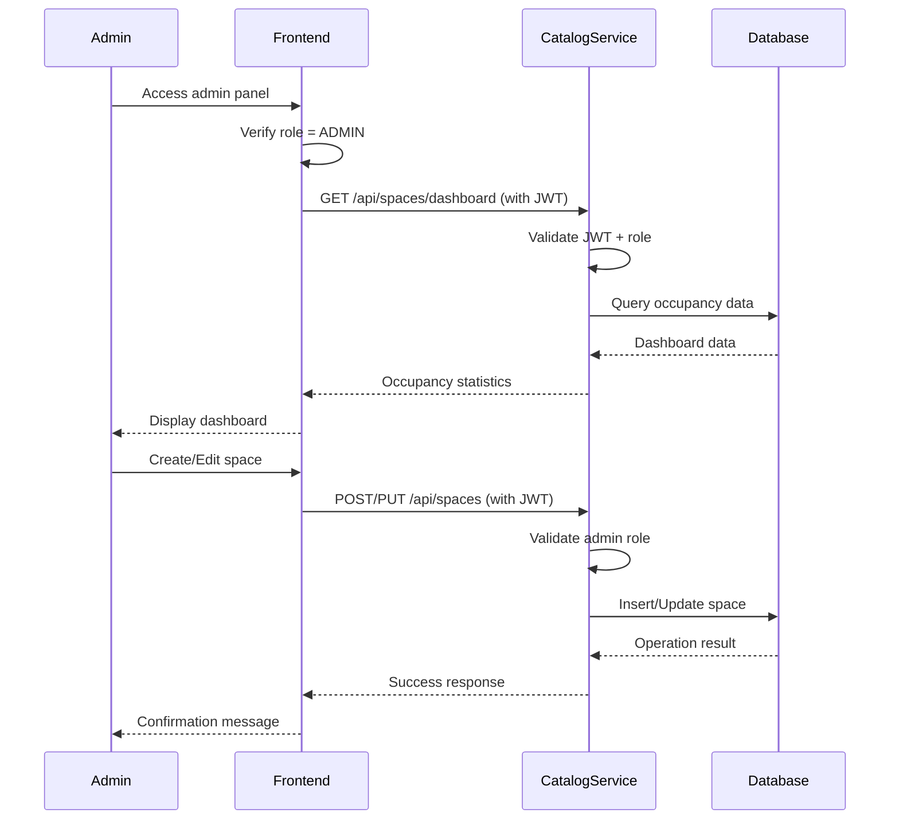
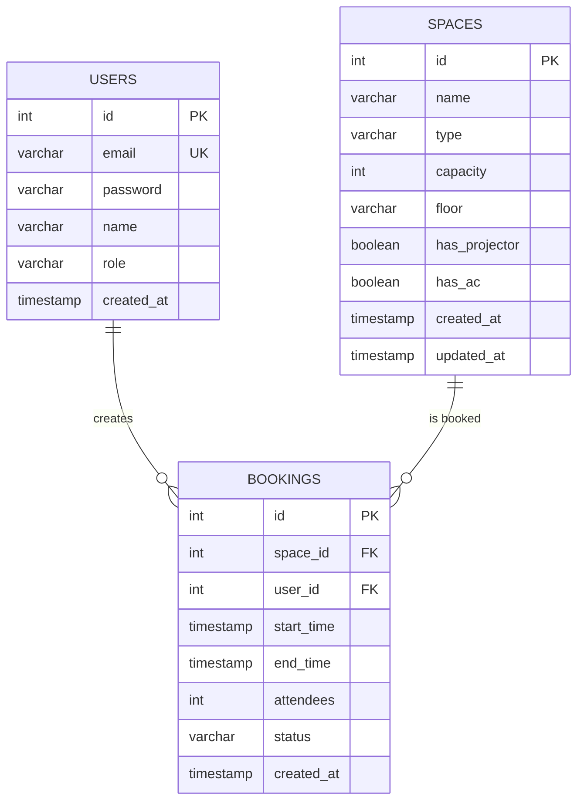
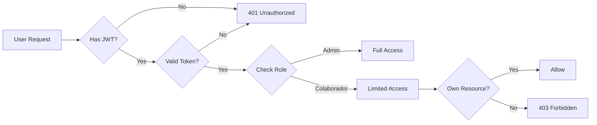
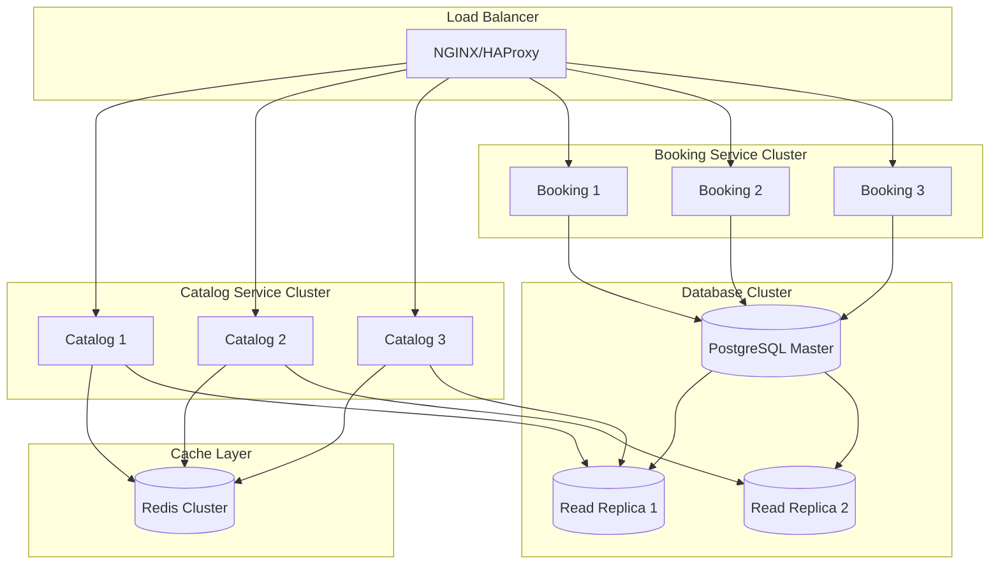

# OfficeSpace - System Architecture

## 🏗️ Architecture Overview

OfficeSpace implements a **Microservices Architecture with Shared Database** pattern, optimized for rapid development while maintaining service separation principles.

## 📐 Architecture Diagram



## 🔄 Service Communication Flow

### 1. User Authentication Flow



### 2. Space Search and Booking Flow



### 3. Admin Space Management Flow



## 🗄️ Database Schema



## 🔐 Security Architecture

### Authentication & Authorization



### JWT Token Flow

1. **Token Generation** (Booking Service):
   - User logs in with email/password
   - Server validates credentials against database
   - Server generates JWT with payload: `{userId, email, role}`
   - Token expires in 24 hours

2. **Token Validation** (All Protected Endpoints):
   - Extract token from `Authorization: Bearer <token>` header
   - Verify signature using JWT_SECRET
   - Check expiration
   - Extract user info from payload

3. **Role-Based Access Control**:
   - **Public**: Login, space listing (read-only)
   - **Authenticated**: Create bookings, view own bookings
   - **Admin**: All operations + space management

## 🏢 Microservices Design

### Catalog Service

**Purpose**: Manage the inventory of physical spaces (rooms and desks)

**Responsibilities**:
- CRUD operations for spaces
- Space availability queries
- Dashboard data aggregation
- Resource filtering

**Technology Stack**:
- Node.js 20.x + Express.js
- PostgreSQL client (pg)
- Swagger documentation
- JWT validation middleware

**Key Design Decisions**:
- Stateless service (no session management)
- Read-heavy optimization (indexes on type, capacity)
- Communicates with Booking Service for availability checks

### Booking Service

**Purpose**: Handle reservations and user authentication

**Responsibilities**:
- User authentication (JWT generation)
- Booking creation with validation
- Overlap detection algorithm
- Booking cancellation
- User booking history

**Technology Stack**:
- Node.js 20.x + Express.js
- PostgreSQL client (pg)
- bcryptjs for password hashing
- jsonwebtoken for JWT
- Joi for validation
- Swagger documentation

**Key Design Decisions**:
- Centralized authentication (no separate auth service)
- Transaction-based booking creation
- Complex validation logic (overlap, capacity, time)
- Optimistic locking for concurrent bookings

## 🔄 Inter-Service Communication

### Communication Pattern: HTTP/REST

**Why HTTP instead of message queues?**
- Simpler setup for MVP
- Synchronous operations fit the use case
- Easier debugging and testing
- Lower infrastructure complexity

**Example: Booking Service → Catalog Service**

```javascript
// Booking Service needs space details
const axios = require('axios');

async function getSpaceDetails(spaceId) {
  try {
    const response = await axios.get(
      `http://catalog-service:3001/api/spaces/${spaceId}`
    );
    return response.data;
  } catch (error) {
    throw new Error('Failed to fetch space details');
  }
}
```

## 📊 Data Flow Patterns

### 1. Read Pattern (Space Search)

```
Frontend → Catalog Service → Database → Catalog Service → Frontend
```

- **Optimization**: Database indexes on frequently queried fields
- **Caching**: Optional Redis layer for popular queries (future enhancement)

### 2. Write Pattern (Create Booking)

```
Frontend → Booking Service → Database (Transaction) → Booking Service → Frontend
```

- **Validation Steps**:
  1. JWT authentication
  2. Space existence check (call Catalog Service)
  3. Capacity validation
  4. Time range validation
  5. Overlap detection (database query)
  6. Insert booking (within transaction)

### 3. Complex Query Pattern (Dashboard)

```
Frontend → Catalog Service → Database (JOIN queries) → Catalog Service → Frontend
```

- **Aggregation**: SQL queries with GROUP BY for statistics
- **Performance**: Materialized views for complex reports (future enhancement)

## 🐳 Deployment Architecture

### Docker Compose Setup

```yaml
Services:
  - postgres: Database (persistent volume)
  - catalog-service: Space management API
  - booking-service: Booking + Auth API
  - frontend: React SPA
```

**Network Configuration**:
- All services in same Docker network
- Services communicate via service names (DNS resolution)
- Only frontend and APIs expose ports to host

**Volume Management**:
- PostgreSQL data persists in named volume
- Application code mounted for development
- Logs stored in container (future: centralized logging)

## 🔍 Monitoring & Observability

### Health Check Endpoints

Each service exposes:
```
GET /health
Response: { status: "healthy", timestamp: "..." }
```

### Logging Strategy

- **Application Logs**: Console output (captured by Docker)
- **Database Logs**: PostgreSQL logs in container
- **Error Tracking**: Structured error responses with correlation IDs

### Future Enhancements

1. **Centralized Logging**: ELK Stack (Elasticsearch, Logstash, Kibana)
2. **Metrics**: Prometheus + Grafana
3. **Distributed Tracing**: Jaeger or Zipkin
4. **APM**: New Relic or Datadog

## 🚀 Scalability Considerations

### Current Architecture (MVP)

- **Vertical Scaling**: Increase container resources
- **Horizontal Scaling**: Multiple instances behind load balancer
- **Database**: Single PostgreSQL instance (sufficient for MVP)

### Future Scaling Path



## 🎯 Design Principles Applied

1. **Separation of Concerns**: Each service has a single responsibility
2. **Stateless Services**: No session state in application servers
3. **Database per Service (Logical)**: Each service owns its tables
4. **API-First Design**: Swagger documentation drives development
5. **Fail-Fast Validation**: Validate early, fail with clear errors
6. **Idempotency**: Safe retry of operations (future enhancement)
7. **Graceful Degradation**: Service failures don't cascade

## 📚 Technology Choices Justification

| Technology | Reason |
|------------|--------|
| **Node.js** | Fast development, async I/O, large ecosystem |
| **Express.js** | Minimal, flexible, well-documented |
| **PostgreSQL** | ACID compliance, complex queries, JSON support |
| **React** | Component-based, large community, easy to learn |
| **Vite** | Fast build times, modern tooling, HMR |
| **Docker** | Consistent environments, easy deployment |
| **JWT** | Stateless auth, scalable, standard |
| **Swagger** | API documentation, testing, client generation |

## 🔄 Migration Path (Monolith → Microservices)

If this were a monolith migration:

1. **Phase 1**: Extract Catalog Service (read-only operations)
2. **Phase 2**: Extract Booking Service (write operations)
3. **Phase 3**: Separate databases (if needed)
4. **Phase 4**: Add message queue for async operations
5. **Phase 5**: Implement event sourcing for audit trail

## ⚠️ Known Limitations & Trade-offs

### Current Architecture

1. **Shared Database**:
   - ✅ Simpler transactions
   - ✅ Easier joins
   - ❌ Tight coupling
   - ❌ Scaling bottleneck

2. **Synchronous Communication**:
   - ✅ Simpler error handling
   - ✅ Immediate consistency
   - ❌ Service dependencies
   - ❌ Cascading failures

3. **No API Gateway**:
   - ✅ Less complexity
   - ❌ No centralized auth
   - ❌ No rate limiting
   - ❌ No request routing

### Mitigation Strategies

- **Database**: Connection pooling, read replicas
- **Communication**: Circuit breakers, timeouts, retries
- **Gateway**: Add NGINX as reverse proxy (optional)

## 🎓 Learning Outcomes

By implementing this architecture, developers learn:

1. **Microservices Fundamentals**: Service boundaries, communication
2. **API Design**: RESTful principles, HTTP semantics
3. **Authentication**: JWT, role-based access control
4. **Database Design**: Schema design, constraints, indexes
5. **Containerization**: Docker, Docker Compose
6. **Documentation**: Swagger/OpenAPI standards
7. **Validation**: Business logic, edge cases
8. **Error Handling**: HTTP status codes, error responses

---

**Next Steps**: Proceed to API Contract documentation for detailed endpoint specifications.