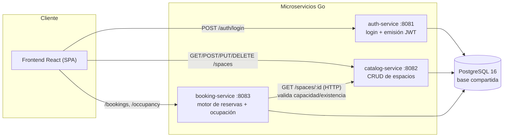
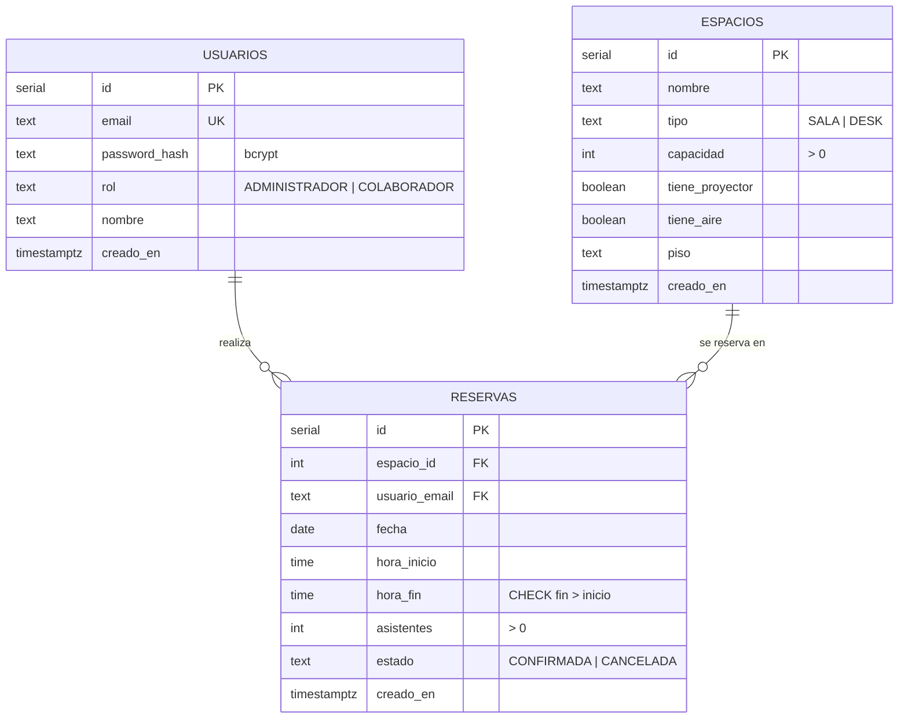

# Arquitectura de OfficeSpace

Documento de decisiones arquitectónicas del MVP. Se irá ampliando por fase; esta
versión cubre la topología de servicios y el modelo de datos (Fase 1).

## Topología de servicios

OfficeSpace son **tres microservicios Go independientes** que comparten una única
instancia de PostgreSQL, más una SPA de React. Cada servicio tiene su propio
proceso, puerto, `Dockerfile` y `go.mod`. Un `go.work` en la raíz agrupa los
módulos para el desarrollo local.



### Decisiones clave

- **Base compartida, lógica de dominio por HTTP.** Aunque los tres servicios usan
  la misma instancia de PostgreSQL, **un servicio no consulta tablas de dominio de
  otro** para decidir reglas de negocio. `booking-service` valida la capacidad y la
  existencia del espacio **llamando por HTTP** a `catalog-service` (`GET /spaces/{id}`),
  no leyendo la tabla `espacios`.
- **FK por integridad + HTTP por lógica.** Se mantienen las llaves foráneas
  `reservas.espacio_id → espacios.id` y `reservas.usuario_email → usuarios.email`.
  Una FK es una garantía de integridad del modelo (evita reservas huérfanas), no una
  consulta de lógica de negocio; conviven deliberadamente con la validación por HTTP.
- **JWT compartido por contrato, no por código.** `auth-service` emite los tokens;
  `catalog-service` y `booking-service` los validan con el mismo `JWT_SECRET` mediante
  un middleware propio en `internal/middleware`. No hay un paquete de dominio
  compartido entre servicios (shared-nothing): lo único compartido es el contrato
  (secreto + claims `sub`, `rol`, `exp`).
- **Dueño de la ocupación = `booking-service`.** Los datos de ocupación derivan de la
  tabla `reservas`; por eso `GET /occupancy?fecha=` vive en booking y `catalog-service`
  no expone ocupación (evita una dependencia HTTP catalog → booking).
- **Esquema en `init-db.sql` (fuente única).** No se usan migraciones por servicio:
  tres servicios migrando las mismas tablas al arrancar generan condiciones de carrera.
  El esquema, índices, restricciones y semilla viven en `shared-infra/init-db.sql`, que
  PostgreSQL ejecuta una sola vez al inicializar el volumen.
- **Zona horaria `America/Mexico_City`.** Toda comparación temporal (en particular "no
  reservar en el pasado") usa esta zona, no la del servidor (UTC). Se fija vía `TZ` en
  los contenedores y al construir el "ahora" en Go con `time.LoadLocation`.

## Modelo de datos



### Garantía anti-solapamiento a nivel de base de datos

La validación en la capa de aplicación (consultar y luego insertar) sufre una
condición de carrera: dos peticiones simultáneas para el mismo intervalo pueden pasar
ambas el chequeo. Por eso, además de validar en `booking-service`, la tabla `reservas`
lleva una **restricción de exclusión** que el motor de PostgreSQL garantiza de forma
atómica:

```sql
ALTER TABLE reservas ADD CONSTRAINT reservas_sin_solapamiento
EXCLUDE USING gist (
    espacio_id WITH =,
    tsrange( (fecha + hora_inicio), (fecha + hora_fin), '[)' ) WITH &&
) WHERE (estado = 'CONFIRMADA');
```

- El rango `'[)'` (inferior inclusivo, superior exclusivo) implementa la **regla de
  límites exclusivos**: `10:00-11:00` y `11:00-12:00` **no** se solapan.
- El `WHERE (estado = 'CONFIRMADA')` la hace **parcial**: una reserva cancelada deja de
  bloquear el horario.
- Requiere la extensión `btree_gist` para combinar `espacio_id WITH =` (igualdad de
  enteros) con `&&` (solapamiento de rangos) en el mismo índice GiST.

`booking-service` valida la regla en la app y devuelve un `409` legible; además captura
la posible violación de esta restricción (por carrera) y la mapea también a `409`. Así
el `409` queda garantizado tanto por la aplicación como por la base.

### Índices

- `idx_reservas_espacio_fecha (espacio_id, fecha)` — acelera la verificación de
  disponibilidad y solapamiento.
- `idx_reservas_usuario (usuario_email)` — acelera "Mis Reservas".
