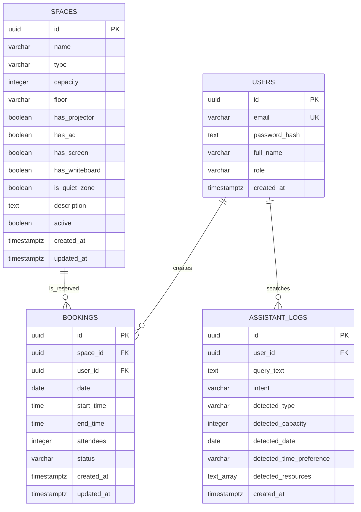

# Modelo de datos

OfficeSpace usa PostgreSQL compartido entre microservicios. El modelo se mantiene deliberadamente simple para el MVP del hackathon: usuarios, espacios, reservas y trazabilidad de busquedas del asistente.



## Reglas relevantes

- `users.role` solo permite `ADMINISTRADOR` o `COLABORADOR`.
- `spaces.type` solo permite `SALA` o `DESK`.
- `spaces.capacity` debe ser mayor a `0`.
- `bookings.status` solo permite `ACTIVE` o `CANCELLED`.
- `bookings.end_time` debe ser mayor que `bookings.start_time`.
- La regla de no solapamiento se aplica en `booking-service` contra reservas `ACTIVE`:

```text
new_start < existing_end AND new_end > existing_start
```

## Indices principales

- `idx_bookings_space_time`: acelera la busqueda de reservas activas por espacio, fecha e intervalo.
- `idx_bookings_user`: acelera la vista "Mis reservas".
- `idx_assistant_logs_created_at`: acelera las metricas y busquedas recientes de Alpha Assistant.
