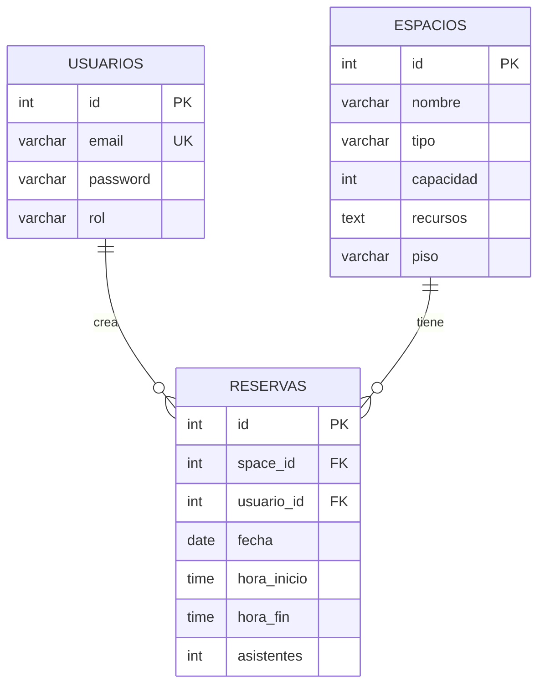

# 🏢 OfficeSpace — Gestión Híbrida Inteligente

> MVP desarrollado para **Corporativo Alpha** que digitaliza y automatiza la reserva de salas de juntas y escritorios en un modelo de trabajo híbrido.

---

## 🚀 Inicio Rápido

### Requisitos previos
- [Docker Desktop](https://www.docker.com/products/docker-desktop/) instalado y corriendo
- Git

### Levantar el proyecto

```bash
# 1. Clonar el repositorio
git clone https://github.com/tu-usuario/officespace-2026.git
cd officespace-2026

# 2. Levantar todos los servicios con Docker
docker-compose up --build

# 3. Abrir el frontend
# Abre el archivo: frontend/index.html en tu navegador
```

> **Nota:** La primera vez tarda ~30 segundos mientras PostgreSQL inicializa y los servicios arrancan.

### Credenciales de prueba

| Rol | Email | Contraseña |
|-----|-------|------------|
| Administrador | admin@corporativoalpha.com | Admin123 |
| Colaborador | carlos.mendez@corporativoalpha.com | User123 |
| Colaborador | ana.torres@corporativoalpha.com | User123 |

---

## 🏗️ Arquitectura del Sistema

El sistema implementa una arquitectura de **Microservicios con Base de Datos Compartida** (Arquitectura Híbrida), elegida por su balance entre separación de responsabilidades y simplicidad de implementación para el hackathon.

```
┌─────────────────────────────────────────────────────────────┐
│                        CLIENTE                               │
│              frontend/ (HTML + CSS + JS)                     │
└──────────────────────────┬──────────────────────────────────┘
                           │ HTTP
                           ▼
┌─────────────────────────────────────────────────────────────┐
│                   API GATEWAY :3000                          │
│         Enruta peticiones + CORS centralizado                │
└────────┬──────────────────┬─────────────────┬───────────────┘
         │                  │                 │
         ▼                  ▼                 ▼
┌──────────────┐  ┌──────────────────┐  ┌──────────────────┐
│ auth-service │  │ catalog-service  │  │ booking-service  │
│   :3003      │  │    :3001         │  │    :3002         │
│              │  │                  │  │                  │
│ POST /login  │  │ GET  /spaces     │  │ POST /bookings   │
│ POST /verify │  │ POST /spaces     │  │ GET  /mis-reservas│
│              │  │ PUT  /spaces/:id │  │ DELETE /bookings │
│              │  │ DEL  /spaces/:id │  │ GET  /dashboard  │
│  Swagger     │  │  Swagger         │  │  Swagger         │
│  /api-docs   │  │  /api-docs       │  │  /api-docs       │
└──────────────┘  └──────────────────┘  └──────────────────┘
         │                  │                 │
         └──────────────────┴─────────────────┘
                            │
                            ▼
              ┌─────────────────────────┐
              │   PostgreSQL 15 :5432   │
              │   Base de Datos         │
              │   Compartida            │
              └─────────────────────────┘
```

### ¿Por qué Microservicios con DB Compartida?

- **Separación de responsabilidades** clara entre autenticación, catálogo y reservas
- **Comunicación HTTP/REST** entre servicios — cada uno expone su propia API
- **Despliegue independiente** — cada servicio tiene su propio Dockerfile
- **DB compartida** reduce la complejidad de transacciones distribuidas y el tiempo de desarrollo, sin sacrificar la separación lógica de responsabilidades

---

## 🗄️ Diagrama Entidad-Relación



---

## 📡 Documentación de API

| Servicio | Swagger URL |
|----------|-------------|
| Auth Service | http://localhost:3003/api-docs |
| Catalog Service | http://localhost:3001/api-docs |
| Booking Service | http://localhost:3002/api-docs |

### Endpoints principales

#### Auth Service
| Método | Ruta | Descripción | Auth |
|--------|------|-------------|------|
| POST | `/login` | Iniciar sesión, retorna JWT | ❌ |
| POST | `/verify` | Verificar token JWT | ❌ |

#### Catalog Service
| Método | Ruta | Descripción | Auth |
|--------|------|-------------|------|
| GET | `/spaces` | Listar espacios (filtros: tipo, capacidad_min) | ✅ Cualquier rol |
| GET | `/spaces/:id` | Obtener espacio por ID | ✅ Cualquier rol |
| POST | `/spaces` | Crear espacio | ✅ Solo Admin |
| PUT | `/spaces/:id` | Actualizar espacio | ✅ Solo Admin |
| DELETE | `/spaces/:id` | Eliminar espacio | ✅ Solo Admin |

#### Booking Service
| Método | Ruta | Descripción | Auth |
|--------|------|-------------|------|
| POST | `/bookings` | Crear reserva (valida solapamiento) | ✅ Cualquier rol |
| GET | `/bookings/mis-reservas` | Ver mis reservas | ✅ Cualquier rol |
| GET | `/bookings/dashboard` | Ocupación del día | ✅ Cualquier rol |
| GET | `/bookings/historial` | Historial completo (Admin) | ✅ Solo Admin |
| DELETE | `/bookings/:id` | Cancelar reserva | ✅ Solo dueño o Admin |

### Ejemplo de uso con curl

```bash
# 1. Login
curl -X POST http://localhost:3000/login \
  -H "Content-Type: application/json" \
  -d '{"email":"carlos.mendez@corporativoalpha.com","password":"User123"}'

# 2. Buscar espacios (usar el token del paso anterior)
curl http://localhost:3000/spaces?tipo=SALA&capacidad_min=4 \
  -H "Authorization: Bearer <TOKEN>"

# 3. Crear reserva
curl -X POST http://localhost:3000/bookings \
  -H "Authorization: Bearer <TOKEN>" \
  -H "Content-Type: application/json" \
  -d '{"space_id":1,"fecha":"2026-07-01","hora_inicio":"09:00","hora_fin":"11:00","asistentes":4}'
```

---

## 🖥️ Pantallas del Frontend

| Pantalla | Archivo | Roles |
|----------|---------|-------|
| Login | `index.html` | Todos |
| Buscar Espacios | `pages/search.html` | Colaborador, Admin |
| Confirmación de Reserva | `pages/confirm.html` | Colaborador, Admin |
| Mis Reservas | `pages/my-bookings.html` | Colaborador, Admin |
| Panel de Administración | `pages/admin.html` | Solo Admin |
| Historial de Reservas | `pages/history.html` | Solo Admin |

---

## 🔔 Características Innovadoras

### Notificaciones en Tiempo Real (WebSockets)
Implementamos notificaciones push usando **Socket.io** que alertan a los usuarios cuando:
- ✅ Su reserva es confirmada exitosamente
- ❌ Su reserva es cancelada
- ⏰ Recordatorio 15 minutos antes de su reserva (via intervalo del servidor)

Las notificaciones aparecen como banners en la esquina superior derecha sin necesidad de refrescar la página.

### Historial de Reservas Admin
Panel exclusivo para administradores con:
- Búsqueda por fecha, espacio o usuario
- Exportación de datos
- Vista completa de todas las reservas del sistema

---

## 🧪 Testing

Ver [`docs/casos-de-prueba.md`](docs/casos-de-prueba.md) para los casos de prueba manuales documentados.

Ver [`docs/gherkin/`](docs/gherkin/) para los scripts BDD de escenarios críticos.

---

## 🗂️ Estructura del Proyecto

```
officespace-2026/
├── api-gateway/          # Enrutador central (puerto 3000)
├── auth-service/         # Autenticación JWT (puerto 3003)
├── catalog-service/      # Gestión de espacios (puerto 3001)
├── booking-service/      # Motor de reservas (puerto 3002)
├── frontend/             # Aplicación web (HTML/CSS/JS)
│   ├── index.html        # Login
│   ├── css/styles.css
│   ├── js/app.js
│   └── pages/
│       ├── search.html       # Búsqueda y filtros
│       ├── confirm.html      # Confirmación de reserva
│       ├── my-bookings.html  # Mis reservas
│       ├── admin.html        # Panel admin
│       └── history.html      # Historial completo (admin)
├── shared-infra/
│   └── init-db.sql       # Script inicial de BD
├── docs/
│   ├── casos-de-prueba.md
│   └── gherkin/
├── docker-compose.yml
├── .gitignore
└── README.md
```

---

## 👥 Equipo

Desarrollado durante el Hackathon OfficeSpace 2026 — Corporativo Alpha.
